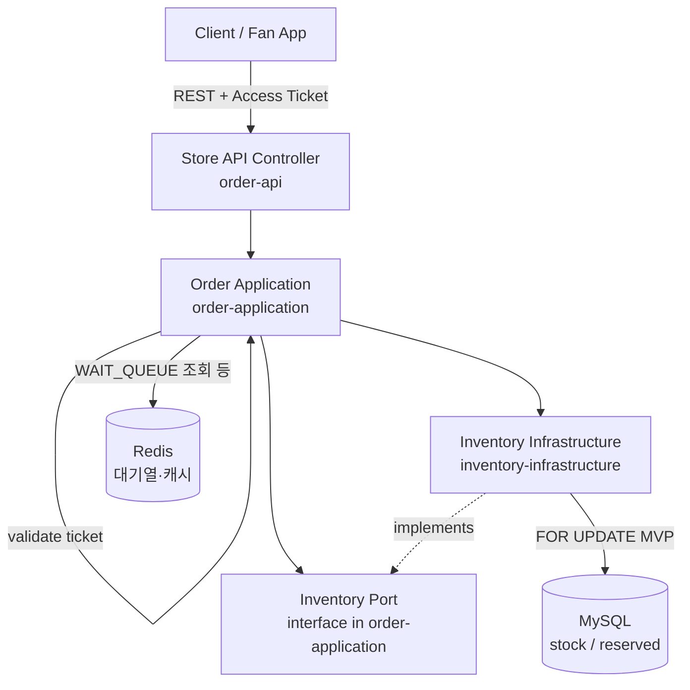

# ADR-001: 멀티모듈 모놀리스 채택

| 항목 | 내용 |
| --- | --- |
| **상태** | Accepted |
| **결정일** | 2026-05-19 |
| **관련** | [ERD](../erd/erd-design.md) · [결제·주문 시퀀스](../sequence/payment-flow-reason.md) |

---

## Title

백엔드 아키텍처 스타일로 **멀티모듈 모놀리스**를 채택한다.

---

## 1. Tech Stack

Java 21 / Spring Boot 기반으로 구성한다.  
아래 스택은 기획서(01~04) 기준으로 도출한 것이며, 각 항목에 **선택 근거**를 함께 둔다.

### Core

| 구분 | 기술 | 선택 근거 |
| --- | --- | --- |
| Language | Java 21 (LTS) | Virtual Thread(Project Loom)로 **동시 I/O 처리 비용 감소 및 Thread 생성 부담 완화**. SSE·웹훅 등 블로킹 I/O 구간에 유리. 최신 LTS로 팀 기술 증명에 적합. |
| Framework | Spring Boot 3.x | Java 21 Virtual Thread 공식 지원. Spring Security, Data JPA, Actuator 생태계 활용. |
| Build | Gradle (Kotlin DSL) | 멀티모듈 서브프로젝트 **의존성 방향을 빌드 레벨에서 강제**. 잘못된 모듈 참조는 컴파일 실패로 조기 차단. |
| API Style | REST (Spring MVC) + SSE | 대기열 순번 실시간 전달(F08-01)에 SSE 사용. WebSocket 스케일·모더레이션 부담은 Not Scope. |

> **WebFlux는 Not Scope.** 팀 러닝 커브와 Spring MVC·RestDocs·기존 운영 경험을 고려해 리액티브 스택 전환은 하지 않는다. SSE 병목은 스레드 수보다 **커넥션·메모리·프록시 타임아웃** 영향이 클 수 있음을 전제로 설계한다.

### Data

| 구분 | 기술 | 선택 근거 |
| --- | --- | --- |
| RDBMS | MySQL 8.x (AWS RDS) | 주문·결제·재고 상태 정합성을 트랜잭션으로 보장. |
| ORM | Spring Data JPA + QueryDSL | 커서 페이징·N+1 제어. **JPA는 `*-infrastructure`에만** 둔다. |
| Cache / 대기열 | Redis (AWS ElastiCache) | 핫딜 대기열 Sorted Set, 랭킹 집계, Read 캐시. |
| 분산락 | Redisson (Phase 3) | **MVP:** 재고 선점은 MySQL `SELECT … FOR UPDATE` 비관락. **Phase 3:** Redis `RLock` vs DB 락 **비교 실험** 및 부하 테스트 근거 수집. |
| Migration | Flyway | 멀티모듈 환경에서 스키마 변경 이력 버전 관리. 롤백 스크립트 운영. |

### Security · Auth

| 구분 | 기술 | 선택 근거 |
| --- | --- | --- |
| 인증 | Spring Security + JWT | 이메일·소셜(카카오·구글) 로그인(F01-01~02). Access/Refresh Token 분리. |
| 소셜 로그인 | Spring OAuth2 Client | 카카오·구글 OAuth2 표준 흐름. Spring Security와 통합. |
| Rate Limiting | Bucket4j (Redis 연동) | 핫딜 오픈 구간 매크로·비정상 트래픽 방어(F08-01). |
| 멱등성 | Idempotency Key (custom) | `PAYMENT.payment_key` Unique Index와 연동. 웹훅 재전송 대응. |

### 결제 · 외부 연동

| 구분 | 기술 | 선택 근거 |
| --- | --- | --- |
| PG | 토스페이먼츠 | 단일 PG에 집중 — 멱등·웹훅·실패 복구. 복수 PG는 Not Scope. |
| 알림 | 이메일 (JavaMailSender) + 추후 FCM | **Domain Event + DB Outbox** 기반 비동기 처리. 이벤트·재시도 상태는 DB에 남긴다. **Kafka는 Not Scope.** |

### Observability · 인프라

| 구분 | 기술 | 선택 근거 |
| --- | --- | --- |
| 모니터링 | Prometheus + Grafana | Write P95 &lt; 300ms, 5xx &lt; 0.1% SLO. Actuator → Prometheus. |
| 부하 테스트 | k6 | 핫딜 동시 ~1k 스파이크. 오버셀 0·락 전략 비교표. |
| Cloud | AWS (EC2 · RDS · ElastiCache) | stg/prod 분리, VPC·보안그룹. |
| CI/CD | GitHub Actions | PR 머지 → 빌드·테스트·배포. 무중단·롤백 검증. |
| Reverse Proxy | Nginx | SSL 종단, Blue/Green 전환. |
| API 문서 | SpringDoc (OpenAPI 3) | Phase 1 계약 동결 후 자동 생성. RestDocs와 역할 분리 검토. |

### 테스트

| 구분 | 기술 | 선택 근거 |
| --- | --- | --- |
| 단위 테스트 | JUnit 5 + Mockito | Domain 레이어 순수 단위 테스트. Spring 컨텍스트 없이 실행. |
| 통합 테스트 | Testcontainers | MySQL·Redis로 결제·재고 E2E. CI 동일 재현. |
| 아키텍처 검증 | ArchUnit (선택) | `domain` 패키지가 `org.springframework`·`jakarta.persistence` import 시 실패. |

---

## 2. 아키텍처 구조

**멀티모듈 모놀리스** — 하나의 Spring Boot 프로세스로 배포하되, 코드 경계는 Gradle 서브프로젝트로 분리하여 **의존성 방향을 컴파일 단계에서 강제**한다.

> **한눈에 보기:** 디렉터리·레이어·오너십 요약은 [architecture/architecture.md](../architecture/architecture.md). 아래는 동일 내용 + 호출 흐름·상세 근거.

### 레포지토리 디렉터리 구조

```
fandrops/
├── settings.gradle.kts
├── build.gradle.kts
├── apps/
│   └── api-server/                 # Boot 진입점 — 조립·설정만
│       └── src/main/java/com/fandrops/FandropsApplication.java
├── modules/
│   ├── common/                     # 공통 유틸·에러코드·응답 포맷 (최소화)
│   ├── user/
│   │   ├── user-domain/
│   │   ├── user-application/
│   │   ├── user-api/
│   │   └── user-infrastructure/
│   ├── order/   … (domain · application · api · infrastructure)
│   ├── payment/
│   ├── inventory/
│   ├── notification/               # api 레이어 없음
│   └── community/
└── docs/                           # ADR, 시퀀스, ERD
```

### 레이어 역할 정의

| 레이어 | 역할 | 규칙 |
| --- | --- | --- |
| `*-api` | HTTP 수신, DTO 변환, Application 호출 | 비즈니스 로직 없음. Controller만. |
| `*-application` | 유스케이스, 트랜잭션 경계, Domain 조합 | **포트(interface)** 정의. 타 모듈 구현체 직접 참조 금지. |
| `*-domain` | 비즈니스 규칙, **Domain Model / Aggregate / Value Object** | **Spring · JPA · Redis 의존 금지.** 순수 Java. |
| `*-infrastructure` | JPA Entity·Repository, Redis, 외부 API 어댑터 | Application 포트 구현. Domain ↔ persistence **매핑** 담당. |

#### Domain과 JPA Entity 분리 (방식 1)

`domain`의 `Order`는 **도메인 모델**이고, `infrastructure`의 `OrderJpaEntity`가 `@Entity`를 가진다.  
`@Entity`는 `jakarta.persistence`에 의존하므로 **domain에 두지 않는다.**

```
order-domain          Order (aggregate)
order-infrastructure  OrderJpaEntity + OrderMapper
```

이렇게 해야 “domain → JPA 금지”와 “영속화 필요”가 동시에 성립한다.

### 의존성 방향 규칙

**허용**

- `api` → `application` → `domain`
- `infrastructure` → `domain`, `application`(포트 구현)
- `application` → 타 모듈 **포트 interface**만
- `common` ← 모든 모듈 (common은 최소 유지)

**금지**

- `domain` → Spring / JPA / Redis
- `user-*` → `order-infrastructure` (타 도메인 infrastructure 직접 참조)
- `order-api` → `payment-infrastructure`
- 타 모듈 `domain` 직접 참조 (협업은 application 포트로)

**검증**

```bash
./gradlew :modules:order:order-domain:dependencies
```

ArchUnit(선택): `..domain..` 패키지가 `org.springframework`, `jakarta.persistence` import 시 테스트 실패.

### 모듈 간 호출 흐름 (예: 핫딜 주문·재고 선점)

폴더 구조만으로는 런타임 협업이 보이지 않으므로, 대표 유스케이스의 **호출 방향**을 명시한다.



**텍스트 요약**

```
Client
  → order-api (Controller)
  → order-application (유스케이스 · 토큰 검증 · 상태 전이)
  → InventoryPort (interface)
  → inventory-infrastructure (JPA / Redis 어댑터)
  → MySQL (비관락) / Redis (대기열)
```

결제 확정·웹훅·알림은 동일 패턴: `payment-api` → `payment-application` → `OrderPort` / `NotificationPort` → 각 `*-infrastructure`.

### 도메인 오너십 → 모듈 매핑

요약표는 [architecture/architecture.md](../architecture/architecture.md)와 동일. **order = 형성빈**, **payment = 장성재** (역할 혼동 방지).

| 담당자 | Gradle 모듈 | 핵심 책임 |
| --- | --- | --- |
| 지영재 | `apps/api-server` · 플랫폼 | AWS · CI/CD · Prometheus/Grafana · k6 |
| 표지민 | `user` · `notification` | Auth · 대기열 · 알림 전송 |
| 정환철 | `community` | 피드 · 댓글 · 랭킹 · 라이브 |
| 형성빈 | `order` · `inventory` | 상품 · 주문 · 장바구니 · 핫딜 재고 (결제 PG는 비범위) |
| 장성재 | `payment` | 토스 · 웹훅 · 멱등 · 주문-결제 E2E·보상 |

---

## Context — 왜 이 결정이 필요한가

FANDROPS는 5인 팀이 **7주(2026.05.19–06.25)** 안에 완성하는 백엔드 포트폴리오 프로젝트다.  
핵심 증명 과제는 기능 개수가 아니라 **오픈런 동시성 제어 · 트랜잭션 정합성 · 부하 수치 재현**이다.

아키텍처 선택은 기술 취향이 아니라 **“7주 안에 측정 가능한 결과를 낼 수 있는가”** 에 대한 실행 가능성 판단이다.  
order / payment / inventory 경계가 뚜렷하고, 향후 서비스 분리 가능성도 염두에 둔다.

---

## Options — 검토한 대안

| # | 대안 | 판정 | 요약 |
| --- | --- | --- | --- |
| ① | **멀티모듈 모놀리스** | ✔ 채택 | 단일 프로세스 배포. Gradle로 경계 강제. 모듈 단위 MSA 후보 확보. |
| ② | 풀 MSA | ✕ 기각 | 서비스별 파이프라인·DB·관측. 5인·7주에서 운영 비용이 이득을 압도. |
| ③ | 단일 패키지 모놀리스 | ✕ 기각 | 도메인 경계 강제 불가. 의존 규칙이 문서에만 남음. |

---

## Decision — 결정 및 근거

**멀티모듈 모놀리스를 채택한다.**

1. **증명에 시간을 쓸 수 있다.** 배포·관측·장애 추적이 단순하다. CI가 단일 아티팩트로 수렴하므로 동시성·부하·SLO 검증에 집중한다.

2. **도메인 경계를 빌드로 강제한다.** `order-domain`이 `payment-infrastructure`를 참조하면 컴파일이 실패한다. 5인 팀에서 리뷰만으로 경계를 지키기 어렵다.

3. **MSA 후보 단위를 확보한다.** `payment-domain` / `application` / `infrastructure` 묶음은 **분리 후보 모듈**로 활용할 수 있다. 다만 공유 DB·로컬 트랜잭션·도메인 이벤트 결합이 있으므로 **추가적인 DB 분리·이벤트 기반 통신 전환** 없이 즉시 분리할 수 있다고 보지 않는다. Day-1 풀 MSA는 Not Scope.

4. **팀 규모·기간에 맞다.** 모듈 간 호출은 같은 JVM 내 메서드 호출로, MVP 단계에서 네트워크·서킷브레이커 부담을 줄인다.

---

## Consequences — 트레이드오프

| 트레이드오프 | 완화 |
| --- | --- |
| 단일 장애점 (프로세스 1개) | 무중단 배포·롤백 |
| 모듈별 독립 스케일 아웃 불가 | MVP ~1k 동시는 단일 인스턴스 전제 |
| 모듈 간 ACID (동일 DB) | MSA 전환 시 분산 트랜잭션·사가 필요 — 전환 시 인지 |
| 빌드 시간 증가 | Gradle 병렬·캐시 |
| Domain ↔ JPA 매핑 보일러플레이트 | Mapper·테스트로 정합성 보장 |

---

## Compliance — 준수 방법

| # | 규칙 |
| --- | --- |
| 01 | `*-domain`의 `build.gradle.kts`에 Spring/JPA/Redis 의존성을 넣지 않는다. |
| 02 | 모듈 간 협업은 `*-application` **포트 interface**로만 한다. **구현체 직접 의존은 아키텍처 위반으로 간주한다.** |
| 03 | `common`은 응답 포맷·에러코드·TraceId 등 횡단 관심사만. 비즈니스 로직 유입 금지. |
| 04 | ArchUnit 도입 시 `domain` 패키지의 프레임워크 import 금지를 테스트로 강제한다. |
| 05 | 모듈 의존 방향 변경은 **본 ADR 개정** 없이 적용하지 않는다. |

---

## 관련 문서

| 문서 | 경로 |
| --- | --- |
| 레이어별 Gradle 모듈 (ADR-002) | [ADR-002-per-layer-gradle-modules.md](./ADR-002-per-layer-gradle-modules.md) |
| ERD | [../erd/erd-design.md](../erd/erd-design.md) |
| 결제·주문 시퀀스 | [../sequence/payment-flow-reason.md](../sequence/payment-flow-reason.md) |
| Git 협업 컨벤션 | [../contributing/git-collaboration-convention.md](../contributing/git-collaboration-convention.md) |
