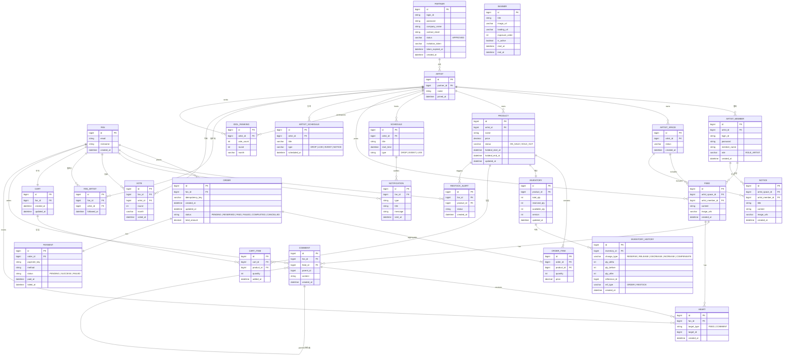

```mermaid
erDiagram
    %% === CORE USER & ARTIST DOMAINS ===
    FAN ||--o{ ORDER : places
    FAN ||--o{ RESTOCK_ALERT : subscribes
    FAN ||--o{ NOTIFICATION : receives
    FAN ||--o{ VOTE : "투표"

    PARTNER ||--o{ ARTIST : "소속"
    ARTIST ||--o{ ARTIST_MEMBER : "멤버"
    ARTIST ||--o{ ARTIST_SPACE : owns
    ARTIST ||--o{ PRODUCT : owns
    ARTIST ||--o{ SCHEDULE : hosts
    ARTIST ||--o{ IDOL_RANKING : participates
    ARTIST ||--o{ FEED : posts
    ARTIST ||--o{ ARTIST_SCHEDULE : "등록"
    ARTIST ||--o{ FAN_ARTIST : "팔로워"
    ARTIST ||--o{ VOTE : "득표"

    ARTIST_MEMBER ||--o{ FEED : "작성"
    ARTIST_MEMBER ||--o{ NOTICE : "작성"

    FAN ||--o{ FAN_ARTIST : "팔로우"
    FAN ||--|| CART : "보유"

    %% === COMMUNITY DOMAINS ===
    ARTIST_SPACE ||--o{ FEED : "includes"
    ARTIST_SPACE ||--o{ NOTICE : "includes"
    FEED ||--o{ COMMENT : has
    FEED ||--o{ HEART : has
    COMMENT ||--o{ HEART : receives
    COMMENT ||--o{ COMMENT : "parent(대댓글)"
    FAN ||--o{ COMMENT : writes
    FAN ||--o{ HEART : reacts

    %% === COMMERCE DOMAINS ===
    PRODUCT ||--|{ ORDER_ITEM : contains
    PRODUCT ||--|| INVENTORY : "재고"
    PRODUCT ||--o{ CART_ITEM : "담김"
    ORDER ||--|{ ORDER_ITEM : aggregates
    ORDER ||--|| PAYMENT : has
    PRODUCT ||--o{ RESTOCK_ALERT : triggers
    CART ||--o{ CART_ITEM : "담김"
    INVENTORY ||--o{ INVENTORY_HISTORY : "이력"

    %% === RANKING & SCHEDULE ===
    IDOL_RANKING }o--|| ARTIST : ranks
    SCHEDULE ||--o{ NOTIFICATION : notifies

    %% === ENTITY DEFINITIONS ===
    FAN {
        bigint id PK
        string email
        string nickname
        datetime created_at
    }

    PARTNER {
        bigint id PK
        string login_id
        string password
        string company_name
        string contact_email
        varchar status "APPROVED"
        varchar invitation_token
        datetime token_expired_at
        datetime created_at
    }

    ARTIST {
        bigint id PK
        bigint partner_id FK
        string name
        datetime joined_at
    }

    ARTIST_MEMBER {
        bigint id PK
        bigint artist_id FK
        string login_id
        string password
        string member_name
        varchar role "ROLE_ARTIST"
        datetime created_at
    }

    ARTIST_SPACE {
        bigint id PK
        bigint artist_id FK
        varchar status
        datetime created_at
    }

    FEED {
        bigint id PK
        bigint artist_space_id FK
        bigint artist_member_id FK
        string content
        varchar image_urls
        datetime created_at
    }

    COMMENT {
        bigint id PK
        bigint fan_id FK
        bigint feed_id FK
        bigint parent_id
        string content
        datetime created_at
    }

    HEART {
        bigint id PK
        bigint fan_id FK
        string target_type "FEED | COMMENT"
        bigint target_id
        datetime created_at
    }

    NOTICE {
        bigint id PK
        bigint artist_space_id FK
        bigint artist_member_id FK
        string title
        string content
        varchar image_urls
        datetime created_at
    }

    PRODUCT {
        bigint id PK
        bigint artist_id FK
        string name
        decimal price
        varchar status "ON_SALE | SOLD_OUT"
        datetime hotdeal_start_at
        datetime hotdeal_end_at
        datetime updated_at
    }

    INVENTORY {
        bigint id PK
        bigint product_id FK
        int total_qty
        int reserved_qty
        int available_qty
        int version
        datetime updated_at
    }

    INVENTORY_HISTORY {
        bigint id PK
        bigint inventory_id FK
        varchar change_type "RESERVE | RELEASE | DECREASE | INCREASE | COMPENSATE"
        int qty_delta
        int qty_before
        int qty_after
        bigint reference_id
        varchar ref_type "ORDER | RESTOCK"
        datetime created_at
    }

    ORDER {
        bigint id PK
        bigint fan_id FK
        varchar idempotency_key
        datetime created_at
        datetime updated_at
        string status "PENDING | RESERVED | PAID | FAILED | COMPLETED | CANCELLED"
        decimal total_amount
    }

    ORDER_ITEM {
        bigint id PK
        bigint order_id FK
        bigint product_id FK
        int quantity
        decimal price
    }

    PAYMENT {
        bigint id PK
        bigint order_id FK
        string payment_key
        string method
        string status "PENDING | SUCCESS | FAILED"
        datetime paid_at
        datetime failed_at
    }

    CART {
        bigint id PK
        bigint fan_id FK
        datetime created_at
        datetime updated_at
    }

    CART_ITEM {
        bigint id PK
        bigint cart_id FK
        bigint product_id FK
        int quantity
        datetime added_at
    }

    FAN_ARTIST {
        bigint id PK
        bigint fan_id FK
        bigint artist_id FK
        datetime followed_at
    }

    VOTE {
        bigint id PK
        bigint fan_id FK
        bigint artist_id FK
        int round
        varchar month
        datetime voted_at
    }

    RESTOCK_ALERT {
        bigint id PK
        bigint fan_id FK
        bigint product_id FK
        string status
        datetime created_at
    }

    SCHEDULE {
        bigint id PK
        bigint artist_id FK
        string title
        datetime start_time
        string type "DROP | EVENT | LIVE"
    }

    IDOL_RANKING {
        bigint id PK
        bigint artist_id FK
        int vote_count
        int round
        varchar month
    }

    ARTIST_SCHEDULE {
        bigint id PK
        bigint artist_id FK
        varchar title
        varchar type "DROP | LIVE | EVENT | NOTICE"
        datetime scheduled_at
    }

    BANNER {
        bigint id PK
        string title
        varchar image_url
        varchar landing_url
        int exposure_order
        boolean is_active
        datetime start_at
        datetime end_at
    }

    NOTIFICATION {
        bigint id PK
        bigint fan_id FK
        string type
        string title
        string message
        datetime sent_at
    }
```
