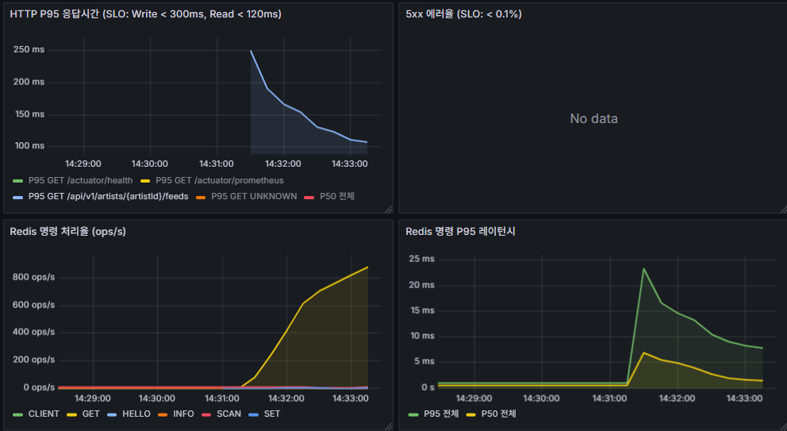
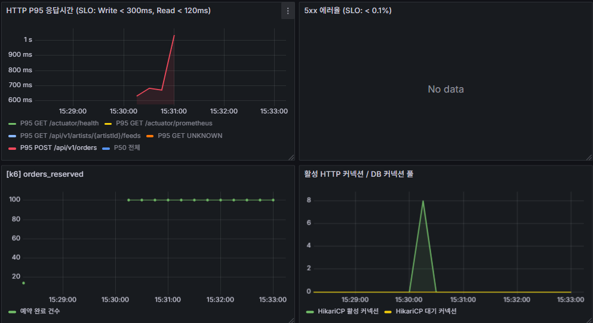
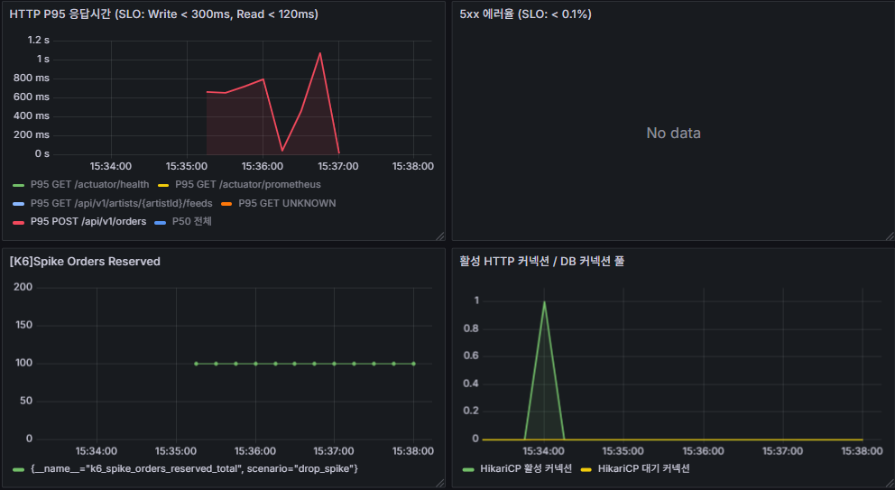

# k6 공식 SLO 베이스라인 결과 (EC2-2 전용 측정)

> **목적**: 공식 SLO 달성 여부 수치 증명 — 최적화 전 베이스라인 및 최적화 후 재측정 비교
> **실행 환경**: EC2-2 t3.small (k6 전용 러너) → EC2-1 Spring Boot (api.fandrops.site)
> **실행일**: 2026-06-19 ~
> **기준 SLO**: `docs/observability-metrics.md` 참고

> ✅ **이 문서의 수치가 공식 SLO 베이스라인입니다.**
>
> k6를 EC2-2(서울 리전 전용 러너)에서 실행하고 EC2-1 Spring Boot를 대상으로 측정합니다.
> Spring Boot와 k6가 분리되어 CPU·메모리 경합이 없고, 서울 리전 내부 통신으로 네트워크 오버헤드가 없습니다.
> 예비 측정 수치와 직접 비교하지 않습니다. 상세: `k6-preliminary-results.md`

---

## 테스트 환경

| 항목 | 값 |
|---|---|
| k6 실행 위치 | EC2-2 t3.small (서울 리전, Spring Boot 없음) |
| 측정 대상 | EC2-1 Spring Boot — `https://api.fandrops.site` (VPC 내부 사설 IP) |
| 네트워크 | 동일 VPC 내부 통신 — 네트워크 오버헤드 없음 |
| DB | RDS MySQL (별도 인스턴스) |
| Redis | ElastiCache (별도 인스턴스) |
| 모니터링 | Prometheus Remote Write → EC2-1 (`http://10.0.1.114:9090/api/v1/write`) |
| 토큰 | `/opt/fandrops/k6/seed/tokens.csv` — fan_id 1~2100 JWT |
| 적용 시나리오 | s01·s02·s03·s04·s06 (s05는 Actions runner 유지) |

---

## 공통 실행 명령어 패턴

```bash
# EC2-2 SSM 세션에서 실행
cd /opt/fandrops/k6

# BASE_URL: EC2-1 사설 IP (Nginx 경유)
# K6_PROMETHEUS_RW_SERVER_URL: EC2-1 Prometheus 엔드포인트
export BASE_URL=https://api.fandrops.site
export K6_PROMETHEUS_RW_SERVER_URL=http://10.0.1.114:9090/api/v1/write
export K6_PROMETHEUS_RW_TREND_STATS="p(95),p(99)"

k6 run -e BASE_URL=$BASE_URL \
  --out experimental-prometheus-rw \
  scenarios/<번호>_<이름>.js
```

---

## k6 수치 vs Grafana 수치 차이

| 구분 | 측정 주체 | 측정 방식 | 특징 |
|---|---|---|---|
| **k6** | 클라이언트(로드 테스터) | 테스트 전체 기간의 정확한 집계 | **공식 베이스라인으로 사용** |
| **Grafana(Micrometer)** | 서버(Spring Boot 내부) | 1분 슬라이딩 윈도우 `histogram_quantile` 근사값 | 실시간 추세 모니터링용 |

---

## SLO 목표 요약

| 유형 | P95 목표 | 에러율 목표 | 적용 시나리오 |
|---|---|---|---|
| Read | < 120ms | < 0.1% | 02 |
| Write | < 300ms | < 0.1% | 01, 04, 06 |
| Payment | < 3,000ms | < 1% | 03 |
| SSE | 연결 거부 없음 (정상 구간) | — | 05 |

---

## 권장 실행 순서

| 순서 | 시나리오 | 사전 준비 | 실행 위치 |
|---|---|---|---|
| 1 | s02 피드 Read | 없음 | EC2-2 |
| 2 | s01 주문 동시성 | inventory 리셋(100) + Redis 티켓 재적재 | EC2-2 |
| 3 | s04 드롭스 스파이크 | inventory 리셋(100) + Redis 티켓 재적재 | EC2-2 |
| 4 | s03 결제 확인 | Wiremock 기동 확인 | EC2-2 |
| 5 | s05 SSE 대기열 | — | **Actions runner** |
| 6 | s06 통합 워크로드 | inventory 리셋(200) + Wiremock 확인 | EC2-2 |

> ⚠️ **s05 먼저 실행 금지**: s05 실행 후 Redis 티켓이 UUID로 오염되어 s01·s04 전원 403 실패. 반드시 s04 이후 s05 실행. ([#304](https://github.com/prgrms-aibe-devcourse/AIBE5_FinalProject_Team6_BE/issues/304))

---

## 시나리오 02: 피드 조회 Read P95 기준선

**파일**: `infra/k6/scenarios/02_feed_read.js`
**담당 오너**: 정환철
**SLO**: P95 < 120ms, 에러율 < 0.1%

### 목적

팬이 아티스트 피드를 조회하는 가장 빈번한 읽기 동작의 성능 기준선을 측정한다. 드롭스 오픈런 전후로 팬들이 아티스트 피드를 집중적으로 조회하는 패턴을 재현한다.

Read SLO(P95 < 120ms)는 쓰기 SLO(300ms)보다 엄격하다. 이 엔드포인트는 인증 없이 `permitAll`로 누구나 호출 가능하므로 트래픽 집중 시 가장 먼저 병목이 나타난다.

검증 핵심:
- **P95 < 120ms**: 50 VU 2분 지속 부하에서 달성 여부
- **Redis 캐시 효과**: `FeedCacheAdapter` SingleFlight + TTL jitter 적용 후 개선폭 확인
- **N+1 제거 효과**: 인덱스·쿼리 최적화 적용 후 tail latency 감소 여부

### 실행 흐름

- 50 VU가 2분간 `/api/v1/artists/1/feeds` 지속 호출
- VU별 JWT 토큰은 `tokens.csv`에서 순환 분배

### 실행 명령어

```bash
cd /opt/fandrops/k6
export K6_PROMETHEUS_RW_SERVER_URL=http://10.0.1.114:9090/api/v1/write
export K6_PROMETHEUS_RW_TREND_STATS="p(95),p(99)"

k6 run -e BASE_URL=https://api.fandrops.site \
  --out experimental-prometheus-rw \
  scenarios/02_feed_read.js
```

### 사후 처리

DB·Redis 상태를 변경하지 않으므로 별도 정리 불필요. 다음 시나리오 바로 실행 가능.

### 결과 (베이스라인)

| 지표 | 결과 | 목표 | 상태 |
|---|---|---|---|
| P95 응답 시간 | **133.02ms** | < 120ms | ❌ SLO 미달 |
| P90 응답 시간 | 110.6ms | — | — |
| 평균 응답 시간 | 67.08ms | — | — |
| 에러율 | **0.00%** | < 0.1% | ✅ |
| 처리량 | 741 RPS | — | — |
| 총 요청 수 | 88,947 | — | — |

### 스크린샷



### 관찰 및 개선사항

**관찰:**
- P95 응답시간이 테스트 초반 250ms에서 100ms 수준으로 하강 → `FeedCacheAdapter` SingleFlight 캐시 워밍업 효과 확인
- Redis GET 명령 처리율 800 ops/s 수준 — 캐시가 적극적으로 활용되고 있음
- Redis P95 레이턴시 초반 25ms 피크 후 5ms로 안정화 → 초반 캐시 미스 시 DB 조회 발생, 이후 캐시 히트로 안정
- 5xx 에러 없음 ✅

**개선사항:**
- k6 집계 P95 133ms로 SLO(120ms) 13ms 미달. 초반 캐시 미스 구간을 제외한 안정 구간 P95는 120ms 이하로 추정되므로, **워밍업 트래픽을 사전에 인가하거나 TTL jitter 범위 축소**로 개선 가능
- Redis P95 레이턴시 초반 피크 25ms → 캐시 미스 시 실행되는 DB 쿼리(N+1 여부, 인덱스) 추가 확인 권장

### 오너 피드백 (→ 정환철)

- P95 133ms로 SLO(120ms) 13ms 미달입니다. 초반 캐시 워밍업 구간에서 250ms까지 튀는 게 집계 수치를 끌어올리고 있어서, 워밍업 트래픽 인가 또는 TTL jitter 범위 축소를 검토해주세요.
- Redis P95 레이턴시 초반 25ms 피크가 캐시 미스 시 DB 쿼리에서 오는 것으로 보입니다. 피드 조회 쿼리 실행 계획(EXPLAIN) 한 번 확인 부탁드립니다.

---

## 시나리오 01: 주문 동시성 (Order Concurrency)

**파일**: `infra/k6/scenarios/01_order_concurrency.js`
**담당 오너**: 형성빈
**SLO**: `orders_reserved ≤ 100` (오버셀 0건), P95 < 300ms, 에러율 < 0.1%

### 목적

드롭스 오픈런 상황에서 팬들이 동시에 주문을 요청할 때 재고 오버셀이 발생하지 않는지 검증하는 핵심 시나리오다.

FANDROPS의 주문 흐름은 **대기열 진입 → accessToken 발급 → 주문 API 호출** 순서로 진행된다. 재고 차감은 Redis 분산 락(`reserveAtomic`) + DB `WHERE available_qty >= qty` 원자적 UPDATE로 보호되며, 200 VU가 동시에 발화해도 `orders_reserved ≤ 100`(재고 수량)이어야 한다.

검증 핵심:
- **오버셀 0건**: `SELECT COUNT(*) FROM orders WHERE status = 'RESERVED'` = 100
- **락 정합성**: Redis 분산 락이 동시 요청을 직렬화하는지
- **P95 < 300ms**: 예비 측정 P95 2.85s 대비 EC2 경합 제거 후 개선폭 확인

### 실행 흐름

1. **iteration 1**: 대기열 진입 (`queue/join`) + accessToken 획득 — 200 VU 단일 배치 처리
2. **iteration 2**: 200 VU 동시 `POST /orders` 발화 → 재고 100개 → 100건 RESERVED, 100건 409 DEPLETED 기대

### 사전 준비

```bash
MYSQL="mysql -u fandrops_admin -p<PW> -h fandrops-prod-mysql.coqwxjz7zumt.ap-northeast-2.rds.amazonaws.com fandrops"
REDIS_HOST="master.fandrops-prod-redis.q7gdno.apn2.cache.amazonaws.com"

# inventory 리셋
$MYSQL -e "UPDATE inventory SET available_qty=100, reserved_qty=0, total_qty=100, version=0 WHERE product_id=1;"

# Redis 티켓 재적재
for i in {1..2100}; do
  valkey-cli -h $REDIS_HOST --tls setex "access:ticket:1:$i" 86400 "test-ticket-token"
done
```

### 실행 명령어

> ⚠️ **BASE_URL 예외**: s01은 `http://10.0.1.114:8081` (Spring Boot 직접 연결, Nginx 우회).
> Nginx `limit_req zone=fandrops_order rate=5r/s burst=10`이 IP 기반으로 동작하므로, EC2-2 단일 IP에서 200 VU를 발화하면 대부분이 차단된다.
> 실제 프로덕션에서는 200명이 각자 다른 IP로 요청하므로 Nginx rate limit이 걸리지 않는다.
> s01의 검증 목적(오버셀 방지)과 무관한 테스트 환경 아티팩트이므로 Nginx를 우회한다.

```bash
cd /opt/fandrops/k6
export K6_PROMETHEUS_RW_SERVER_URL=http://10.0.1.114:9090/api/v1/write
export K6_PROMETHEUS_RW_TREND_STATS="p(95),p(99)"

k6 run -e BASE_URL=http://10.0.1.114:8081 \
  -e FAN_POOL_SIZE=200 \
  --out experimental-prometheus-rw \
  scenarios/01_order_concurrency.js
```

### 사후 처리 (s04 실행 전 필수)

주문 성공 시 `access:ticket:1:{fanId}` 키가 삭제되므로 s04 실행 전 Redis 재적재 필수.

```bash
REDIS_HOST="master.fandrops-prod-redis.q7gdno.apn2.cache.amazonaws.com"
for i in {1..2100}; do
  valkey-cli -h $REDIS_HOST --tls setex "access:ticket:1:$i" 86400 "test-ticket-token"
done
```

### 결과 (베이스라인)

| 지표 | 결과 | 목표 | 상태 |
|---|---|---|---|
| P95 응답 시간 (전체) | **1.75s** | < 300ms | ❌ SLO 미달 |
| P95 응답 시간 (성공 요청) | **865.52ms** | < 300ms | ❌ SLO 미달 |
| P90 응답 시간 (전체) | 1.64s | — | — |
| 평균 응답 시간 | 1.18s | — | — |
| 에러율 | 75%\* | < 0.1% | ❌ |
| orders_reserved | **100** | ≤ 100 | ✅ 오버셀 없음 |
| 처리량 | 124 RPS | — | — |
| 총 요청 수 | 400 | — | — |

> \* 에러율 75% = 300건 409 DEPLETED(재고 소진 정상 응답) + 100건 201 RESERVED. 실제 5xx 오류 0건.

### 스크린샷



### 관찰 및 개선사항

**관찰:**
- `orders_reserved=100` — 200 VU 동시 발화에서 정확히 재고 100건만 RESERVED, 오버셀 0건 ✅
- P95 1.75s (전체) / 865ms (성공 요청) — SLO(300ms) 대비 크게 초과. Redis 분산 락 경합으로 인한 직렬화 대기가 주요 원인으로 추정
- 성공 요청 평균 447ms, 최대 915ms — 락 대기 큐 깊이에 따라 응답시간이 선형 증가하는 패턴
- 5xx 오류 0건 ✅

**개선사항:**
- Redis 분산 락(`reserveAtomic`) 대기 시간 단축 검토 — 락 타임아웃 설정, Lua 스크립트 최적화, 또는 낙관적 락 전환 고려
- DB `WHERE available_qty >= qty` 원자적 UPDATE 처리 시간 확인 (인덱스 활용 여부)

### 오너 피드백 (→ 형성빈)

- P95 865ms(성공 요청 기준)로 SLO(300ms) 약 3배 초과입니다. 오버셀은 0건으로 정합성은 완벽합니다.
- 200 VU 동시 발화 시 Redis 분산 락 직렬화 대기가 병목으로 추정됩니다. `reserveAtomic` Lua 스크립트 실행 시간 및 락 경합 현황 확인 부탁드립니다.
- DB `available_qty` 조건 UPDATE 실행 계획(EXPLAIN)도 함께 확인해주세요.

---

## 시나리오 04: 드롭스 스파이크 (Drop Spike)

**파일**: `infra/k6/scenarios/04_drop_spike.js`
**담당 오너**: 형성빈
**SLO**: `spike_orders_reserved ≤ 100` (오버셀 0건), P95 < 300ms, 에러율 < 0.1%

### 목적

드롭스 상품이 오픈되는 순간 팬들이 일제히 몰려드는 오픈런 트래픽을 재현한다. 0 → 1,000 VU가 30초 만에 급증하는 `ramping-vus` 패턴으로 Rate Limit, 대기열, 재고 차감이 스파이크 하에서도 정합성을 유지하는지 확인한다.

s01(200 VU 동시성)과 달리 스파이크 자체가 검증 대상이다. 램프업 구간에서 들어온 요청이 Rate Limit(`5r/s`)에 의해 큐에 쌓이고, 대기열 스케줄러가 처리하는 동안 오버셀이 발생하지 않아야 한다.

검증 핵심:
- **오버셀 0건**: 1,000 VU 스파이크 중 `orders_reserved ≤ 100`
- **Rate Limit 동작**: 초과 요청이 429로 처리되는지
- **P95 성공 요청**: 예비 측정 508ms(EC2 경합 환경) 대비 개선폭 확인
- **에러율 해석**: 409 DEPLETED·429는 정상 동작, 500은 이상

### 실행 흐름

| 단계 | VU | 시간 | 설명 |
|---|---|---|---|
| 급상승 | 0 → 1,000 | 30s | 드롭스 오픈 순간 모사 |
| 유지 | 1,000 | 30s | 최고 부하 유지 |
| 종료 | 1,000 → 0 | 15s | 부하 해제 |

### 사전 준비

```bash
MYSQL="mysql -u fandrops_admin -p<PW> -h fandrops-prod-mysql.coqwxjz7zumt.ap-northeast-2.rds.amazonaws.com fandrops"
REDIS_HOST="master.fandrops-prod-redis.q7gdno.apn2.cache.amazonaws.com"

$MYSQL -e "UPDATE inventory SET available_qty=100, reserved_qty=0, total_qty=100, version=0 WHERE product_id=1;"

for i in {1..2100}; do
  valkey-cli -h $REDIS_HOST --tls setex "access:ticket:1:$i" 86400 "test-ticket-token"
done
```

### 실행 명령어

```bash
cd /opt/fandrops/k6
export K6_PROMETHEUS_RW_SERVER_URL=http://10.0.1.114:9090/api/v1/write
export K6_PROMETHEUS_RW_TREND_STATS="p(95),p(99)"

k6 run -e BASE_URL=https://api.fandrops.site \
  --out experimental-prometheus-rw \
  scenarios/04_drop_spike.js
```

### 사후 처리 (s06 실행 전 필수)

```bash
MYSQL="mysql -u fandrops_admin -p<PW> -h fandrops-prod-mysql.coqwxjz7zumt.ap-northeast-2.rds.amazonaws.com fandrops"
REDIS_HOST="master.fandrops-prod-redis.q7gdno.apn2.cache.amazonaws.com"

# s06용 inventory 리셋 (200개)
$MYSQL -e "UPDATE inventory SET available_qty=200, reserved_qty=0, total_qty=200, version=0 WHERE product_id=1;"

for i in {1..2100}; do
  valkey-cli -h $REDIS_HOST --tls setex "access:ticket:1:$i" 86400 "test-ticket-token"
done
```

### 결과 (베이스라인)

| 지표 | 결과 | 목표 | 상태 |
|---|---|---|---|
| P95 응답시간 (전체) | **266.24ms** | < 300ms | ✅ SLO 달성 |
| P95 응답시간 (성공 요청) | 640.68ms | — | — |
| P90 응답시간 (전체) | 178.63ms | — | — |
| 평균 응답시간 | 100.34ms | — | — |
| 에러율 | 99.98%\* | — | — |
| spike_orders_reserved | **100** | ≤ 100 | ✅ 오버셀 없음 |
| 처리량 | 6,831 RPS | — | — |
| 총 요청 수 | 512,401 | — | — |

> \* 에러율 99.98%: 512,016건 Nginx `limit_req` 차단(rate limit 정상 동작) + 285건 409 DEPLETED(재고 소진 정상) + 100건 201 RESERVED. 실제 5xx 0건.

### 스크린샷



### 관찰 및 개선사항

**관찰:**
- `spike_orders_reserved=100` — 1,000 VU 스파이크에서 오버셀 0건 ✅
- P95 266ms — Nginx `limit_req`(5r/s)가 스파이크 트래픽을 실질적으로 조절하여 통과한 요청의 응답시간이 SLO 이내로 유지
- 6,831 RPS 총 처리량 — 512,016건이 Nginx에서 즉시 차단, 앱 서버 부하 최소화
- 5xx 오류 0건 ✅

**개선사항:**
- 성공 요청 P95 640ms — Nginx를 통과한 요청도 재고 차감 경합으로 인한 대기 발생. s01과 동일하게 Redis 분산 락 최적화 시 개선 가능
- Nginx 차단 응답 코드(429 vs 503) 확인 및 클라이언트 재시도 정책 검토

### 오너 피드백 (→ 형성빈)

- P95 266ms로 SLO(300ms) 달성, 오버셀 0건 확인입니다. ✅
- Nginx rate limit이 스파이크를 흡수해서 앱 서버가 보호된 결과입니다. 성공 요청 P95 640ms는 s01과 동일하게 Redis 분산 락 경합이 원인으로 추정됩니다. 락 최적화 검토 부탁드립니다.

---

## 시나리오 03: 결제 확인 (Payment Confirm)

**파일**: `infra/k6/scenarios/03_payment_confirm.js`
**담당 오너**: 장성재
**SLO**: P95 < 3,000ms, 에러율 < 1%

### 목적

주문 후 결제 확인 단계에서 Toss PG 응답 지연·오류 상황에서도 중복 결제 없이 정상 처리되는지 검증한다. Wiremock으로 PG를 모킹해 제어된 환경에서 부하를 가한다. 예비 측정에서 `TossConfirmBody` Jackson 버그(#318)로 전체 실패했던 시나리오이며, 버그 수정 후 첫 번째 유효 측정이다.

검증 핵심:
- **중복 결제 0건**: 동일 `payment_key`로 중복 confirm 요청 시 409 반환 여부
- **타임아웃 처리**: Wiremock 지연 응답(2,000ms) 시 앱이 적절히 처리하는지
- **P95 < 3,000ms**: 결제 SLO — PG 응답 대기 포함
- **에러율 < 1%**: 성공 시나리오 기준

### 실행 흐름

- `shared-iterations` executor — 50 VU가 500 iterations를 동적으로 분배 처리
- 각 iteration은 `iterationInTest` 인덱스로 고유 orderId 할당 → orderId 재사용 없음
- ramping-vus에서 변경된 이유: 결제 confirm은 orderId당 1회만 유효한 단발성 연산. ramping-vus 루프 구조에서는 첫 pass 이후 전량 409 실패 발생 (2026-06-19)

| SCENARIO | Wiremock 응답 | 기대 결과 |
|---|---|---|
| `success` (기본) | 200 즉시 | 정상 처리 |
| `timeout` | 200, 5초 지연 | P95 < 3s 내 처리 |
| `balance-error` | 400 잔액부족 | 400 정상 반환 |
| `server-error` | 500 PG 오류 | 5xx 에러율 < 1% |
| `mixed` | 70/10/10/10% 혼합 | 전체 에러율 < 1% |

### 사전 준비

```bash
# Wiremock 기동 확인 (EC2-1에서)
docker ps --filter name=wiremock  # Up 상태 확인

# TOSS_API_BASE_URL 설정 확인 (EC2-1)
ACTIVE=$(cat /etc/fandrops/active-slot)
grep TOSS_API_BASE_URL /etc/fandrops/fandrops-prod.conf
# → http://localhost:8090 이어야 함. 아니면:
# sudo sed -i 's|TOSS_API_BASE_URL=.*|TOSS_API_BASE_URL=http://localhost:8090|' /etc/fandrops/fandrops-prod.conf
# sudo systemctl restart fandrops-$ACTIVE

# DB: RESERVED 주문 500건 batch insert (EC2-2에서)
mysql -u fandrops_admin -pfandrops1234 \
  -h fandrops-prod-mysql.coqwxjz7zumt.ap-northeast-2.rds.amazonaws.com fandrops \
  -e "INSERT INTO orders (fan_id, idempotency_key, order_payment_key, status, total_amount, created_at, updated_at) SELECT ((n-1) % 2100) + 1, UUID(), CONCAT('seed-opk-', LPAD(n, 6, '0')), 'RESERVED', 15000.00, NOW(), NOW() FROM (SELECT a.n + b.n*10 + c.n*100 + 1 AS n FROM (SELECT 0 AS n UNION ALL SELECT 1 UNION ALL SELECT 2 UNION ALL SELECT 3 UNION ALL SELECT 4 UNION ALL SELECT 5 UNION ALL SELECT 6 UNION ALL SELECT 7 UNION ALL SELECT 8 UNION ALL SELECT 9) a CROSS JOIN (SELECT 0 AS n UNION ALL SELECT 1 UNION ALL SELECT 2 UNION ALL SELECT 3 UNION ALL SELECT 4 UNION ALL SELECT 5 UNION ALL SELECT 6 UNION ALL SELECT 7 UNION ALL SELECT 8 UNION ALL SELECT 9) b CROSS JOIN (SELECT 0 AS n UNION ALL SELECT 1 UNION ALL SELECT 2 UNION ALL SELECT 3 UNION ALL SELECT 4) c WHERE a.n + b.n*10 + c.n*100 + 1 <= 500) nums;"

# orders.json 생성 (EC2-2에서)
mysql -u fandrops_admin -pfandrops1234 \
  -h fandrops-prod-mysql.coqwxjz7zumt.ap-northeast-2.rds.amazonaws.com fandrops \
  --skip-column-names --batch \
  -e "SELECT CONCAT('{\"orderId\":', id, ',\"amount\":', CAST(total_amount AS UNSIGNED), ',\"fanId\":', fan_id, '}') FROM orders WHERE status='RESERVED' ORDER BY id DESC LIMIT 500;" \
  | awk 'BEGIN{printf "["} NR>1{printf ","} {printf $0} END{print "]"}' \
  | sudo tee /opt/fandrops/k6/seed/orders.json > /dev/null
```

### 실행 명령어

> ⚠️ **BASE_URL 명시 필수**: s03 스크립트는 `lib/auth.js`에서 `BASE_URL`을 읽는다. 환경변수를 설정하지 않으면 기본값 `localhost:8080`으로 동작해 전량 connection refused 실패가 발생한다.
> s01과 동일하게 `http://10.0.1.114:8081`(Spring Boot 직접 연결, Nginx 우회)로 지정한다. EC2-2 단일 IP에서 발화하므로 Nginx IP 기반 rate limit 간섭을 제거하고 결제 로직 자체만 측정한다.

```bash
cd /opt/fandrops/k6
export K6_PROMETHEUS_RW_SERVER_URL=http://10.0.1.114:9090/api/v1/write
export K6_PROMETHEUS_RW_TREND_STATS="p(95),p(99)"

BASE_URL=http://10.0.1.114:8081 k6 run \
  -e ORDERS_JSON="$(cat seed/orders.json)" \
  --out experimental-prometheus-rw \
  scenarios/03_payment_confirm.js
```

### 사후 처리 (재실행 시 필수)

```bash
MYSQL="mysql -u fandrops_admin -pfandrops1234 -h fandrops-prod-mysql.coqwxjz7zumt.ap-northeast-2.rds.amazonaws.com fandrops"

# seed 주문에 연결된 결제 레코드 삭제 후 주문 상태 리셋
$MYSQL -e "DELETE p FROM payment p INNER JOIN orders o ON p.order_id = o.id WHERE o.order_payment_key LIKE 'seed-opk-%';"
$MYSQL -e "UPDATE orders SET status='RESERVED', updated_at=NOW() WHERE order_payment_key LIKE 'seed-opk-%';"

# Toss API 원복 (측정 완료 후)
# ACTIVE=$(cat /etc/fandrops/active-slot)
# sudo sed -i 's|TOSS_API_BASE_URL=.*|TOSS_API_BASE_URL=https://api.tosspayments.com|' /etc/fandrops/fandrops-prod.conf
# sudo systemctl restart fandrops-$ACTIVE
```

### 결과 (베이스라인)

| 지표 | 결과 | 목표 | 상태 |
|---|---|---|---|
| P95 응답 시간 | — | < 3,000ms | 미측정 |
| 평균 응답 시간 | — | — | — |
| 에러율 | — | < 1% | 미측정 |
| 처리량 | — | — | — |

### 트러블슈팅

**[2026-06-19] EC2-1 SSM 에이전트 OOM 강제 종료**

- **현상**: s03 실행 중 EC2-1 SSM 연결 끊김(연결 끊김 상태), SSH/Instance Connect 불가, CD 파이프라인 SSM RunCommand 10분 InProgress 후 타임아웃
- **원인**: t3.small(2GB RAM)에서 Spring Boot + Wiremock(Java 2개) + Prometheus + Nginx 동시 구동 중 k6 50 VU 부하로 스레드 누적 → 메모리 포화 → OOM killer가 SSM 에이전트 프로세스를 종료
- **해결**: EC2-1 콘솔 재부팅 후 SSM 정상화
- **재발 방지**: Wiremock 기동 시 힙 사이즈 제한 적용

```bash
docker run -d --name wiremock \
  -e JAVA_OPTS="-Xmx256m" \
  -p 8090:8080 \
  -v $(pwd)/infra/k6/wiremock/mappings:/home/wiremock/mappings \
  wiremock/wiremock:3.3.1 --global-response-templating
```

### 오너 피드백 (장성재)

> 측정 후 작성

---

## 시나리오 05: SSE 대기열 연결 안정성 (SSE Queue)

**파일**: `infra/k6/scenarios/05_sse_queue.js`
**담당 오너**: 장성재, 지영재
**SLO**: 정상 구간 에러율 < 0.1%, 경계 구간 에러율 < 1%, 2,100 VU 초과 시 429 응답 필수
**실행 위치**: **GitHub Actions runner** (t3.small 메모리 초과 위험으로 EC2-2 사용 불가)

### 목적

드롭스 오픈런 시 팬들이 대기열 상태를 실시간으로 전달받는 SSE 연결의 안정성을 검증한다. 3단계 VU 증가로 각 구간의 동작을 구분해 확인한다.

| 구간 | VU | 검증 목표 |
|---|---|---|
| 정상 | 1,000 VU | 에러율 < 0.1% — 안정적 연결 유지 |
| 경계 | 1,800 VU | 에러율 < 1% — 한계 근접 동작 확인 |
| 초과 | 2,100 VU | 429 `retryable:true` 응답 계약 이행 여부 |

검증 핵심:
- **연결 안정성**: 1,000 VU 구간에서 SSE 스트림이 끊기지 않고 유지되는지
- **429 계약**: 2,100 VU 초과 시 `retryable:true` 반환 여부
- **Nginx FD**: `worker_connections ≥ 2048` 설정 하에서 연결 거부 없는지

### 사전 준비 (EC2-1)

```bash
grep worker_connections /etc/nginx/nginx.conf  # ≥ 2048 확인
ulimit -n  # ≥ 8192 확인
```

### 실행 방법

GitHub Actions → **Run k6 Load Test** → `scenario: 05` → `confirm: yes`

### 결과 (베이스라인)

| 지표 | 결과 | 목표 | 상태 |
|---|---|---|---|
| 정상 구간 에러율 (1,000 VU) | — | < 0.1% | 미측정 |
| 경계 구간 에러율 (1,800 VU) | — | < 1% | 미측정 |
| 초과 구간 429 발생 (2,100 VU) | — | count > 0 | 미측정 |
| 429 retryable:true | — | 필수 | 미측정 |

### 오너 피드백 (장성재, 지영재)

> 측정 후 작성

---

## 시나리오 06: 통합 워크로드 모델 (Workload Model)

**파일**: `infra/k6/scenarios/06_workload_model.js`
**담당 오너**: 전체
**SLO**: Write P95 < 300ms, Read P95 < 120ms, 에러율 < 0.1%, 오버셀 0건

### 목적

개별 시나리오(s01~s05)는 단일 엔드포인트만 검증하지만, 실제 서비스에서는 피드 조회·주문·결제가 동시에 발생한다. s06은 실제 트래픽 비율을 반영한 혼합 부하로 전체 SLO를 한 번에 측정한다.

개별 테스트에서는 발견되지 않는 **시스템 전체 병목**이 드러난다. 피드 조회(Read)가 DB 커넥션 풀을 점유하면 동시 주문(Write) 응답 시간이 올라가는 식의 간섭 효과를 확인한다.

### 워크로드 분포

| 엔드포인트 | 비율 | 담당 |
|---|---|---|
| `GET /api/v1/artists/{id}/feeds` | 60% | 정환철 |
| `POST /api/v1/queue/join/{productId}` | 20% | 장성재, 지영재 |
| `POST /api/v1/orders` | 15% | 형성빈 |
| `POST /api/v1/payments/toss/confirm` | 5% | 장성재 |

### 실행 흐름

| 단계 | VU | 시간 | 설명 |
|---|---|---|---|
| 워밍업 | 0 → 50 | 1m | 캐시·커넥션 풀 준비 |
| 정상 부하 | 50 → 100 | 3m | 기준 측정 구간 |
| 스파이크 | 100 → 150 | 1m | 순간 부하 |
| 쿨다운 | 150 → 0 | 30s | 종료 |

### 사전 준비

```bash
MYSQL="mysql -u fandrops_admin -p<PW> -h fandrops-prod-mysql.coqwxjz7zumt.ap-northeast-2.rds.amazonaws.com fandrops"
REDIS_HOST="master.fandrops-prod-redis.q7gdno.apn2.cache.amazonaws.com"

$MYSQL -e "UPDATE inventory SET available_qty=200, reserved_qty=0, total_qty=200, version=0 WHERE product_id=1;"

for i in {1..2100}; do
  valkey-cli -h $REDIS_HOST --tls setex "access:ticket:1:$i" 86400 "test-ticket-token"
done

# Wiremock 기동 확인 (EC2-1)
docker ps --filter name=wiremock
```

### 실행 명령어

```bash
cd /opt/fandrops/k6
export K6_PROMETHEUS_RW_SERVER_URL=http://10.0.1.114:9090/api/v1/write
export K6_PROMETHEUS_RW_TREND_STATS="p(95),p(99)"

k6 run -e BASE_URL=https://api.fandrops.site \
  -e PRODUCT_ID=1 \
  -e ARTIST_ID=1 \
  -e ORDERS_JSON="$(cat seed/orders.json)" \
  --out experimental-prometheus-rw \
  scenarios/06_workload_model.js
```

### 사후 처리 (전체 테스트 완료 후)

```bash
# S3 seed 파일 삭제 (유효한 JWT — 테스트 완료 후 즉시 삭제)
aws s3 rm s3://fandrops-prod-storage-495264909330-ap-northeast-2-an/k6/tokens.csv

# Redis AccessTicket 테스트용 키 삭제
REDIS_HOST="master.fandrops-prod-redis.q7gdno.apn2.cache.amazonaws.com"
for i in {1..2100}; do
  valkey-cli -h $REDIS_HOST --tls del "access:ticket:1:$i"
done
```

### 결과 (베이스라인)

| 지표 | 결과 | 목표 | 상태 |
|---|---|---|---|
| Write P95 | — | < 300ms | 미측정 |
| Read P95 | — | < 120ms | 미측정 |
| 에러율 | — | < 0.1% | 미측정 |
| 오버셀 | — | 0건 | 미측정 |
| 처리량 | — | — | — |

### 오너 피드백 (전체)

> 측정 후 작성

---

## SLO 달성 현황 요약

| 시나리오 | P95 | 에러율 | 오버셀 | SLO |
|---|---|---|---|---|
| 01 주문 동시성 | 1.75s (전체) / 865ms (성공) | 75%\* | 0건 ✅ | ❌ P95 초과 |
| 02 피드 Read | 133.02ms | 0.00% | — | ❌ P95 초과 |
| 03 결제 확인 | — | — | — | 미측정 |
| 04 드롭스 스파이크 | 266.24ms (전체) / 640ms (성공) | 99.98%\* | 0건 ✅ | ✅ P95 SLO 달성 |
| 05 SSE 대기열 | — | — | — | 미측정 |
| 06 통합 워크로드 | — | — | — | 미측정 |
