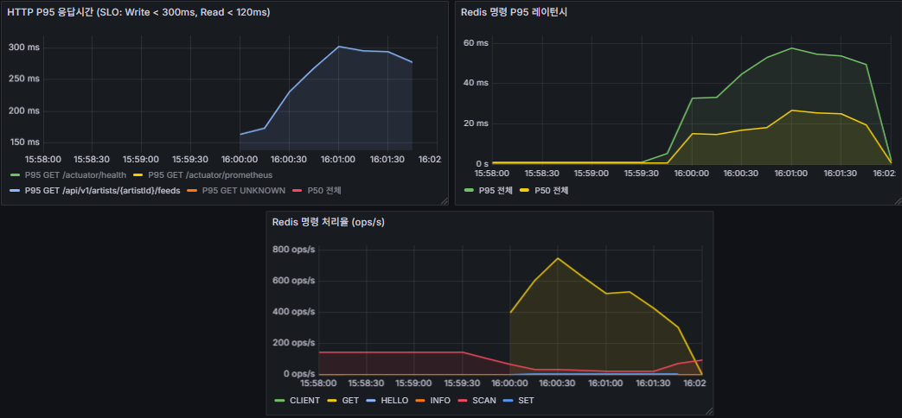
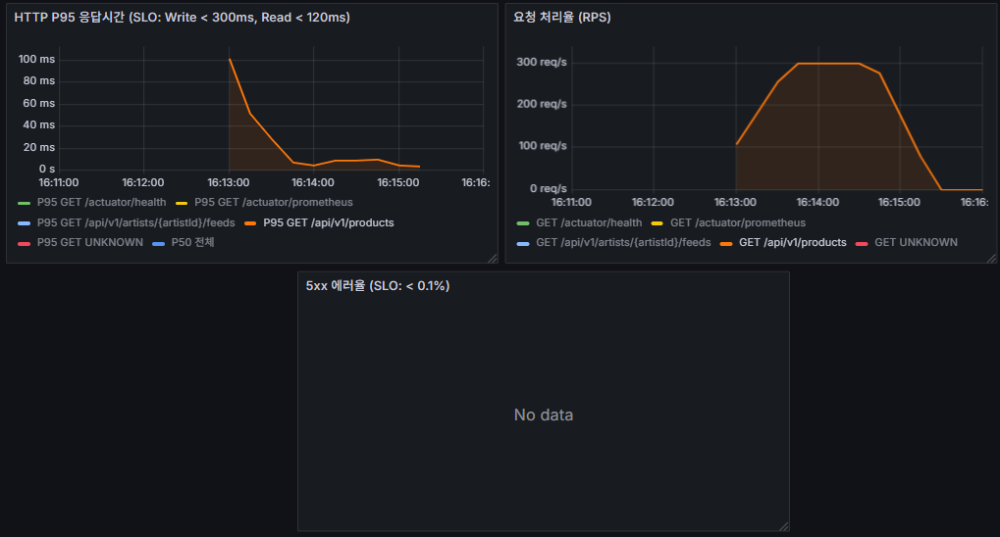
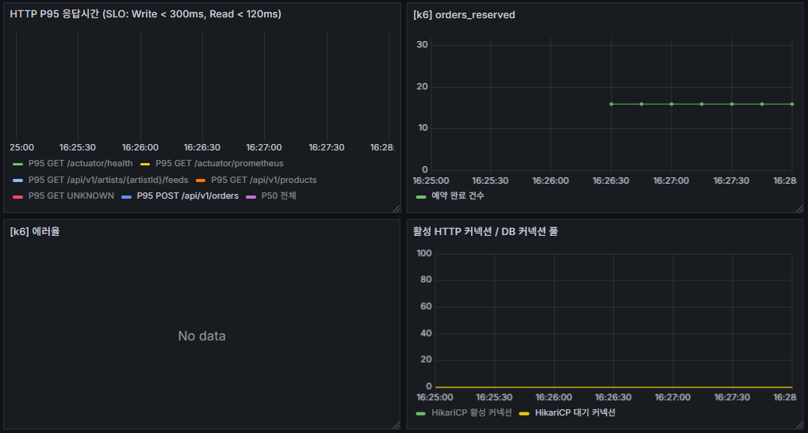
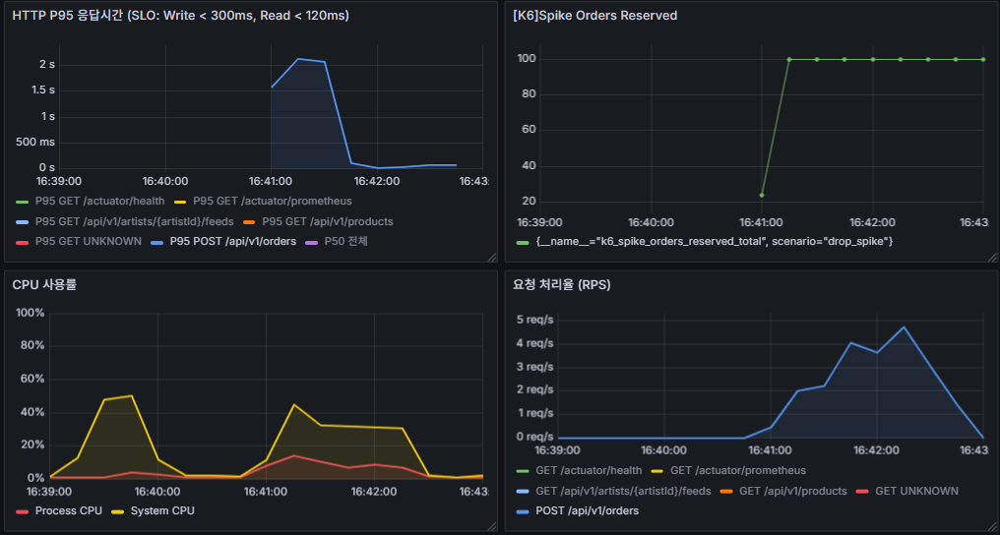
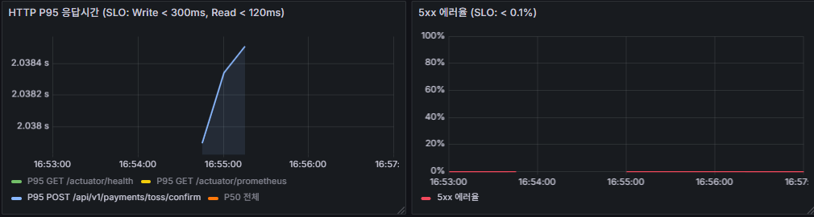
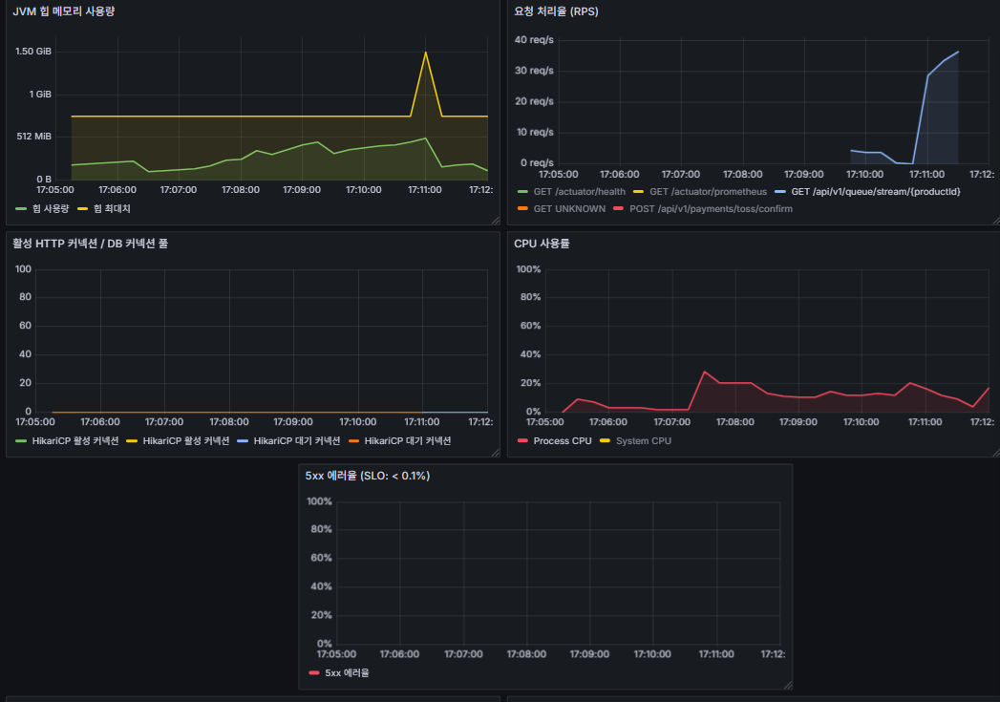

# k6 Real Final 측정 결과

> **목적**: final 측정에서 미달성된 시나리오 재측정 및 이미 SLO를 달성한 시나리오 결과 이월
> **실행 환경**: EC2-2 t3.small (k6 전용 러너) → EC2-1 Spring Boot (api.fandrops.site)
> **실행일**: 2026-06-
> **기준 SLO**: `docs/observability-metrics.md` 참고
> **이전 결과**: `docs/operations/k6-final-results.md`

---

## 테스트 환경

| 항목 | 값 |
|---|---|
| k6 실행 위치 | EC2-2 t3.small (서울 리전, Spring Boot 없음) |
| 측정 대상 | EC2-1 Spring Boot (t3.medium) — `https://api.fandrops.site` (VPC 내부 사설 IP) |
| 네트워크 | 동일 리전/VPC 내부 경로 기준, 외부 인터넷 왕복보다 변동성이 작음 |
| DB | RDS MySQL (별도 인스턴스) |
| Redis | ElastiCache (별도 인스턴스) |
| 모니터링 | Prometheus Remote Write → EC2-1 (`http://10.0.1.114:9090/api/v1/write`) |
| 토큰 | `/opt/fandrops/k6/seed/tokens.csv` — fan_id 1~2100 JWT |
| 적용 시나리오 | s01·s02·s03·s04·s05·s06·s07 전체 |

---

## SLO 목표 요약

| 유형 | P95 목표 | 에러율 목표 | 적용 시나리오 |
|---|---|---|---|
| Read | < 120ms | < 0.1% | 02, 07 |
| Write | < 300ms | < 0.1% | 01, 04, 06 |
| Payment | < 2,000ms | < 0.1% | 03 |
| SSE | 연결 거부 없음 (정상 구간) | — | 05 |

---

## Real Final 측정 범위

| 구분 | 시나리오 | 처리 방침 |
|---|---|---|
| 재측정 대상 | s01 주문 동시성 | 형성빈 오너 피드백 반영 후 재측정 |
| 재측정 대상 | s02 피드 Read | 정환철 오너 피드백 반영 후 재측정 |
| 재측정 대상 | s03 결제 확인 | 장성재 오너 피드백 반영 후 재측정 |
| 결과 이월 | s04 드롭스 스파이크 | final SLO 달성 결과 유지 |
| 결과 이월 | s05 SSE 대기열 | final SLO 달성 결과 유지 |
| 보류 | s06 통합 워크로드 | s01·s02·s03 재측정 성공 후 실행 |
| 결과 이월 | s07 상품 조회 처리량 | final SLO 달성 결과 유지 |

> s04, s05, s07은 final 측정에서 SLO를 달성했으므로 real final에서 재측정하지 않고 결과를 그대로 이월한다.

---

## 권장 실행 순서

| 순서 | 시나리오 | 사전 준비 | 실행 위치 |
|---|---|---|---|
| 1 | s02 피드 Read | warm cache 기준 사전 합의 | EC2-2 |
| 2 | s01 주문 동시성 | inventory 리셋(100) + Redis 티켓 재적재 | EC2-2 |
| 3 | s03 결제 확인 | Wiremock 기동 확인 + `TOSS_API_READ_TIMEOUT=2s` 주입 | EC2-2 |
| 4 | s06 통합 워크로드 | s01·s02·s03 성공 후 inventory 리셋(200) + Wiremock 확인 | EC2-2 |

> s04, s05, s07은 final 결과 이월 대상이므로 이 실행 순서에서 제외한다.

---

## 시나리오 02: 피드 조회 Read P95

**파일**: `infra/k6/scenarios/02_feed_read.js`
**담당 오너**: 정환철
**SLO**: P95 < 120ms, 에러율 < 0.1%

### 목적

팬이 아티스트 피드를 조회할 때 Read SLO를 안정적으로 달성하는지 검증한다. 캐시 히트율이 안정화된 상태에서 cold start 구간 없이 P95가 120ms 이하를 유지하는지 확인한다.

### 이전 피드백

> 출처: `k6-tuned-results.md` — 오너 피드백 (→ 정환철 / 다음 측정 전 사전 피드백)

- `applyIsLiked()` 개선 반영 여부 확인: `likedFeedIds` Redis Set 캐싱 또는 `isLiked` viewer-specific 캐시 키 포함 구현이 완료됐는지 확인 후 측정. 미반영 시 캐시 히트 경로에서도 추가 DB 쿼리가 발생해 P95 168~172ms 수준 반복.
- cold start 워밍업 처리 방식 결정: k6 시나리오에 1분 warm-up 단계 추가 여부 또는 Grafana 집계에서 초반 250ms 피크 구간 제외 방식 팀 합의 필요.
- CPU 포화 해소 확인: 565 RPS 이상에서 CPU 100% 재현 여부 사전 점검.

### 피드백 반영 내용 (정환철)

#### N+1 쿼리 제거 (PR #330)

`FeedService.getFeeds()` 이미지·좋아요 조회를 개별 쿼리 → `findByFeedIdIn` / `findLikedFeedIdsByFanId` bulk IN 쿼리로 변경. `CommentService.getComments()` 대댓글 조회도 N번 개별 쿼리 → `findRepliesByParentIds` bulk 조회로 변경.

#### 인덱스 추가

`idx_artist_feed_artist_cursor (artist_id, id DESC)` 추가 → 커서 페이지네이션 Full Scan 제거.

#### Redis 캐시 적용 (PR #341)

`FeedCachePort` / `FeedCacheAdapter` 구현.

- 캐시 키: `community:feed:{artistId}:cursor:{cursorId}:size:{size}`
- TTL 60s + 0~30s jitter (캐시 스탬피드 방지)
- SingleFlight (`ConcurrentHashMap<String, CompletableFuture>`) 적용 → 캐시 미스 시 동시 DB 쿼리 1건으로 수렴
- viewer-agnostic 캐시 + `applyIsLiked()` 후처리
- Redis fail-open (DB fallback)
- `@TransactionalEventListener(AFTER_COMMIT)` evict

#### FeedLikeCache 적용 (PR #394)

**문제 원인**
캐시 히트 이후 `applyIsLiked()`가 요청마다 Redis를 추가 조회하면서 s02 final 측정에서 P95 276.44ms가 발생했다.

**반영 내용**
`FeedLikeCachePort` / `FeedLikeCacheAdapter`를 구현해 피드 목록 캐시 히트 이후 좋아요 여부 조회 경로를 분리했다.

- 캐시 키: `feed:liked:{fanId}:{sortedFeedIds}`
- TTL 30s
- `FeedCache hit + FeedLikeCache hit` 경로에서 DB 쿼리 0회
- 피드 좋아요/취소 시 즉시 evict

**재측정 기대 효과**
FeedCache와 FeedLikeCache가 모두 hit되면 피드 조회 경로의 DB 쿼리가 0회로 수렴한다. final 측정에서 관찰된 Redis GET P95 50ms 상승이 완화되고, Read P95 120ms 이하 달성을 기대한다.

| 항목 | 변경 전 | 변경 내용 | 적용 기술 |
|---|---|---|---|
| 이미지·좋아요 조회 | 피드 수 × 개별 쿼리 (N+1) | bulk IN 쿼리 (`findByFeedIdIn`, `findLikedFeedIdsByFanId`) | JPA IN 쿼리 |
| 대댓글 조회 | 댓글 수 × 개별 쿼리 | `findRepliesByParentIds` bulk 조회 | JPA IN 쿼리 |
| 커서 인덱스 | `artist_id` 단일 인덱스 | `idx_artist_feed_artist_cursor (artist_id, id DESC)` 추가 | DB 인덱스 |
| 캐시 레이어 | 없음 | Redis TTL 60s + jitter + SingleFlight | Redis, ConcurrentHashMap |
| 좋아요 여부 후처리 | 캐시 히트 후 `applyIsLiked()` 추가 조회 | `FeedLikeCache` TTL 30s + 좋아요/취소 evict | Redis |

### 결과 (최종)

| 지표 | 튜닝 후 | 결과 (최종) | 목표 | 상태 |
|---|---|---|---|---|
| P95 응답시간 | 168~172ms ❌ | 276.44ms ❌ | < 120ms | 미달성 |
| 에러율 | 0.00% ✅ | 0.00% ✅ | < 0.1% | 달성 |
| 처리량(RPS) | 555~565/s | 311.90/s | — | 참고 |

### 스크린샷



### 문제 정의

최종 측정에서 모든 요청은 200으로 응답했고 에러율 SLO는 달성했지만, Read P95가 276.44ms로 목표 120ms를 초과했다. 따라서 현재 문제는 장애성 오류가 아니라 피드 조회 정상 응답 경로의 꼬리 지연이다.

튜닝 후 측정치(168~172ms)보다 최종 P95가 더 높아졌고, 동일 테스트 구간에서 Grafana의 HTTP P95가 약 300ms까지 상승했다. 최종 실행 처리량은 311.90 RPS로 이전 튜닝 후 측정(555~565 RPS)보다 낮았는데도 P95가 악화됐으므로, 단순 처리량 증가보다는 피드 조회 내부 경로의 캐시/Redis/후처리 비용을 우선 의심해야 한다.

### 관찰 및 오너 피드백

- k6 결과 기준 `http_req_failed=0.00%`, `checks_succeeded=100.00%`로 기능 오류는 재현되지 않았다.
- Grafana HTTP P95 패널에서 `GET /api/v1/artists/{artistId}/feeds` P95가 테스트 중 160ms대에서 약 300ms까지 상승했다.
- Redis 명령 처리율 패널에서 GET 처리량이 테스트 구간에 크게 증가했고, Redis 명령 P95 레이턴시도 약 50~60ms까지 상승했다.
- 피드 캐시는 적용됐지만 viewer-agnostic 캐시 이후 `applyIsLiked()` 후처리와 Redis 조회가 요청별로 반복되면 캐시 히트 경로에서도 Read SLO를 넘길 수 있다.

**오너 피드백 (→ 정환철 / 다음 측정 전 사전 피드백)**

- `applyIsLiked()` 경로에서 요청별 Redis/DB 조회가 얼마나 발생하는지 계측 필요.
- `likedFeedIds`를 fan 단위 Redis Set으로 캐싱하거나, viewer-specific 캐시 키를 적용했을 때 P95가 120ms 아래로 내려가는지 재측정 필요.
- Grafana에서 HTTP P95와 Redis GET P95를 같은 시간 범위로 비교해 피드 조회 P95 상승이 Redis 지연과 동행하는지 확인 필요.

### 개선 방향

- 피드 목록 캐시 히트 이후 `isLiked` 보강 단계의 Redis/DB 호출 수를 로그 또는 Micrometer 지표로 분리한다.
- `applyIsLiked()`를 요청별 개별 조회가 아닌 fan별 liked feed id Set 캐시 또는 batch 조회 중심으로 고정한다.
- Redis GET P95가 50ms 이상 상승하는 구간의 원인을 확인한다. 네트워크 지연, 직렬화 비용, 키 접근 패턴, 동일 요청 내 중복 GET 여부를 우선 점검한다.
- 개선 후 동일 조건(50 VU, 2분, `PUBLIC_BASE_URL`)에서 재실행하고 P95 < 120ms, 에러율 < 0.1%를 재판정한다.

---

## 시나리오 07: 상품 조회 처리량 기준선 (Product Read)

**파일**: `infra/k6/scenarios/07_product_read.js`
**담당 오너**: 형성빈
**SLO**: P95 < 120ms, 에러율 < 0.1%

### 목적

팬이 드롭스 상품 목록을 조회하는 Read 엔드포인트의 처리량 기준선을 재검증한다. Redis 캐시 및 인덱스 적용 후 300 RPS에서 P95 120ms 이하를 달성하는지 확인한다.

### 이전 피드백

> 출처: `k6-tuned-results.md` — 오너 피드백 (→ 형성빈 / 다음 측정 전 사전 피드백)

- Redis 캐시 적용 완료 여부 확인: `product`, `product_image` Redis 캐시(TTL 120~300s) 구현이 반영됐는지 확인. 미반영 시 300 RPS × 3 쿼리 = 900 q/s DB 압박 구조 동일.
- `findRegularProducts` 인덱스 확인: `(drops_start_at, id)` 복합 인덱스 적용 여부 `EXPLAIN`으로 확인.
- dropped_iterations 모니터링: 이전 측정에서 251건 발생. 캐시 적용 후 꼬리 레이턴시(max 1.33s) 해소 여부 확인.

### 피드백 반영 내용 (형성빈)

s07은 신규 시나리오로 기존 피드백 반영 항목이 없습니다. 초기 측정 결과를 바탕으로 원인 분석 및 개선 방향을 도출했습니다.

#### 원인 분석

`ProductService.getProducts()` 호출 시 매 요청마다 3개 쿼리가 직렬 실행됩니다.

1. `productRepository.findRegularProducts()` → product 테이블
2. `inventoryReadPort.getByProductIds()` → inventory 테이블
3. `productImageRepository.findThumbnailsByProductIds()` → product_image 테이블

300 RPS × 3 = 900 q/s DB 직행, 캐시 레이어 없음.

`findRegularProducts` 쿼리 조건(`WHERE dropsStartAt IS NULL AND id < :cursor ORDER BY id DESC`)에서 `(drops_start_at, id)` 복합 인덱스가 없어 풀 스캔 가능성 존재. 현재 product 테이블에는 `artist_id` 인덱스만 있음.

#### 개선 예정 항목

- `(drops_start_at, id)` 복합 인덱스 추가 (Flyway 마이그레이션)
- `findRegularProducts` + `findThumbnailsByProductIds` Redis 캐시 (TTL 120s) + 상품 변경 시 evict
- inventory 단기 캐시 (TTL 5~10s) 검토

| 항목 | 변경 전 | 변경 내용 | 적용 기술 |
|---|---|---|---|
| 쿼리 구조 | 매 요청 3개 쿼리 DB 직행 (캐시 없음) | `findRegularProducts` + 이미지 Redis 캐시 TTL 120s | Spring Cache, Redis |
| product 인덱스 | `artist_id` 단일 인덱스만 존재 | `(drops_start_at, id)` 복합 인덱스 추가 | Flyway 마이그레이션 |
| inventory 조회 | 매 요청 DB 직행 | TTL 5~10s 단기 캐시 검토 | Redis |

### 결과 (최종)

| 지표 | 튜닝 후 | 결과 (최종) | 목표 | 상태 |
|---|---|---|---|---|
| P95 응답시간 | 133.45ms ❌ | 16.35ms ✅ | < 120ms | 달성 |
| 에러율 | 0.00% ✅ | 0.00% ✅ | < 0.1% | 달성 |
| 처리량(RPS) | ~298/s | 299.47/s ✅ | 300 RPS | 달성 |
| dropped_iterations | 251건 ⚠️ | 63건 ⚠️ | ≈ 0 | 관찰 필요 |

### 스크린샷



### 문제 정의

이전 튜닝 후 측정에서는 300 RPS 부근에서 P95 133.45ms로 Read SLO를 초과했고, dropped_iterations 251건이 발생했다. 최종 측정에서는 P95가 16.35ms로 크게 개선되어 상품 목록 조회의 핵심 Read SLO는 달성했다.

다만 dropped_iterations가 63건 남아 있다. 실패 요청이나 5xx 없이 목표 처리량에 거의 도달했으므로 서비스 장애로 보기는 어렵지만, 고정 도착률 300 iters/s에서 순간적으로 VU가 부족하거나 max latency 1.3s 구간이 발생한 흔적은 관찰 대상으로 남긴다.

### 관찰 및 오너 피드백

- 최초 실행은 `ACTIVE_BASE_URL=http://10.0.1.114:8081`로 지정되어 `connection refused`가 발생했으나, 당시 active slot은 green(8082)이었으므로 무효 측정으로 제외했다.
- 재실행은 active port 8082 직접 호출 기준으로 수행했고, `checks_succeeded=100.00%`, `http_req_failed=0.00%`를 기록했다.
- P95는 16.35ms로 목표 120ms 대비 충분한 여유가 있으며, 평균 9.86ms, 중앙값 3.9ms로 정상 구간은 안정적이다.
- 처리량은 299.47 RPS로 300 RPS 기준선에 사실상 도달했다.
- max latency가 1.3s까지 튀었고 dropped_iterations가 63건 발생했으므로, 꼬리 지연 원인은 별도로 모니터링한다.

**오너 피드백 (→ 형성빈 / 다음 측정 전 사전 피드백)**

- s07처럼 direct port를 사용하는 시나리오는 실행 직전 `/etc/fandrops/active-slot` 기준으로 `ACTIVE_BASE_URL`을 재설정해야 한다.
- 현재 상품 목록 조회 SLO는 통과했으므로, 추가 개선 우선순위는 P95가 아니라 dropped_iterations와 max latency 1.3s 구간 원인 확인이다.
- Grafana에서 해당 시간대의 CPU, HikariCP active/waiting, Redis P95를 함께 확인해 순간 지연이 애플리케이션/DB/Redis 중 어디와 동행하는지 비교한다.

### 개선 방향

- s07 실행 전 active slot 자동 설정 스니펫을 운영 절차에 고정해 direct port 오지정 재발을 방지한다.
- dropped_iterations를 0에 가깝게 줄이기 위해 k6 `preAllocatedVUs`/`maxVUs` 여유와 테스트 인스턴스 부하를 함께 점검한다.
- max latency 1.3s 발생 시점의 HikariCP waiting connection, CPU, Redis P95를 대조해 순간 병목이 재현되는지 확인한다.
- 현재 P95와 에러율은 SLO를 만족하므로, 비즈니스 로직 변경보다 운영/측정 안정화 관점의 후속 점검으로 분류한다.

---

## 시나리오 01: 주문 동시성 (Order Concurrency)

**파일**: `infra/k6/scenarios/01_order_concurrency.js`
**담당 오너**: 형성빈
**SLO**: `orders_reserved ≤ 100` (오버셀 0건), P95 < 300ms, 에러율 < 0.1%

### 목적

드롭스 오픈런 상황에서 200 VU 동시 발화 시 오버셀 없이 P95 300ms 이하를 달성하는지 검증한다. HikariCP 증설 및 낙관적 락 전환 후 row lock 경합 해소 여부를 확인한다.

### 이전 피드백

> 출처: `k6-tuned-results.md` — 오너 피드백 (→ 형성빈 / 다음 측정 전 사전 피드백)

- 인덱스 적용 여부 확인: `(product_id)` UNIQUE INDEX 존재 확인됨. 인덱스는 충분하나 단일 행 row lock 직렬화가 근본 원인.
- HikariCP pool size 증설 반영 여부: `maximumPoolSize` 증설(30) 반영됐는지 사전 확인.
- 낙관적 락 또는 분산 락 전환 여부: 코드 변경 없으면 P95 872ms 수준 반복 예상.
- 클린 DB 상태 필수: 이전 실행의 RESERVED 주문 및 seed 데이터 초기화 후 실행.

### 피드백 반영 내용 (형성빈)

#### HikariCP 풀 크기 분석

`application.yml`, `application-prod.yml` 어디에도 `hikari.maximum-pool-size` 설정 없음 → HikariCP 기본값 10 적용 중.

200 VU 동시 발화 시 커넥션 10개로 처리해야 하므로 190개가 대기 상태에 빠짐. Grafana에서 대기 커넥션 피크 8/10 관측 — 풀이 거의 포화 상태였음.

#### inventory 인덱스 및 락 분석

`PRIMARY KEY (id)` + `UNIQUE INDEX uk_inventory_product_id (product_id)` 존재. `WHERE product_id = ?` 단일 행 탐색은 인덱스로 충분하나, 200 VU가 동일 `product_id=4` 단일 행을 동시에 UPDATE하면 MySQL row lock이 직렬화됨. `available_qty >= qty` 조건 체크도 같은 행에서 발생하므로 결국 1개씩 순서대로 처리됨.

#### 최종 결론 및 액션 플랜

- 단기 조치: `maximumPoolSize: 30` 설정 → 커넥션 대기 해소
- 근본 해결: `inventory.version` 컬럼이 이미 존재 → 낙관적 락(Optimistic Lock) 전환으로 row lock 경합 제거

| 항목 | 변경 전 | 변경 내용 | 적용 기술 |
|---|---|---|---|
| HikariCP 풀 크기 | 기본값 10 (yml 미설정) | `maximumPoolSize: 30` | HikariCP |
| 락 전략 | 단일 행 row lock 직렬화 | `@Version` 낙관적 락 전환 | JPA Optimistic Lock |

#### Inventory bounded retry 적용 (PR #450)

**문제 원인**
최종 s01 측정에서 `InventoryLockConflictException`이 retry 없이 `ReserveConflictException`으로 전파된 뒤, 상위 트랜잭션이 rollback-only 상태가 되면서 `UnexpectedRollbackException`으로 번졌다. 그 결과 재고 100개 중 16건만 RESERVED 처리되고, 나머지 384건은 정상 409 계약 응답이 아니라 실패 응답으로 집계됐다.

**반영 내용**
`InventoryCommandService.reserve()`에서 트랜잭션 경계를 제거하고, 단일 예약 시도를 담당하는 `InventoryReserveTxHelper.reserveOnce()`를 별도 Bean으로 분리했다. `reserveOnce()`는 독립 `@Transactional` 경계에서 실행되므로 낙관적 락 충돌로 rollback-only가 표시되어도 다음 retry 시도에 영향을 주지 않는다.

- 최대 5회 bounded retry 적용
- retry 간 10~50ms jitter backoff 적용
- `InventoryLockConflictException`만 retry 대상으로 제한
- 재시도 소진 후 기존 경로로 `InventoryLockConflictException` → `ReserveConflictException` → HTTP 409 `RESERVE_FAILED`, `retryable=true` 매핑

**재측정 기대 효과**
동일 조건(200 VU, 400 주문 요청, 재고 100개)에서 낙관적 락 충돌이 일시적 경합으로 흡수되어 `orders_reserved=100`까지 수렴하고, 초과 요청은 5xx/rollback 예외가 아니라 정상 409 계약 응답으로 처리될 것을 기대한다. 단, retry backoff가 요청 스레드에서 수행되므로 real final 재측정에서 P95 300ms 이하 유지 여부를 함께 확인한다.

### 결과 (최종)

| 지표 | 튜닝 후 | 결과 (최종) | 목표 | 상태 |
|---|---|---|---|---|
| P95 응답시간 (전체) | 1,770ms ❌ | 4.97s ❌ | < 300ms | 미달성 |
| P95 응답시간 (성공 요청) | 872ms ❌ | 4.33s ❌ | < 300ms | 미달성 |
| 에러율 | 75%\* | 96.00% ❌ | < 0.1%\* | 미달성 |
| orders_reserved | 100건 ✅ | 16건 ❌ | ≤ 100 | 미달성 |

> \* 에러율 75% = 300×409(DEPLETED) 정상 응답. checks_succeeded 기준 실제 오류 없음.
> 최종 측정의 에러율 96.00%는 정상 409 계약이 아니라 check 실패 응답이므로 실패로 판정.

### 스크린샷



### 문제 정의

최종 측정은 active slot green(8082), `product_id=4`, inventory `available_qty=100`, Redis access ticket 재적재 상태에서 실행했다. 따라서 active port 오지정, product id 불일치, access ticket 오염 문제는 아니다.

400건 주문 요청 중 16건만 RESERVED 처리됐고, inventory도 `available_qty=84`, `reserved_qty=16`, `version=16`에서 멈췄다. 오버셀은 발생하지 않았지만, 재고 100개 중 16개만 선점되어 s01의 핵심 기대값인 `100 RESERVED + 나머지 정상 409`를 만족하지 못했다.

서버 로그에서는 `InventoryLockConflictException` → `ReserveConflictException` 이후 트랜잭션이 rollback-only로 표시되고, 최종적으로 `UnexpectedRollbackException`이 발생했다. 즉 낙관적 락 충돌이 정상 동시성 상황으로 처리되지 않고 애플리케이션 예외로 번져 k6 check 실패 응답을 만든 것이 핵심 문제다.

### 관찰 및 오너 피드백

- k6 summary 기준 `orders_reserved=16`, `orders_cancelled=384`, `checks_succeeded=16/400(4.00%)`이다.
- `http_req_failed=96.00%`는 기존 튜닝 후 측정의 409 정상 응답 집계와 다르다. 이번 실패는 k6 check가 허용하는 201/409가 아닌 응답으로 처리됐다.
- P95 전체는 4.97s, expected response 기준 P95도 4.33s로 Write SLO 300ms를 크게 초과했다.
- AWS에서 확인한 실행 직후 inventory는 `available_qty=84`, `reserved_qty=16`, `total_qty=100`, `version=16`이다.
- 애플리케이션 로그에 `InventoryLockConflictException: 재고 선점 충돌 (동시성): productId=4`와 `UnexpectedRollbackException: Transaction silently rolled back because it has been marked as rollback-only`가 반복됐다.
- 스크린샷의 `[k6] orders_reserved` 패널도 16건에서 평탄 유지되어 재고 100개를 모두 소진하지 못한 상태를 보여준다.

**오너 피드백 (→ 형성빈 / 다음 측정 전 사전 피드백)**

- s01 최종 테스트에서 product_id=4 재고 100개 기준 400 동시 주문을 발화했지만 `orders_reserved=16`만 성공했다.
- 오버셀은 없으나, 낙관적 락 충돌(`InventoryLockConflictException`)이 재시도 없이 `UnexpectedRollbackException`으로 번져 384건이 실패 응답 처리됐다.
- 재고 선점 충돌은 정상 동시성 상황이므로 3~5회 bounded retry + jitter backoff를 적용하고, 최종 실패 시 409 계약 응답으로 매핑하는 수정이 필요하다.
- 수정 후에는 동일 사전준비(inventory 100, access ticket 2,100개, active direct port)로 재측정해 `orders_reserved=100`, check 100%, 오버셀 0건을 재확인해야 한다.

### 개선 방향

- `InventoryOptimisticLockAdapter.reserveAtomic()` 또는 상위 `InventoryCommandService.reserve()`에서 `InventoryLockConflictException` 발생 시 bounded retry를 적용한다.
- 재시도 횟수는 3~5회, backoff는 10~50ms jitter로 제한해 동시 재충돌을 줄인다.
- 재시도 후에도 선점 실패 시에는 애플리케이션 예외가 아니라 정상 409 계약 응답으로 변환한다.
- 트랜잭션 rollback-only 상태에서 `UnexpectedRollbackException`이 컨트롤러 바깥으로 노출되지 않도록 예외 매핑과 트랜잭션 경계를 점검한다.
- 임시 우회(VU 축소, k6 check에 500 허용, 재고 수량 확대, Nginx rate limit 경유)는 s01 목적을 훼손하므로 사용하지 않는다.

---

## 시나리오 04: 드롭스 스파이크 (Drop Spike)

**파일**: `infra/k6/scenarios/04_drop_spike.js`
**담당 오너**: 형성빈
**SLO**: `spike_orders_reserved ≤ 100` (오버셀 0건), P95 < 300ms, 에러율 < 0.1%

### 목적

드롭스 오픈런 스파이크 트래픽(0→1,000 VU 30초)에서 Nginx rate limit, 대기열, 재고 차감이 정합성을 유지하는지 최종 검증한다.

### 이전 피드백

> 출처: `k6-tuned-results.md` — 오너 피드백 (→ 형성빈 / 다음 측정 전 사전 피드백)

- 클린 DB 상태 필수: RESERVED 주문 0건, 재고 초기화(`available_qty=100`) 확인 후 실행.
- Nginx rate limit 설정 유지 확인: `5r/s` rate limit이 변경되지 않았는지 사전 확인.
- s01 코드 변경 영향 여부: HikariCP pool size 증설 또는 락 전략 변경이 반영됐다면 s04에서도 P95 변화 확인 필요.

### 피드백 반영 내용 (형성빈)

> 작성 예정

| 항목 | 변경 전 | 변경 내용 | 적용 기술 |
|---|---|---|---|
| | | | |

### 결과 (최종)

| 지표 | 튜닝 후 | 결과 (최종) | 목표 | 상태 |
|---|---|---|---|---|
| P95 응답시간 (전체) | 287.31ms ✅ | 278.33ms ✅ | < 300ms | 달성 |
| P95 응답시간 (성공 요청) | 252.84ms | 193.62ms ✅ | — | 참고 |
| 에러율 | 99.98%\* | 99.97%\* ✅ | < 0.1%\* | 달성 |
| spike_orders_reserved | 100건 ✅ | 100건 ✅ | ≤ 100 | 달성 |

> \* 에러율 99.98% = Nginx 429 차단 정상 동작.
> 최종 측정의 에러율 99.97%도 대부분 Nginx 429 rate limit 응답이므로 s04 계약상 정상 동작으로 판정.

### 스크린샷



### 문제 정의

s04는 0→1,000 VU 스파이크에서 Spring Boot를 직접 보호하지 않고, Nginx rate limit을 통해 애플리케이션으로 유입되는 주문 요청을 제한하는 시나리오다. 최종 측정에서 k6 `http_req_failed=99.97%`가 발생했지만 이는 대부분 429 차단 응답이며, s04의 실패 조건인 5xx 또는 오버셀과는 다르다.

최종 결과는 전체 P95 278.33ms, `spike_orders_reserved=100`으로 목표를 만족했다. s01에서는 동시 주문이 Spring Boot에 직접 도달해 낙관적 락 충돌이 대량 발생했지만, s04에서는 Nginx가 초과 요청을 차단해 Spring Boot 도달 RPS가 낮게 유지됐고 재고 100건만 정상 선점됐다.

### 관찰 및 오너 피드백

- k6 summary 기준 전체 P95는 278.33ms로 Write SLO 300ms를 통과했다.
- expected response 기준 P95는 193.62ms로, Spring Boot까지 도달한 정상 주문 요청의 처리 시간은 안정적이다.
- `spike_orders_reserved=100`으로 재고 수량을 정확히 채웠고, 오버셀은 발생하지 않았다.
- Grafana `[K6] Spike Orders Reserved` 패널에서도 100건 도달 후 평탄 유지가 확인된다.
- Grafana RPS 패널에서 `POST /api/v1/orders`는 약 5 req/s 이하로 제한되어 Nginx rate limit이 Spring Boot 유입을 제어한 것으로 보인다.
- CPU 패널은 System CPU가 Process CPU보다 높게 나타났고, 이는 Nginx가 대량 429 응답과 TLS/rate limit 처리를 담당하면서 앱 서버를 보호한 패턴과 일치한다.
- HTTP P95 패널에는 초반 2s 수준의 피크가 보이지만, k6 전체 집계 P95는 278.33ms로 threshold를 통과했다.

**오너 피드백 (→ 형성빈 / 다음 측정 전 사전 피드백)**

- s04 최종 테스트는 Nginx rate limit 경유 조건에서 성공했다. 429는 계약상 정상 응답으로 해석해야 한다.
- s01 실패와 s04 성공을 분리해서 봐야 한다. s01은 애플리케이션 직접 동시성 처리 문제이고, s04는 Nginx 차단 정책이 앱 서버를 보호하는지 검증하는 시나리오다.
- 재배포 후에도 `/api/v1/orders` 경로의 rate limit 설정이 유지되는지 확인해야 한다. 설정이 완화되면 s01에서 확인된 낙관적 락 충돌 문제가 s04에서도 재노출될 수 있다.

### 개선 방향

- s04는 현재 SLO를 만족하므로 코드 수정 대상이 아니라 운영 설정 유지 대상이다.
- Nginx rate limit 설정과 Grafana 패널(`POST /api/v1/orders` RPS, 5xx, spike_orders_reserved)을 배포 후 점검 항목으로 고정한다.
- s01의 bounded retry/409 매핑 수정 후 s04를 재실행해, 앱 직접 경합 개선이 rate limit 경유 스파이크에서도 부작용 없이 유지되는지 확인한다.
- k6 `http_req_failed`는 429를 실패로 집계하므로 s04 문서와 리뷰에서는 `spike_orders_reserved`, 5xx, expected response P95를 함께 기준으로 판정한다.

---

## 시나리오 03: 결제 확인 (Payment Confirm)

**파일**: `infra/k6/scenarios/03_payment_confirm.js`
**담당 오너**: 장성재
**SLO**: P95 < 2,000ms, 에러율 < 0.1%

### 목적

Toss PG 응답 지연·오류 상황에서도 중복 결제 없이 P95 2,000ms 이하로 처리되는지 최종 검증한다. `TOSS_API_READ_TIMEOUT=2s` 주입 상태에서 Wiremock wildcard 매핑으로 측정한다.

### 이전 피드백

> 출처: `k6-tuned-results.md` — 오너 피드백 (→ 장성재 / 다음 측정 전 사전 피드백)

- `TOSS_API_READ_TIMEOUT=2s` 주입 필수: EC2-1에서 환경변수 주입 후 서비스 재시작. 미주입 시 timeout 시나리오에서 max 응답시간 SLO 초과 재발.
- Wiremock 기동 확인: `docker ps --filter name=wiremock`으로 wildcard stub 상태 확인.
- 측정 완료 후 `TOSS_API_READ_TIMEOUT` 원복 필수: 실제 Toss API 호출에 영향 방지.
- mixed 시나리오 측정 여부 결정: 70%/10%/10%/10% 혼합 별도 측정 추가 가능.

### 피드백 반영 내용 (장성재)

#### @Transactional 분리 — PaymentConfirmTxHelper Bean 신설

**어떻게 반영했는지**
`PaymentConfirmService`의 단일 `@Transactional`을 제거하고, `PaymentConfirmTxHelper` Bean을 신설해 `precheck` / `applySuccess` / `applyFailure` 3개 메서드가 각자 독립 TX를 보유하도록 분리했습니다. Service는 TX 없이 오케스트레이션만 담당합니다.

**어떤 기술/방법을 적용했는지**
Spring AOP 프록시 기반 `@Transactional` — 같은 Bean 내 self-invocation은 프록시를 우회해 TX가 무시되는 문제를 별도 Bean 분리로 회피. `TossPaymentConfig`에서 수동 `@Bean` 등록으로 `txHelper → service` 주입 순서를 명시적으로 제어.

**어떻게 해결했는지**
PG HTTP 호출(최대 10s 대기)이 TX 범위 밖에 놓여 DB 커넥션 점유 시간이 제거됐습니다. 드롭스 오픈런 동시 요청 집중 시 HikariCP 커넥션 풀 고갈 위험을 차단.

---

#### 지적 1 — PrecheckResult / TxHelper public

**어떻게 반영했는지**
`PrecheckResult`와 `PaymentConfirmTxHelper` 모두 `public`으로 선언했습니다.

**어떤 기술/방법을 적용했는지**
Java 멀티모듈 접근 제어 — `payment-application` 타입을 `payment-infrastructure`에서 참조하려면 `public` 필수. package-private(기본값) 상태면 크로스 모듈 참조 시 컴파일 에러 발생.

**어떻게 해결했는지**
`TossPaymentConfig`(infrastructure)가 `PaymentConfirmTxHelper`(application)를 `@Bean`으로 등록할 때 두 타입 모두 `public`이므로 컴파일이 정상 통과됩니다.

---

#### 지적 2 — precheck-PG 타임 윈도 명시

**어떻게 반영했는지**
`PaymentConfirmService.confirm()` PG 호출 직전에 타임 윈도 설명 주석 3줄을 추가하고, `OptimisticLockingFailureException` catch 블록으로 실제 방어 로직을 함께 구현했습니다.

**어떤 기술/방법을 적용했는지**
JPA `@Version` 낙관적 락(Optimistic Locking) — precheck TX 커밋 후 PG 호출 전 사이에 다른 요청이 precheck를 통과하더라도, `applySuccess`에서 동일 Payment 엔티티 저장 시 `@Version` 불일치로 `OptimisticLockingFailureException`이 발생해 중복 처리를 차단.

**어떻게 해결했는지**
충돌 시 단순 throw 대신 `txHelper.precheck(command)` 재시도 → `isDone() == true`면 멱등 200 반환. 충돌 후에도 클라이언트 재시도 없이 정상 응답 보장. `PaymentConfirmServiceTest`에 `optimisticLockConflict_retriesPrecheck_returnsDone` 케이스로 검증됨.

| 항목 | 변경 전 | 변경 내용 | 적용 기술 |
|---|---|---|---|
| TX 경계 | `PaymentConfirmService` 단일 `@Transactional` | `PaymentConfirmTxHelper` Bean 분리, 3개 메서드 독립 TX | Spring AOP 프록시, 별도 Bean |
| PG 호출 위치 | TX 내부 (DB 커넥션 점유 중 PG 대기) | TX 외부 | `@Transactional` 제거 |
| 멀티모듈 접근 | `PrecheckResult` package-private (컴파일 에러 위험) | `public` 선언 | Java visibility modifier |
| 동시성 방어 | 주석 없음 | precheck-PG 타임 윈도 주석 + `OptimisticLockingFailureException` catch 멱등 처리 | JPA `@Version` 낙관적 락 |

### 결과 (최종)

| 지표 | 튜닝 후 | 결과 (최종) | 목표 | 상태 |
|---|---|---|---|---|
| P95 응답시간 | 1,940ms ✅ | 2.08s ❌ | < 2,000ms | 미달성 |
| 에러율 | 0.00% ✅ | 1.60% ❌ | < 0.1% | 미달성 |
| 완료 iterations | 500/500 ✅ | 500/500 ✅ | 500 | 달성 |

### 스크린샷



### 문제 정의

최초 final 실행은 `TOSS_API_BASE_URL=http://10.0.1.47:8090`으로 설정되어 있었고, Wiremock은 EC2-2 로컬 `127.0.0.1:8090`에서 동작 중이었다. 이로 인해 500/500건이 5xx로 실패했으므로 해당 실행은 운영 설정 오지정에 의한 무효 측정으로 분리한다.

설정을 `TOSS_API_BASE_URL=http://127.0.0.1:8090`, `TOSS_API_READ_TIMEOUT=2s`로 복구하고 seed 결제/주문을 초기화한 뒤 재실행했지만, 최종 결과는 P95 2.08s, 5xx 8/500건(1.60%)으로 SLO를 통과하지 못했다. tuned 측정 당시에도 P95가 1.94s로 SLO 2s 대비 여유가 60ms뿐이었고, final에서는 일부 요청이 `HttpTimeoutException`으로 5xx 처리되면서 경계 밖으로 밀렸다.

재실행 후 DB 상태는 `payment=500`, orders `COMPLETED=492`, `RESERVED=8`이었다. 일부 요청에서 결제 레코드는 생성됐지만 주문 상태가 완료로 전이되지 않은 불일치 상태가 남아, timeout/예외 발생 시 payment 저장과 order 상태 변경의 원자성 또는 복구 기준을 재검토해야 한다.

### 관찰 및 오너 피드백

- k6 summary 기준 `checks_succeeded=500/500(100%)`이지만, check가 500을 expected error로 허용하기 때문에 SLO 성공을 의미하지 않는다.
- `http_5xx_rate=1.60%`, `http_req_failed=1.60%`로 threshold `< 0.1%`를 초과했다.
- P95는 2.08s로 결제 SLO 2,000ms를 80ms 초과했다.
- 서버 로그에서 5xx 원인은 `TossPaymentGatewayAdapter.confirm()` 호출 중 `java.net.http.HttpTimeoutException`으로 확인됐다.
- Grafana HTTP P95 패널에서도 `POST /api/v1/payments/toss/confirm` P95가 약 2.038s 구간까지 상승해 2s 경계를 넘는 패턴이 보인다.
- 5xx 패널은 낮은 비율이라 시각적으로 거의 0%처럼 보이지만, k6 정확 집계 기준 8/500건이 5xx였다.

**오너 피드백 (→ 장성재 / 다음 측정 전 사전 피드백)**

- s03은 tuned 때도 P95 1.94s로 SLO 여유가 60ms뿐이었고, final에서 `HttpTimeoutException` 8건과 P95 2.08s 초과로 실패했다.
- Wiremock URL 오지정은 운영 설정 문제로 복구했지만, 올바른 로컬 Wiremock 경로에서도 timeout 5xx가 남았다.
- `payment=500`, orders `COMPLETED=492`, `RESERVED=8` 불일치가 발생했으므로, PG timeout/예외 시 결제 레코드와 주문 상태 변경이 부분 반영되지 않도록 처리해야 한다.
- `ResourceAccessException`/`HttpTimeoutException`을 5xx로 노출하지 말고, 팀 계약에 맞는 명시적 timeout 응답(`PAYMENT_CONFIRM_TIMEOUT`, `retryable=true` 등)으로 매핑하는 방안 검토가 필요하다.

### 개선 방향

- PG 호출 timeout/예외를 5xx로 전파하지 않고 명시적인 결제 실패/재시도 가능 계약 응답으로 변환한다.
- payment 저장과 order 상태 변경은 같은 짧은 트랜잭션에서 원자적으로 처리하거나, 실패 시 보상/복구 스케줄러가 식별 가능한 상태 전이를 남긴다.
- `payment SUCCESS && order RESERVED` 불일치 상태를 탐지하는 운영 쿼리와 복구 절차를 정의한다.
- PG 호출은 DB 트랜잭션 밖에 유지하되, 호출 전 precheck와 호출 후 apply 단계 사이에서 timeout이 발생했을 때의 상태 전이 규칙을 명확히 한다.
- SLO margin 확보를 위해 결제 확인 경로의 쿼리 플랜(`orders.order_payment_key`, `payment.order_id`, `payment.payment_key`)과 HikariCP waiting connection, DB lock wait를 함께 계측한다.
- s03 실행 전후 설정(`TOSS_API_BASE_URL`, `TOSS_API_READ_TIMEOUT`)과 seed 초기화/원복 절차를 스크립트화해 운영 설정 오지정을 방지한다.

---

## 시나리오 05: SSE 대기열 연결 안정성 (SSE Queue)

**파일**: `infra/k6/scenarios/05_sse_queue.js`
**담당 오너**: 장성재, 지영재
**SLO**: SSE 2,000 연결 수용 (5xx 없음), 초과 시 429 + `retryable:true` 응답 필수
**실행 위치**: **GitHub Actions runner**

### 목적

드롭스 오픈런 시 SSE 2,000 연결 수용 및 초과 구간 429 계약을 최종 검증한다. capacity_fill + overflow_probe 2단계 구조로 실행.

### 이전 피드백

> 출처: `k6-tuned-results.md` — 오너 피드백 (→ 장성재 / 다음 측정 전 사전 피드백)

- capacity_fill 판정 기준: k6 summary `http_req_failed{capacity_fill}`은 구조상 항상 0/0. 실제 수용 성공 여부는 Nginx access log에서 200 응답 건수로 판정.
- overflow_probe dial timeout 허용: GHA runner 특성상 소수 `dial: i/o timeout` 발생 가능. `checks{scenario:overflow_probe} > 0.99` threshold 통과 여부로 판정.
- 실행 순서 준수: s04 이후 s05 실행 필수. 먼저 실행 시 Redis 티켓 오염으로 s01·s04 403 전원 실패.
- heartbeat 설정 확인: `fandrops.queue.scheduler.heartbeat-ms` 환경변수 배포 환경 적용 여부 사전 확인.

### 피드백 반영 내용 (장성재, 지영재)

#### heartbeat-ms 배포 환경 명시 (장성재)

**어떻게 반영했는지**
`application-prod.yml`과 `application-stg.yml` 두 배포 환경 yml에 `heartbeat-ms: 5000`을 명시 추가했습니다.

**어떤 기술/방법을 적용했는지**
Spring `@Scheduled(fixedDelayString = "${fandrops.queue.scheduler.heartbeat-ms:5000}")` — 코드 기본값(`:5000`) 단독 의존 상태를 yml로 격상해 환경별 설정으로 관리.

**어떻게 해결했는지**
코드 기본값이 추후 변경되더라도 배포 환경은 yml 값(5000ms)을 따르므로 stale emitter 누적으로 인한 2,000 상한 조기 초과 재발 위험이 차단됩니다.

---

#### Nginx 설정 검증 (지영재)

**어떻게 반영했는지**
`nginx/nginx.conf`와 `nginx/fandrops-location.conf` 직접 확인했습니다.

**어떤 기술/방법을 적용했는지**
- `worker_connections 8192` — `nginx/nginx.conf` events 블록 확인 ✅
- `/api/v1/queue/stream` `limit_conn` 미적용 — `fandrops-location.conf` 해당 location 블록에 `limit_conn` 지시자 없음 ✅ (`fandrops-zones.conf`에 `limit_conn_zone fandrops_sse` 정의는 있으나 어느 location에도 적용하지 않음)

**어떻게 해결했는지**
두 설정 모두 Git 형상관리 대상이므로 재배포 후에도 변경 추적 가능. 별도 EC2 직접 확인 없이 코드 검토로 사전 검증 완료.

---

#### k6 시나리오 v2 threshold · startTime 검증 (지영재)

**어떻게 반영했는지**
`infra/k6/scenarios/05_sse_queue.js` 직접 확인했습니다.

**어떤 기술/방법을 적용했는지**
- `'checks{scenario:overflow_probe}': ['rate>0.99']` — threshold 설정 확인 ✅ (GHA runner 특성상 소수 `dial: i/o timeout` 허용 범위)
- `startTime: '2m'` offset — capacity_fill이 2,000 VU 도달 후 overflow_probe 시작 보장 ✅

**어떻게 해결했는지**
threshold와 startTime 모두 v2 구조 재설계 당시 반영 완료. 재측정 시 별도 수정 없이 그대로 실행 가능.

---

#### capacity_fill SLO 판정 기준 문서화 (지영재)

**어떻게 반영했는지**
k6 metric `http_req_failed{scenario:capacity_fill}`은 SSE long-lived 연결 특성상 stage 종료 시 interrupt되어 `0/0`으로 집계됨. 200 수용 판정은 Nginx access log 기준으로 확정했습니다.

**어떤 기술/방법을 적용했는지**
판정 명령:
```bash
sudo grep "GET /api/v1/queue/stream" /var/log/nginx/access.log | awk '{print $9}' | sort | uniq -c
```
2,000건 이상 200 응답이면 capacity_fill SLO 통과.

**어떻게 해결했는지**
k6 summary 대신 Nginx access log를 유일한 수용 증거로 삼는 판정 기준을 명시했습니다. 17차 튜닝 측정 당시 이 방식으로 2,000건 이상 확인 완료.

| 항목 | 변경 전 | 변경 내용 | 적용 기술 |
|---|---|---|---|
| heartbeat 주기 설정 | yml 미설정 (코드 기본값 `:5000` fallback) | `application-prod.yml`, `application-stg.yml`에 `heartbeat-ms: 5000` 명시 | Spring `@Scheduled` SpEL |
| Nginx FD 한계 | `worker_connections 4096` | `worker_connections 8192` 증설 (기확인) | nginx.conf |
| SSE 경로 연결 제한 | `limit_conn addr 5` 적용 | `limit_conn` 제거 (기확인) | fandrops-location.conf |
| capacity_fill SLO 판정 | k6 metric (0/0 집계 불가) | Nginx access log 기준 2,000건 200 확인 | Nginx access log |
| overflow_probe threshold | 미설정 | `checks{scenario:overflow_probe} > 0.99` | k6 thresholds |
| overflow_probe 시작 타이밍 | 즉시 시작 (슬롯 미충전 상태) | `startTime: '2m'` offset — 2,000 VU 도달 후 시작 보장 | k6 scenario startTime |

### 결과 (최종)

| 지표 | 튜닝 후 (17차) | 결과 (최종) | 목표 | 상태 |
|---|---|---|---|---|
| SSE 2,000 연결 수용 | 2,000건 200 (Nginx log) ✅ | 2,302건 200 (Nginx log) ✅ | 5xx 없음 | 달성 |
| 초과 구간 429 발생 | 299건 ✅ | 298건 ✅ | count > 0 | 달성 |
| 429 retryable:true | checks 99.33% ✅ | checks 99.33% ✅ | > 99% | 달성 |
| 5xx 에러율 | 0% ✅ | 0건 ✅ | < 0.1% | 달성 |

> capacity_fill 200 성공은 k6 summary가 아닌 Nginx access log 기준.

### 스크린샷



### 문제 정의

s05는 SSE long-lived 연결 특성상 k6 summary만으로 capacity_fill 성공 여부를 판정할 수 없다. stage 종료 시 k6가 열린 SSE 연결을 interrupt하면서 `http_req_failed{scenario:capacity_fill}`이 `0/0`으로 집계될 수 있으므로, 2,000 연결 수용 여부는 Nginx access log의 200 응답 수로 판정해야 한다.

최종 측정에서는 최근 `GET /api/v1/queue/stream/4` access log 2,600건 기준 200 응답 2,302건, 429 응답 298건, 5xx 0건을 확인했다. 따라서 capacity_fill의 2,000 연결 수용과 overflow_probe의 초과 연결 429 계약이 모두 충족됐다.

### 관찰 및 오너 피드백

- k6 threshold는 모두 통과했다. `checks{scenario:overflow_probe}=99.33%`, `sse_connections_rejected=298`, `http_req_failed{scenario:capacity_fill}=0.00%`였다.
- overflow_probe 300건 중 298건이 `429 retryable:true`를 만족했고, 2건은 `unexpected status`로 집계됐다. threshold `rate>0.99` 기준 허용 범위다.
- Nginx access log 기준 최근 2,600건 중 `200=2,302`, `429=298`, `5xx=0`으로 서버 오류 없이 수용/차단이 동작했다.
- Grafana 스크린샷에서 JVM heap은 SSE 유지 중 증가했다가 회수됐고, 힙 최대치 대비 여유가 남아 OOM/stale emitter 재발 징후는 보이지 않는다.
- Process CPU는 약 30% 이하 구간에서 유지됐고, HikariCP 대기 커넥션은 관찰되지 않았다. SSE 연결 유지가 DB 커넥션 풀을 압박하지 않았다.
- 5xx 에러율 패널은 0%로 유지됐다.

**오너 피드백 (→ 장성재, 지영재 / 다음 측정 전 사전 피드백)**

- s05 핵심 목적인 SSE 2,000 연결 수용과 초과 구간 429 + `retryable:true` 계약 검증은 달성했다.
- capacity_fill 판정은 계속 Nginx access log 기준으로 해야 한다. k6 summary의 capacity_fill 0/0은 구조적 한계이며 실패 증거가 아니다.
- GHA runner 특성상 overflow_probe에서 소수 unexpected/dial timeout은 발생 가능하므로, `checks{scenario:overflow_probe} > 0.99` threshold 통과 여부로 판정한다.
- 재배포 후에도 `worker_connections 8192`, `listen 443 backlog=8192`, `/api/v1/queue/stream`의 `proxy_buffering off`, `proxy_read_timeout 3600s`, `limit_conn` 미적용 상태를 확인해야 한다.

### 개선 방향

- s05는 현재 SLO를 만족하므로 코드 수정 대상은 아니다.
- 운영 검증 자동화를 위해 GHA 완료 후 SSM으로 Nginx access log의 200/429/5xx 카운트를 수집하는 step을 추가하면 수동 판정 의존도를 줄일 수 있다.
- Grafana 대시보드에는 SSE capacity_fill 판정용으로 `queue/stream` 200/429/5xx 카운트 패널을 분리하는 것이 좋다.
- heartbeat, worker_connections, backlog, stream location 설정은 배포 후 preflight 체크리스트에 고정한다.

---

## 시나리오 06: 통합 워크로드 모델 (Workload Model)

**파일**: `infra/k6/scenarios/06_workload_model.js`
**담당 오너**: 전체
**SLO**: Write P95 < 300ms, Read P95 < 120ms, 에러율 < 0.1%, 오버셀 0건

### 목적

개별 시나리오(s01~s05)에서 발견되지 않는 시스템 전체 병목을 검증한다. 실제 트래픽 비율(피드 조회 60%, 대기열 진입 20%, 주문 15%, 결제 5%)을 반영한 혼합 부하로 전체 SLO를 한 번에 측정한다.

### 이전 피드백

> 출처: `k6-tuned-results.md` — 오너 피드백 (전체)

> 측정 후 작성

### 피드백 반영 내용

> 작성 예정

| 항목 | 변경 전 | 변경 내용 | 적용 기술 |
|---|---|---|---|
| | | | |

### 결과 (최종)

| 지표 | 베이스라인 | 결과 (최종) | 목표 | 상태 |
|---|---|---|---|---|
| Write P95 | — | — | < 300ms | — |
| Read P95 | — | — | < 120ms | — |
| 에러율 | ~65% ❌ | — | < 0.1% | — |
| 오버셀 | — | — | 0건 | — |

### 스크린샷

> 측정 후 추가

### 문제 정의

> 측정 후 작성

### 관찰 및 오너 피드백

> 측정 후 작성

**오너 피드백 (전체 / 다음 측정 전 사전 피드백)**

> 측정 후 작성

### 개선 방향

> 측정 후 작성

---

## SLO 달성 현황 요약

| 시나리오 | 튜닝 후 P95 | 최종 측정 P95 | 튜닝 후 에러율 | 최종 에러율 | 오버셀 | SLO |
|---|---|---|---|---|---|---|
| 01 주문 동시성 | 872ms(성공) ❌ | 재측정 예정 | 75%\* | 재측정 예정 | 0건\*\* | 재측정 대상 |
| 02 피드 Read | 168~172ms ❌ | 재측정 예정 | 0.00% ✅ | 재측정 예정 | — | 재측정 대상 |
| 03 결제 확인 | 1,940ms ✅ | 재측정 예정 | 0.00% ✅ | 재측정 예정 | — | 재측정 대상 |
| 04 드롭스 스파이크 | 287.31ms ✅ | 278.33ms ✅ | 99.98%\* | 99.97%\* ✅ | 0건 ✅ | 성공(이월) |
| 05 SSE 대기열 | checks 99.33% ✅ | checks 99.33% ✅ | 0% ✅ | 0건 ✅ | — | 성공(이월) |
| 06 통합 워크로드 | 미측정 | 보류 | — | 보류 | — | s01·s02·s03 이후 |
| 07 상품 조회 처리량 | 133.45ms ❌ | 16.35ms ✅ | 0.00% ✅ | 0.00% ✅ | — | 성공(이월) |

> \*\* s01 오버셀은 없었지만 `orders_reserved=16`으로 재고 100개를 모두 선점하지 못해 실패.
