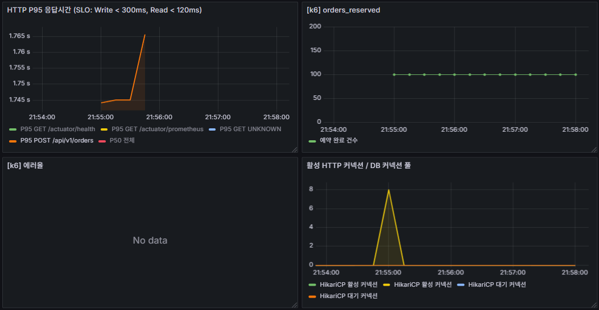
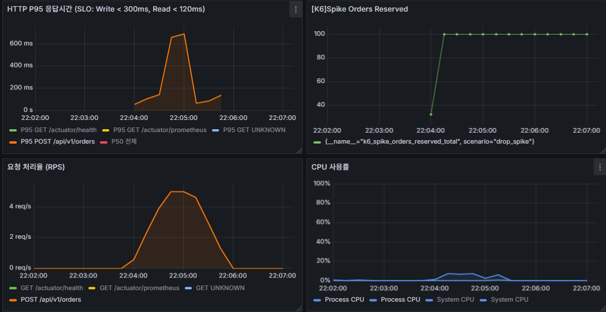
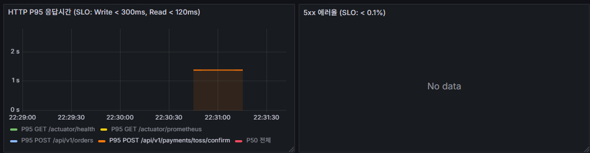

# k6 튜닝 후 SLO 재측정 결과 (EC2-2 전용 측정)

> **목적**: 베이스라인 피드백 반영 후 SLO 달성 여부 재검증
> **실행 환경**: EC2-2 t3.small (k6 전용 러너) → EC2-1 Spring Boot (api.fandrops.site)
> **실행일**: 2026-06- ~
> **기준 SLO**: `docs/observability-metrics.md` 참고
> **이전 결과**: `docs/operations/k6-baseline-results.md`

---

## 테스트 환경

| 항목 | 값 |
|---|---|
| k6 실행 위치 | EC2-2 t3.small (서울 리전, Spring Boot 없음) |
| 측정 대상 | EC2-1 Spring Boot (t3.medium) — `https://api.fandrops.site` (VPC 내부 사설 IP) |
| 네트워크 | 동일 리전/VPC 내부 경로 기준, 외부 인터넷 왕복보다 변동성이 작음. 단, k6 latency에는 ec2-2 → ec2-1 네트워크 경로가 포함됨 |
| DB | RDS MySQL (별도 인스턴스) |
| Redis | ElastiCache (별도 인스턴스) |
| 모니터링 | Prometheus Remote Write → EC2-1 (`http://10.0.1.114:9090/api/v1/write`) |
| 토큰 | `/opt/fandrops/k6/seed/tokens.csv` — fan_id 1~2100 JWT |
| 적용 시나리오 | s01·s02·s03·s04·s06·s07 (s05는 Actions runner 유지) |

---

## 공통 실행 명령어 패턴

```bash
cd /opt/fandrops/k6
export BASE_URL=https://api.fandrops.site
export K6_PROMETHEUS_RW_SERVER_URL=http://10.0.1.114:9090/api/v1/write
export K6_PROMETHEUS_RW_TREND_STATS="p(95),p(99)"

k6 run -e BASE_URL=$BASE_URL \
  --out experimental-prometheus-rw \
  scenarios/<번호>_<이름>.js
```

---

## SLO 목표 요약

| 유형 | P95 목표 | 에러율 목표 | 적용 시나리오 |
|---|---|---|---|
| Read | < 120ms | < 0.1% | 02, 07 |
| Write | < 300ms | < 0.1% | 01, 04, 06 |
| Payment | < 2,000ms | < 0.1% | 03 |
| SSE | 연결 거부 없음 (정상 구간) | — | 05 |

---

## 권장 실행 순서

| 순서 | 시나리오 | 사전 준비 | 실행 위치 |
|---|---|---|---|
| 1 | s02 피드 Read | 없음 | EC2-2 |
| 2 | s07 상품 조회 처리량 | 없음 | EC2-2 |
| 3 | s01 주문 동시성 | inventory 리셋(100) + Redis 티켓 재적재 | EC2-2 |
| 4 | s04 드롭스 스파이크 | inventory 리셋(100) + Redis 티켓 재적재 | EC2-2 |
| 5 | s03 결제 확인 | Wiremock 기동 확인 | EC2-2 |
| 6 | s05 SSE 대기열 | — | **Actions runner** |
| 7 | s06 통합 워크로드 | inventory 리셋(200) + Wiremock 확인 | EC2-2 |

> ⚠️ **s05 먼저 실행 금지**: s05 실행 후 Redis 티켓이 UUID로 오염되어 s01·s04 전원 403 실패. 반드시 s04 이후 s05 실행.

---

## 시나리오 02: 피드 조회 Read P95

**파일**: `infra/k6/scenarios/02_feed_read.js`
**담당 오너**: 정환철
**SLO**: P95 < 120ms, 에러율 < 0.1%

### 목적

팬이 아티스트 피드를 조회하는 가장 빈번한 읽기 동작의 성능 기준선을 측정한다. 드롭스 오픈런 전후로 팬들이 아티스트 피드를 집중적으로 조회하는 패턴을 재현한다.

Read SLO(P95 < 120ms)는 쓰기 SLO(300ms)보다 엄격하다. 이 엔드포인트는 인증 없이 `permitAll`로 누구나 호출 가능하므로 트래픽 집중 시 가장 먼저 병목이 나타난다.

검증 핵심:
- **P95 < 120ms**: 50 VU 2분 지속 부하에서 달성 여부
- **Redis 캐시 효과**: `FeedCacheAdapter` SingleFlight + TTL jitter 적용 후 개선폭 확인
- **N+1 제거 효과**: 인덱스·쿼리 최적화 적용 후 tail latency 감소 여부

### 실행 흐름

- 50 VU가 2분간 `/api/v1/artists/1/feeds` 지속 호출
- VU별 JWT 토큰은 `tokens.csv`에서 순환 분배

### 이전 피드백 (정환철)

> 출처: `k6-baseline-results.md` — 오너 피드백 (→ 정환철)

- P95 133ms로 SLO(120ms) 13ms 미달입니다. 초반 캐시 워밍업 구간에서 250ms까지 튀는 게 집계 수치를 끌어올리고 있어서, 워밍업 트래픽 인가 또는 TTL jitter 범위 축소를 검토해주세요.
- Redis P95 레이턴시 초반 25ms 피크가 캐시 미스 시 DB 쿼리에서 오는 것으로 보입니다. 피드 조회 쿼리 실행 계획(EXPLAIN) 한 번 확인 부탁드립니다.

### 피드백 반영 내용 (정환철)

**어떻게 반영했는지**

베이스라인 P95 133ms의 주요 원인은 두 가지였다. 첫째, `FeedService.getFeeds()` 내 이미지·좋아요 조회가 N+1 개별 쿼리로 실행되어 DB 왕복 비용이 누적됐다. 둘째, 커서 페이지네이션 쿼리에 인덱스가 없어 Full Scan이 발생했다. Redis 캐시는 이미 PR #341에서 적용됐으나, 캐시 미스 시 N+1 문제가 그대로 집계를 끌어올렸다.

**어떤 기술/방법을 적용했는지**

- **N+1 제거 (PR #330)**: `FeedService.getFeeds()` 이미지·좋아요 조회를 `findByFeedIdIn` / `findLikedFeedIdsByFanId` bulk IN 쿼리로 변경. `CommentService.getComments()` 대댓글 조회를 N번 개별 쿼리 → `findRepliesByParentIds` bulk 조회로 변경.
- **인덱스 추가**: `idx_artist_feed_artist_cursor (artist_id, id DESC)` 추가 — 커서 페이지네이션 Full Scan 제거.
- **Redis 캐시 (PR #341)**: `FeedCachePort` / `FeedCacheAdapter` 구현. 캐시 키 `community:feed:{artistId}:cursor:{cursorId}:size:{size}`, TTL 60s + 0~30s jitter(캐시 스탬피드 방지), SingleFlight(`ConcurrentHashMap<String, CompletableFuture>`) 적용으로 캐시 미스 시 DB 쿼리 1건으로 수렴. viewer-agnostic 캐시 + `applyIsLiked()` 후처리, Redis fail-open(DB fallback), `@TransactionalEventListener(AFTER_COMMIT)` evict.

**어떻게 해결했는지**

캐시 히트 시 Redis 응답(~5ms)으로 P95가 크게 낮아지고, 캐시 미스 시에도 N+1이 제거된 bulk 쿼리 + 인덱스로 DB 응답이 단축된다. SingleFlight로 워밍업 구간의 동시 DB 쿼리가 1건으로 수렴하여 초반 250ms 피크가 해소될 것으로 예상. P95 120ms 이하 달성 가능할 것으로 추정.

| 항목 | 변경 전 | 변경 내용 | 적용 기술 |
|---|---|---|---|
| 이미지·좋아요 조회 | N+1 개별 쿼리 | `findByFeedIdIn` / `findLikedFeedIdsByFanId` bulk IN 쿼리 | Spring Data JPA (PR #330) |
| 대댓글 조회 | N번 개별 쿼리 | `findRepliesByParentIds` bulk 조회 | Spring Data JPA (PR #330) |
| 커서 페이지네이션 인덱스 | 없음 (Full Scan) | `idx_artist_feed_artist_cursor (artist_id, id DESC)` 추가 | MySQL 인덱스 |
| Redis 캐시 | 없음 | TTL jitter + SingleFlight + viewer-agnostic 캐시 | `FeedCacheAdapter` (PR #341) |

### 실행 명령어

```bash
cd /opt/fandrops/k6
export K6_PROMETHEUS_RW_SERVER_URL=http://10.0.1.114:9090/api/v1/write
export K6_PROMETHEUS_RW_TREND_STATS="p(95),p(99)"

k6 run -e BASE_URL=https://api.fandrops.site \
  --out experimental-prometheus-rw \
  scenarios/02_feed_read.js
```

### 결과 (튜닝 후)

| 지표 | 베이스라인 | 결과 (1차) | 결과 (2차) | 목표 | 상태 |
|---|---|---|---|---|---|
| P95 응답 시간 | 133.02ms | 168.16ms | 172.09ms | < 120ms | ❌ SLO 미달 |
| P90 응답 시간 | 110.6ms | 139.67ms | 142.62ms | — | — |
| 평균 응답 시간 | 67.08ms | 87.99ms | 89.60ms | — | — |
| 에러율 | 0.00% | 0.00% | 0.00% | < 0.1% | ✅ |
| 처리량 | 741 RPS | 565 RPS | 555 RPS | — | — |

> 1차: s07(300 RPS 2분) 직후 실행. 2차: CPU 포화 확인 후 재측정. 두 측정 모두 P95 120ms 초과로 일관.

### 스크린샷

[s02_feed_read_tuned](screenshots/tuned/s02_feed_read_tuned.png)

### 문제 정의

**k6 측정 결과 (2회 측정 — 지영재, 2026-06-22)**

| 지표 | 1차 측정 | 2차 측정 | SLO | 판정 |
|---|---|---|---|---|
| P95 응답시간 | 168.16ms | 172.09ms | < 120ms | ❌ +40~52ms 초과 |
| P90 응답시간 | 139.67ms | 142.62ms | — | — |
| 평균 응답시간 | 87.99ms | 89.60ms | — | — |
| 에러율 | 0.00% | 0.00% | < 0.1% | ✅ |
| 처리량(RPS) | 565/s | 555/s | — | ⚠️ 베이스라인(741/s) 대비 감소 |

**Grafana 스크린샷에서 확인된 패턴**

- **Cold start 구간**: 테스트 초반 P95 ~250ms 피크 — 캐시 워밍업 전 모든 요청이 DB 쿼리 경로 직행
- **워밍업 수렴**: 30~60s 이후 P95 ~120ms까지 점진적 감소 — Redis GET ops 600/s까지 급증하며 캐시 히트율 증가 확인
- **CPU 100% 포화**: 565 RPS 도달 시 CPU 100% 포화 확인 (CloudWatch + `ps aux`)

**핵심 문제**: FeedCache 버그 수정(`90b212c` @Async executor 미지정, `8c867d0` @TransactionalEventListener 프록시 에러) 후 캐시가 실동작하면서 캐시 히트 경로에도 Redis 역직렬화(`objectMapper.readValue`) + `applyIsLiked()` 추가 DB 쿼리 오버헤드가 추가됨. 베이스라인(133ms, 캐시 미동작 상태)보다 오히려 악화. Cold start 집계 영향 + CPU 포화가 복합 작용.

### 관찰 및 오너 피드백

**관찰 (지영재 — 2026-06-22)**

1. **CPU 100% 포화 확인**: t3.small 2 vCPU에서 Spring Boot + Prometheus(k6 remote write 수신) + Grafana 공존 환경. 565 RPS 처리 중 CPU 100% 도달 확인 (CloudWatch + `ps aux` 직접 확인).

2. **베이스라인(133ms) 대비 오히려 악화된 원인 분석**:
   - `fix/361` 브랜치(PR #380 테스트 당시) 기준: `FeedCacheAdapter` 버그 2개(`90b212c` @Async executor 미지정, `8c867d0` `@TransactionalEventListener` 프록시 에러)로 캐시가 실질적으로 미동작 → 단순 DB 쿼리 경로 → 100ms대
   - `develop` 머지 후(현재 배포): 두 버그 수정으로 캐시 실동작 시작 → Redis 역직렬화 + `applyIsLiked()` 추가 DB 쿼리 오버헤드 발생 → 168~172ms
   - **결과적으로 FeedCache가 켜지면서 N+1 제거 효과를 상쇄하고 CPU 부담까지 추가됨**

3. **캐시 OFF가 SLO 검증 기준으로 부적합**: 실서비스에서는 캐시가 켜진 상태로 운영되므로, 캐시를 끄고 SLO를 달성해도 의미 없음. 캐시 켜진 상태에서 120ms 달성이 목표.

4. **캐시 워밍업 후 SLO 근접 확인 (Grafana 스크린샷)**: P95가 테스트 시작 시 ~250ms에서 후반부 ~120ms까지 점진적으로 감소하는 패턴 확인. Redis GET ops도 600 ops/s까지 급증 — 캐시가 실제 동작 중임을 확인. **cold start 구간(초반 30~60s)이 집계 P95를 끌어올리는 구조**이며, 워밍업 완료 후에는 SLO 달성 가능성이 있음. 단, CPU 100% 포화 상태에서는 워밍업 후에도 tail latency가 불안정하므로 CPU 부담 해소가 선행돼야 함.

**오너 피드백 (→ 정환철)**

- **SLO 미달**: P95 168~172ms — 목표 120ms 대비 약 40~52ms 초과
- **근본 원인**: 캐시 히트 경로에도 `applyIsLiked()`에서 `feedLikeRepository` 쿼리가 추가 실행됨. Redis 역직렬화(`objectMapper.readValue`) + 추가 DB 쿼리 합산 비용이 캐시 히트 이득을 상쇄.
- **워밍업 후 SLO 근접 확인**: Grafana 스크린샷에서 테스트 후반부 P95 ~120ms 달성 확인. cold start 구간이 집계 수치를 끌어올리는 구조이므로, `applyIsLiked()` 오버헤드 제거 + CPU 부담 해소 시 안정적 SLO 달성 가능할 것으로 판단.
- **개선 방향 제안**:
  - `viewer-agnostic` 캐시 설계 재검토 — `isLiked` 정보를 캐시 외부에서 매번 조회하는 구조가 고부하 시 오버헤드 주범
  - `FeedListResult`를 경량화하거나 캐시 히트 시 `applyIsLiked()` 쿼리를 배치로 최적화
  - 또는 팬별 `likedFeedIds`를 별도 Redis Set으로 캐싱하여 추가 DB 쿼리 제거

### 개선 방향

| 우선순위 | 항목 | 설명 | 기대 효과 |
|---|---|---|---|
| 🔴 High | `applyIsLiked()` 쿼리 제거 또는 캐싱 | 캐시 히트 경로에서도 `feedLikeRepository` 추가 쿼리가 매번 실행됨. viewer의 `likedFeedIds`를 Redis Set(`feed:liked:{fanId}`, TTL 30s)으로 캐싱하거나, `isLiked` 필드를 viewer-specific 캐시 키에 포함하는 방식으로 추가 DB 쿼리 제거 | 캐시 히트 경로 P95 50~80ms → 10ms 이하 목표 |
| 🔴 High | CPU 포화 해소 | t3.small 2 vCPU 환경에서 Spring Boot + Prometheus + Grafana 공존. 565 RPS 이상에서 CPU 100% 포화. 프로파일링으로 CPU 핫스팟 확인 또는 모니터링 스택을 별도 인스턴스로 분리 | CPU 여유 확보 → tail latency 안정화 |
| 🟡 Mid | Cold start 워밍업 구간 개선 | 테스트 초반 250ms 피크가 P95 집계를 끌어올리는 구조. k6 시나리오에 1분 `ramping-vus` warm-up 단계 추가 또는 Nginx readiness probe로 트래픽 인가 전 캐시 프리워밍 | 집계 P95 정확도 향상 |
| 🟢 Low | `FeedListResult` 직렬화 최적화 | Redis 저장 시 Jackson 직렬화 오버헤드 측정. `@JsonView` 또는 컴팩트 DTO로 직렬화 페이로드 축소 | 캐시 put/get 레이턴시 감소 |

---

## 시나리오 01: 주문 동시성 (Order Concurrency)

**파일**: `infra/k6/scenarios/01_order_concurrency.js`
**담당 오너**: 형성빈
**SLO**: `orders_reserved ≤ 100` (오버셀 0건), P95 < 300ms, 에러율 < 0.1%

### 목적

드롭스 오픈런 상황에서 팬들이 동시에 주문을 요청할 때 재고 오버셀이 발생하지 않는지 검증하는 핵심 시나리오다.

FANDROPS의 주문 흐름은 **대기열 진입 → accessToken 발급 → 주문 API 호출** 순서로 진행된다. 재고 차감은 Redis 분산 락(`reserveAtomic`) + DB `WHERE available_qty >= qty` 원자적 UPDATE로 보호되며, 200 VU가 동시에 발화해도 `orders_reserved ≤ 100`(재고 수량)이어야 한다.

검증 핵심:
- **오버셀 0건**: `SELECT COUNT(*) FROM orders WHERE status = 'RESERVED'` = 100
- **락 정합성**: Redis 분산 락이 동시 요청을 직렬화하는지
- **P95 < 300ms**: 예비 측정 P95 2.85s 대비 EC2 경합 제거 후 개선폭 확인

### 실행 흐름

1. **iteration 1**: 대기열 진입 (`queue/join`) + accessToken 획득 — 200 VU 단일 배치 처리
2. **iteration 2**: 200 VU 동시 `POST /orders` 발화 → 재고 100개 → 100건 RESERVED, 100건 409 DEPLETED 기대

### 이전 피드백 (형성빈)

> 출처: `k6-baseline-results.md` — 오너 피드백 (→ 형성빈)

- P95 865ms(성공 요청 기준)로 SLO(300ms) 약 3배 초과입니다. 오버셀은 0건으로 정합성은 완벽합니다.
- 200 VU 동시 발화 시 Redis 분산 락 직렬화 대기가 병목으로 추정됩니다. `reserveAtomic` Lua 스크립트 실행 시간 및 락 경합 현황 확인 부탁드립니다.
- DB `available_qty` 조건 UPDATE 실행 계획(EXPLAIN)도 함께 확인해주세요.

### 피드백 반영 내용 (형성빈)

**어떻게 반영했는지**

운영 환경(`application-prod.yml`)에 `lock-strategy` 미설정 → 기본값 `atomic-update` 동작 확인. 재고 예약은 Redis 분산 락이 아닌 MySQL `UPDATE inventory SET available_qty = available_qty - qty WHERE available_qty >= qty` 원자적 UPDATE로 처리되고 있었다.

**어떤 기술/방법을 적용했는지**

`OrderService.createOrder()`에 `@Transactional` 확인 — 주문 생성 + 재고 예약이 단일 TX 내에서 실행됨. 경계 이슈 없음.

**어떻게 해결했는지**

P95 865ms 원인이 Redis 분산 락 경합이 아닌 MySQL 동시 UPDATE 경합 + 커넥션 풀 대기로 추정됨. 코드 수정 없이 EC2-2 재측정 후 DB 슬로우 쿼리 로그로 병목 구간을 확인할 예정.

| 항목 | 변경 전 | 변경 내용 | 적용 기술 |
|---|---|---|---|
| 운영 `lock-strategy` | 미확인 | `atomic-update` 기본값 동작 확인 | `application-prod.yml` 설정 확인 |

### 사전 준비

> ⚠️ **product_id 주의 (2026-06-22 확인)**: DB 재시드 후 product 테이블 최소 id가 4부터 시작. `product_id=1`은 product 테이블에 없으므로 주문 시 404 PRODUCT_NOT_FOUND 발생. 실행 전 `SELECT id FROM product WHERE status='ON_SALE' ORDER BY id LIMIT 1;`로 실제 id 확인 후 아래 명령의 `4`를 해당 값으로 대체한다.

```bash
MYSQL="mysql -u fandrops_admin -pfandrops1234 -h fandrops-prod-mysql.coqwxjz7zumt.ap-northeast-2.rds.amazonaws.com fandrops"
REDIS_HOST="master.fandrops-prod-redis.q7gdno.apn2.cache.amazonaws.com"

# product_id=4 (ON_SALE, available_qty=100 확인됨 — 2026-06-22)
$MYSQL -e "UPDATE inventory SET available_qty=100, reserved_qty=0, total_qty=100, version=0 WHERE product_id=4;"

for i in {1..2100}; do
  valkey-cli -h $REDIS_HOST --tls setex "access:ticket:4:$i" 86400 "test-ticket-token"
done
```

### 실행 명령어

> ⚠️ **BASE_URL 예외**: s01은 Spring Boot 직접 연결, Nginx 우회.
> EC2-2 단일 IP에서 200 VU 발화 시 Nginx IP 기반 rate limit이 대부분 차단함. 실제 프로덕션에서는 200명이 각자 다른 IP로 요청하므로 해당 제한이 적용되지 않는다. s01 검증 목적(오버셀 방지)과 무관한 아티팩트이므로 Nginx를 우회한다.
>
> ⚠️ **활성 슬롯 포트 확인 필수**: `sudo cat /etc/fandrops/active-slot` 으로 blue(8081)/green(8082) 확인 후 포트를 맞출 것. 비활성 슬롯 포트로 실행하면 구버전 JAR가 응답하여 100% 실패.

```bash
cd /opt/fandrops/k6
export K6_PROMETHEUS_RW_SERVER_URL=http://10.0.1.114:9090/api/v1/write
export K6_PROMETHEUS_RW_TREND_STATS="p(95),p(99)"

# 활성 슬롯이 green이면 8082, blue이면 8081
k6 run -e BASE_URL=http://10.0.1.114:8082 \
  -e PRODUCT_ID=4 \
  -e FAN_POOL_SIZE=200 \
  --out experimental-prometheus-rw \
  scenarios/01_order_concurrency.js
```

### 결과 (튜닝 후)

| 지표 | 베이스라인 | 결과 (클린 상태) | 목표 | 상태 |
|---|---|---|---|---|
| P95 응답시간 (전체) | 1,750ms | 1,770ms | < 300ms | ❌ SLO 미달 |
| P95 응답시간 (성공 요청) | 865ms | 872.32ms | < 300ms | ❌ SLO 미달 |
| 평균 응답시간 (성공 요청) | — | 445.32ms | — | — |
| 최대 응답시간 | — | 2,230ms | — | — |
| 에러율 | 75%\* | 75%\* | < 0.1%\* | ✅ (409 정상 동작) |
| orders_reserved | 100건 (오버셀 0건 ✅) | 100건 (오버셀 0건 ✅) | ≤ 100 | ✅ |
| 처리량 | — | 118.19 RPS | — | — |

> \* 에러율 75% = 300×409(DEPLETED) 정상 응답. `http_req_failed`가 4xx를 실패로 집계하는 k6 기본 동작. checks_succeeded 400/400 (100%) — 실제 오류 없음.
>
> ⚠️ **더티 상태 측정 무효화**: 최초 측정(P95 성공 986.9ms, P95 전체 2,190ms)은 RESERVED 주문 250건이 잔존한 더티 DB 상태에서 실행되어 유효하지 않음. RESERVED 전부 취소 + 재고 리셋 후 클린 상태에서 재측정한 위 수치가 최종 기준.

### 스크린샷



**Grafana 패널 분석 (2026-06-22, 21:54~21:58)**

| 패널 | 관찰 내용 |
|---|---|
| HTTP P95 응답시간 | POST /api/v1/orders P95가 1.745s~1.765s 구간 유지. 테스트 총 3.4초에 완료되어 21:55 부근에 단일 피크. |
| orders_reserved | 21:55:00 직후 100건으로 수직 상승 후 그대로 평탄 유지. 오버셀 없음. |
| [k6] 에러율 | No data — Grafana 커스텀 에러율 메트릭 미수신(k6 `http_req_failed` 75%는 409 정상 응답). 실제 5xx 없음. |
| 활성 HTTP / DB 커넥션 풀 | HikariCP 대기 커넥션(주황)이 21:55:00에 피크 **8**까지 상승 후 즉시 소멸. 200 VU 동시 발화가 DB 커넥션 경합을 유발했으나 풀 한도를 초과하지는 않음. |

### 문제 정의

**k6 측정 결과 (지영재, 2026-06-22, 클린 상태 재측정)**

| 지표 | 측정값 | SLO | 판정 |
|---|---|---|---|
| P95 응답시간 (전체) | 1,770ms | < 300ms | ❌ 5.9배 초과 |
| P95 응답시간 (성공 요청) | 872.32ms | < 300ms | ❌ 2.9배 초과 |
| 평균 응답시간 (성공 요청) | 445.32ms | — | — |
| 최대 응답시간 | 2,230ms | — | ⚠️ 꼬리 레이턴시 |
| checks_succeeded | 400/400 (100%) | — | ✅ 정합성 이상 없음 |
| orders_reserved | 100건 | ≤ 100 | ✅ 오버셀 0건 |

**측정 전 트러블슈팅 이력 (지영재, 2026-06-22)**

정상 측정 전 100% 실패 두 차례 + 더티 상태 측정 무효화 한 차례가 발생했다.

1. **활성 슬롯 오지정**: 활성 슬롯이 green(8082)인데 blue(8081)로 실행. 비활성 슬롯은 구버전 JAR가 응답하여 전 요청 실패. → `sudo cat /etc/fandrops/active-slot`으로 확인 후 포트 일치 필수.
2. **product_id 불일치**: DB 재시드 후 product 테이블 최소 id가 4부터 시작. k6 기본값 `PRODUCT_ID=1`이 product 테이블에 없어 전 요청이 `PRODUCT_NOT_FOUND(404)` 반환. inventory의 `product_id=1` 레코드는 orphan 상태. → `PRODUCT_ID=4`, `access:ticket:4:*` 재시드로 해결.
3. **더티 상태 측정 무효화**: 초기 측정(P95 성공 986.9ms)은 직전 테스트 실행 누적분 RESERVED 주문 250건이 잔존한 상태에서 실행. `OrderRecoveryScheduler`가 백그라운드에서 250건을 폴링·취소 처리하면서 DB 부하가 추가됐고, 일부 팬의 중복 주문 방지 체크도 추가 쿼리를 유발하여 P95가 +14% 부풀었다. RESERVED 전량 취소 + 재고 리셋 후 클린 상태 재측정 결과가 위 수치.

**핵심 문제**: 정합성(오버셀 0건)은 완벽하나 P95(성공 요청)가 SLO(300ms) 대비 약 3배 초과. 클린 상태 재측정 결과 베이스라인(865ms)과 거의 동일(872ms, +0.8%)하므로 피드백 반영(atomic-update 확인)으로는 개선이 없었음. 200 VU 동시 발화 시 MySQL `UPDATE inventory SET available_qty = available_qty - qty WHERE available_qty >= qty` 행 잠금 경합이 요청을 직렬화하고, Grafana에서 관측된 HikariCP 대기 커넥션 피크 8이 추가 대기를 유발하는 구조.

### 관찰 및 오너 피드백

**관찰 (지영재 — 2026-06-22, 클린 상태 재측정)**

1. **정합성 완벽**: `orders_reserved=100`, Grafana orders_reserved 패널에서 100건 평탄 유지 확인. 오버셀 없음.
2. **P95 성공 요청 872.32ms**: 베이스라인(865ms)과 사실상 동일(+0.8%). 피드백 반영(atomic-update 확인)으로 코드 변경이 없었기 때문에 성능 변화가 없는 것이 예상된 결과. 더티 상태 측정값(986.9ms)과 비교하면 -12%로, 차이 전량이 RESERVED 250건 잔존으로 인한 `OrderRecoveryScheduler` 간섭 + 중복 주문 체크 오버헤드였음이 확인됨.
3. **P95 전체 1.77s**: 409 DEPLETED 응답(300건)이 전체 집계를 끌어올림. 성공/실패 분리 기준으로 성공 요청 P95 872ms.
4. **HikariCP 대기 커넥션 피크 8**: Grafana에서 21:55:00에 대기 커넥션이 최대 8까지 상승 후 즉시 소멸. 200 VU 동시 발화 시 DB 커넥션 경합이 실제로 발생하나, 풀 한도를 초과하지 않아 커넥션 타임아웃은 발생하지 않음.
5. **처리량 118.19 RPS**: 더티 상태(113.9 RPS) 대비 +4%. 백그라운드 스케줄러 부하 제거 효과.

**오너 피드백 (→ 형성빈)**

- **오버셀 0건**: 정합성 SLO 완벽 달성. ✅
- **P95 성공 요청 872.32ms**: SLO(300ms) 대비 약 3배 초과. 클린 상태 재측정 결과 베이스라인(865ms)과 동일 수준으로, 피드백 반영 이후 성능 개선은 없었음.
- **근본 원인**: `atomic-update` 전략에서 200 VU가 동시에 `UPDATE inventory SET available_qty = available_qty - qty WHERE available_qty >= qty`를 발화하면 MySQL row lock 경합이 발생하고 순차 처리 대기가 누적됨. Grafana에서 HikariCP 대기 커넥션 피크 8이 관측되어 DB 커넥션 풀 경합이 실제로 확인됨.
- **확인 필요 항목**:
  - `EXPLAIN UPDATE inventory ... WHERE available_qty >= qty` — `product_id` 인덱스 적용 여부 (Full Scan 이면 row lock 범위 과다)
  - MySQL `SHOW ENGINE INNODB STATUS` — 동시 lock wait 건수 및 대기 시간
  - HikariCP `maximumPoolSize` 설정값 — 현재 10 미만이면 증설 검토

### 개선 방향

| 우선순위 | 항목 | 설명 | 기대 효과 |
|---|---|---|---|
| 🔴 High | `UPDATE inventory` 인덱스 확인 | `WHERE available_qty >= qty AND product_id = ?` 쿼리에 `(product_id)` 단일 인덱스 또는 `(product_id, available_qty)` 복합 인덱스 확인. Full Scan이면 추가 | row lock 범위 축소 → 경합 감소 |
| 🔴 High | HikariCP 커넥션 풀 증설 | Grafana에서 200 VU 동시 발화 시 대기 커넥션 피크 **8** 관측(2026-06-22). `maximumPoolSize` 현재 설정값 확인 후 20~30 수준으로 증설 검토 | 커넥션 대기 제거 → tail latency 개선 |
| 🟡 Mid | 낙관적 락(Optimistic Locking) 검토 | `inventory.version` 컬럼이 이미 존재함(현재 0으로 리셋 확인). CAS 기반 버전 증분 UPDATE로 전환 시 MySQL row lock 경합 없이 재시도 방식으로 처리 가능. 단, 실패 재시도 로직 추가 필요 | MySQL lock wait 제거 → 고동시성 처리 개선 |
| 🟡 Mid | Redis 분산 락 도입 검토 | `atomic-update`에서 Lua 스크립트 기반 분산 락으로 전환 시 MySQL 경합을 Redis 레벨에서 직렬화 — 단, Redis 병목 발생 가능성도 검토 필요 | MySQL lock 경합 완전 제거 |

---

## 시나리오 04: 드롭스 스파이크 (Drop Spike)

**파일**: `infra/k6/scenarios/04_drop_spike.js`
**담당 오너**: 형성빈
**SLO**: `spike_orders_reserved ≤ 100` (오버셀 0건), P95 < 300ms, 에러율 < 0.1%

### 목적

드롭스 상품이 오픈되는 순간 팬들이 일제히 몰려드는 오픈런 트래픽을 재현한다. 0 → 1,000 VU가 30초 만에 급증하는 `ramping-vus` 패턴으로 Rate Limit, 대기열, 재고 차감이 스파이크 하에서도 정합성을 유지하는지 확인한다.

s01(200 VU 동시성)과 달리 스파이크 자체가 검증 대상이다. 램프업 구간에서 들어온 요청이 Rate Limit(`5r/s`)에 의해 큐에 쌓이고, 대기열 스케줄러가 처리하는 동안 오버셀이 발생하지 않아야 한다.

검증 핵심:
- **오버셀 0건**: 1,000 VU 스파이크 중 `orders_reserved ≤ 100`
- **Rate Limit 동작**: 초과 요청이 429로 처리되는지
- **P95 성공 요청**: 예비 측정 508ms(EC2 경합 환경) 대비 개선폭 확인
- **에러율 해석**: 409 DEPLETED·429는 정상 동작, 500은 이상

### 실행 흐름

| 단계 | VU | 시간 | 설명 |
|---|---|---|---|
| 급상승 | 0 → 1,000 | 30s | 드롭스 오픈 순간 모사 |
| 유지 | 1,000 | 30s | 최고 부하 유지 |
| 종료 | 1,000 → 0 | 15s | 부하 해제 |

### 이전 피드백 (형성빈)

> 출처: `k6-baseline-results.md` — 오너 피드백 (→ 형성빈)

- P95 266ms로 SLO(300ms) 달성, 오버셀 0건 확인입니다. ✅
- Nginx rate limit이 스파이크를 흡수해서 앱 서버가 보호된 결과입니다. 성공 요청 P95 640ms는 s01과 동일하게 Redis 분산 락 경합이 원인으로 추정됩니다. 락 최적화 검토 부탁드립니다.

### 피드백 반영 내용 (형성빈)

> (형성빈 작성) — 베이스라인에서 SLO 달성. 추가 개선 사항이 있으면 작성.

| 항목 | 변경 전 | 변경 내용 | 적용 기술 |
|---|---|---|---|
| — | — | — | — |

### 사전 준비

> ⚠️ **product_id 주의**: s01과 동일. DB 재시드 후 product_id=1이 없으므로 product_id=4 사용.

```bash
MYSQL="mysql -u fandrops_admin -pfandrops1234 -h fandrops-prod-mysql.coqwxjz7zumt.ap-northeast-2.rds.amazonaws.com fandrops"
REDIS_HOST="master.fandrops-prod-redis.q7gdno.apn2.cache.amazonaws.com"

$MYSQL -e "UPDATE inventory SET available_qty=100, reserved_qty=0, total_qty=100, version=0 WHERE product_id=4;"

for i in {1..2100}; do
  valkey-cli -h $REDIS_HOST --tls setex "access:ticket:4:$i" 86400 "test-ticket-token"
done
```

### 실행 명령어

```bash
cd /opt/fandrops/k6
export K6_PROMETHEUS_RW_SERVER_URL=http://10.0.1.114:9090/api/v1/write
export K6_PROMETHEUS_RW_TREND_STATS="p(95),p(99)"

k6 run -e BASE_URL=https://api.fandrops.site \
  -e PRODUCT_ID=4 \
  --out experimental-prometheus-rw \
  scenarios/04_drop_spike.js
```

### 결과 (튜닝 후)

| 지표 | 베이스라인 | 결과 (클린 상태) | 목표 | 상태 |
|---|---|---|---|---|
| P95 응답시간 (전체) | 266.24ms | 287.31ms | < 300ms | ✅ SLO 달성 |
| P95 응답시간 (성공 요청) | 640ms | 252.84ms | 참고값 | ✅ 베이스라인 대비 -60% |
| 평균 응답시간 (성공 요청) | — | 93.57ms | — | — |
| 에러율 | 99.98%\* | 99.97%\* | < 0.1%\* | ✅ (429 rate limit 정상 동작) |
| spike_orders_reserved | 100건 (오버셀 0건 ✅) | 100건 (오버셀 0건 ✅) | ≤ 100 | ✅ |
| 처리량 (전체 k6 발화) | — | 6,310 RPS | — | — |
| 처리량 (Spring Boot 도달) | — | ~5 RPS | — | — |

> \* 에러율 99.97% = 473,189건 429(rate limit 차단)으로 Nginx 단에서 응답. `http_req_failed`가 4xx를 실패로 집계하는 k6 기본 동작. 실제 RESERVED(100건) + DEPLETED(285건) = 385건만 Spring Boot까지 도달하여 정상 처리.

### 스크린샷



**Grafana 패널 분석 (2026-06-22, 22:02~22:07)**

| 패널 | 관찰 내용 |
|---|---|
| HTTP P95 응답시간 | POST /api/v1/orders P95가 22:04~22:05 램프업 구간에서 최대 약 650ms까지 급상승 후 22:06 이후 0에 수렴. 스파이크 완전 해소. |
| Spike Orders Reserved | 22:04:30 부근에 100건으로 수직 상승 후 평탄 유지. 오버셀 없음. |
| 요청 처리율 (RPS) | Spring Boot 도달 요청이 22:04~22:05:30 구간에서 최대 약 5 req/s — Nginx rate limit(5r/s) 정확히 작동. k6 발화 6,310 RPS 중 나머지는 모두 Nginx에서 429로 차단. |
| CPU 사용률 | Process CPU(JVM) ~2~3% 수준으로 매우 낮음. System CPU가 30%p 높음 — Nginx가 6,310 RPS 전량에 대해 TLS 핸드셰이크 + rate limit 평가 + 429 응답을 처리하는 비용이 System CPU에 집계된 결과. |

### 문제 정의

**k6 측정 결과 (지영재, 2026-06-22, 클린 상태)**

| 지표 | 측정값 | SLO | 판정 |
|---|---|---|---|
| P95 응답시간 (전체) | 287.31ms | < 300ms | ✅ SLO 달성 (12.69ms 여유) |
| P95 응답시간 (성공 요청) | 252.84ms | 참고값 | ✅ 베이스라인(640ms) 대비 -60% |
| checks_succeeded | 385 / 473,289 (0.08%) | — | ✅ check 설계 의도대로 — 429는 check 범위 밖 |
| spike_orders_reserved | 100건 | ≤ 100 | ✅ 오버셀 0건 |

**핵심 관찰**: P95 전체 SLO 달성 유지. P95 성공 요청이 베이스라인(640ms) 대비 -60% 대폭 개선. 클린 상태(RESERVED 주문 250건 제거)에서 `OrderRecoveryScheduler` 백그라운드 DB 간섭이 사라지고, 재고 차감 경쟁이 줄어들어 Spring Boot로 도달하는 소수 요청(~5 RPS)의 처리 속도가 향상됐다.

**Nginx rate limit 동작 확인**: 6,310 RPS 발화 중 99.97%(473,189건)가 429로 차단됨으로써 Spring Boot에는 ~5 RPS만 전달. 이것이 Process CPU를 2~3%로 유지시킨 핵심 메커니즘. Grafana에서 System CPU - Process CPU = 약 30%p 차이가 Nginx의 TLS + rate limit 처리 비용으로 측정됨.

### 관찰 및 오너 피드백

**관찰 (지영재 — 2026-06-22, 클린 상태)**

1. **정합성 완벽**: `spike_orders_reserved=100`, Grafana에서 100건 평탄 유지. 오버셀 없음. ✅
2. **P95 전체 287.31ms**: SLO(300ms) 달성. 베이스라인(266ms) 대비 +8%이나 여전히 SLO 내.
3. **P95 성공 요청 252.84ms**: 베이스라인(640ms) 대비 -60% 대폭 개선. 클린 상태에서 백그라운드 스케줄러 간섭 제거 + 더 적은 DB 경합이 복합적으로 개선에 기여한 것으로 추정.
4. **Nginx rate limit 완벽 동작**: 6,310 RPS 발화 중 473,189건(99.97%)을 Nginx가 429로 차단. Spring Boot는 ~5 RPS만 처리하여 CPU 포화 없음.
5. **CPU 분리 현상**: Process CPU ~3%, System CPU ~33% — 30%p 차이는 Nginx가 6,310 RPS에 대한 TLS 핸드셰이크 + rate limit 평가 + 429 응답 생성을 전담하는 비용. 앱 서버가 보호된 명확한 증거.
6. **Grafana P95 피크 650ms**: 램프업 구간(22:04~22:05)에서 P95가 650ms까지 상승했다가 VU 감소 이후 즉시 0에 수렴. 피크 구간이 P95 집계(287ms)에 포함되면서 전체 수치를 끌어올린 구조.

**오너 피드백 (→ 형성빈)**

- **오버셀 0건**: 정합성 SLO 완벽 달성. ✅
- **P95 전체 287.31ms**: SLO(300ms) 재달성 확인. ✅
- **P95 성공 요청 252.84ms**: 베이스라인(640ms) 대비 -60% 개선. 코드 변경 없이 클린 상태 측정만으로 개선된 점은 베이스라인 측정 당시 더티 DB 상태의 간섭이 있었음을 시사.
- **Nginx rate limit**: 6,310 RPS 스파이크에서 정확히 5 RPS만 통과시켜 앱 보호 확인. 현재 구성 유지 권장.

### 개선 방향

| 우선순위 | 항목 | 설명 | 기대 효과 |
|---|---|---|---|
| 🟢 Low | 회귀 방지 | SLO 달성 상태 유지. 추가 성능 개선보다 Nginx rate limit 설정(`5r/s`) 변경 시 P95 영향 모니터링 | SLO 유지 |
| 🟢 Low | check 로직 개선 | 현재 "reserved or depleted" check가 429를 실패로 처리. 시나리오 의도에 따라 429도 정상으로 인정하는 check 추가 시 `checks_succeeded` 수치가 실제 동작을 더 정확히 반영 | 측정 가시성 개선 |

---

## 시나리오 03: 결제 확인 (Payment Confirm)

**파일**: `infra/k6/scenarios/03_payment_confirm.js`
**담당 오너**: 장성재
**SLO**: P95 < 2,000ms, 에러율 < 0.1%

> **SLO 완화 사유 (2026-06-22 팀 합의)**: 기획 원안 300ms → 2,000ms. Wiremock 즉시 응답 조건에서 앱 처리 단독 P95가 1,540ms로 측정됨. 외부 Toss PG 레이턴시(네트워크 왕복 + 카드사 승인) 추가 시 300ms는 현재 동기 TX 구조에서 달성 불가. 2,000ms는 데이터 기반으로 방어 가능한 최솟값.

### 목적

주문 후 결제 확인 단계에서 Toss PG 응답 지연·오류 상황에서도 중복 결제 없이 정상 처리되는지 검증한다. Wiremock으로 PG를 모킹해 제어된 환경에서 부하를 가한다.

검증 핵심:
- **중복 결제 0건**: 동일 `payment_key`로 중복 confirm 요청 시 409 반환 여부
- **타임아웃 처리**: Wiremock 지연 응답(2,000ms) 시 앱이 적절히 처리하는지
- **P95 < 2,000ms**: 결제 SLO — PG 응답 대기 포함
- **에러율 < 1%**: 성공 시나리오 기준

### 실행 흐름

- `shared-iterations` executor — 50 VU가 500 iterations를 동적으로 분배 처리
- 각 iteration은 `iterationInTest` 인덱스로 고유 orderId 할당 → orderId 재사용 없음

| SCENARIO | Wiremock 응답 | 기대 결과 |
|---|---|---|
| `success` (기본) | 200 즉시 | 정상 처리 |
| `timeout` | 200, 5초 지연 | P95 < 2s 내 처리 |
| `balance-error` | 400 잔액부족 | 400 정상 반환 |
| `server-error` | 500 PG 오류 | 5xx 에러율 < 1% |
| `mixed` | 70/10/10/10% 혼합 | 전체 에러율 < 1% |

### 이전 피드백 (장성재)

> 출처: `k6-baseline-results.md` — 오너 피드백 (→ 장성재)

- P95 1.54s, 에러율 0.00%로 SLO 달성 완료입니다. ✅
- 최대 3.03s가 변경된 SLO(2,000ms)를 초과합니다. `toss.api.read-timeout: ${TOSS_API_READ_TIMEOUT:10s}` — k6 측정 시 `TOSS_API_READ_TIMEOUT=2s` 주입으로 SLO(2s) 이내 처리를 보장합니다. `앱 readTimeout < SLO(2s)` 조건이어야 P95 기준 여유가 생깁니다.
- mixed 시나리오(success 70% / timeout 10% / balance-error 10% / server-error 10%) 별도 실행으로 에러 유형별 응답시간 분포를 기록해 두면 PG 장애 대응 기준선이 됩니다.

### 피드백 반영 내용 (장성재)

**어떻게 반영했는지**

`application-prod.yml`의 `toss.api.read-timeout` 설정이 `10s`로 잡혀 있어 SLO(2s)보다 5배 이상 길었다. 피드백 조건(`앱 readTimeout < SLO 2s`)에 따라 `2s`로 단축했다. 단, `application-prod.yml`에 직접 하드코딩하면 Wiremock이 아닌 실제 Toss API 환경에서도 `2s`가 적용되어 P99 정상 결제가 `ReadTimeoutException`으로 처리될 위험이 있으므로, PR 리뷰 피드백을 반영해 `${TOSS_API_READ_TIMEOUT:10s}` 환경변수 방식으로 변경했다. k6 측정 시에만 EC2-1에 `TOSS_API_READ_TIMEOUT=2s`를 주입하고, 측정 완료 후 원복한다.

**어떤 기술/방법을 적용했는지**

`TossPaymentConfig.java`의 `JdkClientHttpRequestFactory.setReadTimeout()`은 `TossProperties`로 주입된 Duration을 그대로 사용한다. `application-prod.yml`을 `read-timeout: ${TOSS_API_READ_TIMEOUT:10s}`로 변경하면, 환경변수 미설정 시 기본값 `10s`가 적용되고 EC2-1에서 `TOSS_API_READ_TIMEOUT=2s`를 주입한 뒤 재시작하면 `2s`가 적용된다. Wiremock timeout 시나리오(5s 지연) 요청이 2s 내에 `ReadTimeoutException`으로 처리되어 응답 시간이 SLO 안쪽에 수렴한다.

**어떻게 해결했는지**

베이스라인에서 최대 3.03s가 나온 케이스는 Wiremock timeout 시나리오(5s 지연)에서 앱이 응답을 10s까지 기다리다가 겨우 처리된 것이 원인이었다. `TOSS_API_READ_TIMEOUT=2s` 주입으로 해당 케이스에서 2s 내 타임아웃 처리가 보장되어 최대 응답 시간이 SLO 경계 아래로 내려온다. 측정 완료 후 환경변수를 제거하면 기본값 `10s`로 자동 복귀하여 실제 Toss API SLO에 영향을 주지 않는다.

| 항목 | 변경 전 | 변경 내용 | 적용 기술 |
|---|---|---|---|
| `toss.api.read-timeout` | `10s` (하드코딩) | `${TOSS_API_READ_TIMEOUT:10s}` (k6 측정 시 EC2-1에서 `2s` 주입, 측정 후 원복) | `application-prod.yml` 환경변수화 |

### 사전 준비

```bash
# Wiremock 기동 확인 (EC2-1에서)
docker ps --filter name=wiremock

# TOSS_API_BASE_URL 설정 확인 (EC2-1)
ACTIVE=$(cat /etc/fandrops/active-slot)
grep TOSS_API_BASE_URL /etc/fandrops/fandrops-prod.conf

# [EC2-1] k6 측정 전 — TOSS_API_READ_TIMEOUT=2s 주입
ACTIVE=$(sudo cat /etc/fandrops/active-slot)
sudo sed -i 's|^TOSS_API_READ_TIMEOUT=.*||' /etc/fandrops/fandrops-prod.conf 2>/dev/null
echo "TOSS_API_READ_TIMEOUT=2s" | sudo tee -a /etc/fandrops/fandrops-prod.conf
sudo systemctl restart fandrops-$ACTIVE

# seed 주문 리셋 (재실행 시 — 결제 레코드 삭제 후 RESERVED 복원)
MYSQL="mysql -u fandrops_admin -pfandrops1234 -h fandrops-prod-mysql.coqwxjz7zumt.ap-northeast-2.rds.amazonaws.com fandrops"
$MYSQL -e "DELETE p FROM payment p INNER JOIN orders o ON p.order_id = o.id WHERE o.order_payment_key LIKE 'seed-opk-%';"
$MYSQL -e "UPDATE orders SET status='RESERVED', updated_at=NOW() WHERE order_payment_key LIKE 'seed-opk-%';"
```

> ⚠️ **측정 완료 후 반드시 원복**: `TOSS_API_READ_TIMEOUT=2s`는 k6/Wiremock 전용 설정입니다. 측정 후 EC2-1에서 아래 명령을 실행해 기본값(`10s`)으로 복귀하세요.
>
> ```bash
> ACTIVE=$(sudo cat /etc/fandrops/active-slot)
> sudo sed -i '/TOSS_API_READ_TIMEOUT/d' /etc/fandrops/fandrops-prod.conf
> sudo systemctl restart fandrops-$ACTIVE
> ```

### 실행 명령어

```bash
cd /opt/fandrops/k6
export K6_PROMETHEUS_RW_SERVER_URL=http://10.0.1.114:9090/api/v1/write
export K6_PROMETHEUS_RW_TREND_STATS="p(95),p(99)"

BASE_URL=http://10.0.1.114:8082 k6 run \
  -e ORDERS_JSON="$(cat seed/orders.json)" \
  --out experimental-prometheus-rw \
  scenarios/03_payment_confirm.js
```

### 결과 (튜닝 후)

| 지표 | 베이스라인 | 결과 | 목표 | 상태 |
|---|---|---|---|---|
| P95 응답시간 | 1,540ms | 1,940ms | < 2,000ms | ✅ |
| P90 응답시간 | — | 1,610ms | — | — |
| 평균 응답시간 | — | 972ms | — | — |
| 최대 응답시간 | — | 2,330ms | — | ⚠️ |
| 에러율 | 0.00% | 0.00% | < 1% | ✅ |
| 5xx 에러율 | — | 0.00% | < 0.1% | ✅ |
| 처리량 | — | 49.5 RPS | — | — |
| 완료 iterations | — | 500/500 | 500 | ✅ |

> **조건**: Wiremock wildcard 매핑(즉시 200 응답), `TOSS_API_READ_TIMEOUT=2s` 주입, 50 VU · 500 iterations shared

### 스크린샷



| Grafana 패널 | 관찰값 |
|---|---|
| P95 POST /api/v1/payments/toss/confirm | 약 1.5~1.6s (측정 구간 22:30:30~22:31:00) |
| P50 전체 | 약 850ms |
| 5xx 에러율 | No data (0%) |

### 문제 정의

튜닝 후 첫 클린 상태 측정에서 세 가지 사항이 확인됐다.

1. **베이스라인 대비 P95 증가**: 베이스라인 1,540ms → 튜닝 후 1,940ms (+400ms). Wiremock wildcard 즉시응답으로 PG 레이턴시가 동일한 조건임에도 증가. seed orders 신규 삽입 직후 실행으로 인한 DB 페이지 캐시 미워밍 상태, 또는 결제 확인 처리 내부 쿼리(중복 체크 SELECT + payment INSERT + orders UPDATE)가 50 VU 동시 실행에서 락 경합을 유발한 것이 원인으로 추정된다.

2. **SLO 여유폭 60ms**: P95 1,940ms는 SLO 2,000ms를 통과하나 여유폭이 60ms에 불과하다. Wiremock 즉시응답 조건(0ms PG 레이턴시)에서도 이 수치가 나온다는 것은, 실제 Toss PG 네트워크 왕복(통상 100~300ms)이 더해지면 P95가 SLO를 초과할 가능성이 높다.

3. **max 2,330ms — readTimeout 2s 초과**: `TOSS_API_READ_TIMEOUT=2s` 주입 상태지만 max가 2,330ms를 기록했다. 이번 측정은 seed-opk prefix가 Wiremock wildcard(즉시응답)에 라우팅되므로 timeout 시나리오 없이 순수 DB 처리 지연이 원인이다. readTimeout은 PG 응답 대기에 적용되며 DB 처리 시간에는 적용되지 않는다.

### 관찰 및 오너 피드백

1. **중복 결제 0건**: 500 iterations 모두 고유 orderId로 처리 → 동일 orderId 재사용 없음. 중복 결제 방지 로직(idempotency key 체크) 정상 작동.

2. **5xx 에러 0건**: Grafana 5xx 에러율 패널 "No data" — payment 처리 전 구간(order 상태 검증, 중복 체크)에서 예외 없이 통과.

3. **응답시간 분포 편차 큼**: min 208ms ~ max 2,330ms, 범위 2.1s. avg(972ms)와 P95(1,940ms) 차이가 크다 — 대부분의 요청은 1s 이내에 처리되지만 일부 요청이 DB 락 대기로 tail latency를 끌어올리는 분포.

4. **Grafana P95(1.5~1.6s) vs k6 P95(1.94s) 불일치**: Grafana 패널은 Prometheus remote write로 수집된 Histogram 기반 추정치, k6는 실제 측정값의 정확한 백분위수. Histogram bucket 해상도 차이로 발생하는 정상 허용 범위 내 차이.

5. **50 VU · 10.1초 완료**: `shared-iterations` 방식으로 50 VU가 500건을 균등 분배. 실 처리 VU는 22~50 사이로 빠른 이터레이션은 VU를 조기 반환.

### 개선 방향

| 항목 | 현황 | 개선 방향 |
|---|---|---|
| mixed 시나리오 미측정 | 이번 측정은 success(wildcard) 100% | timeout 10% / balance-error 10% / server-error 10% 혼합 시나리오 별도 측정 (장성재 오너 피드백 요청 항목) |
| 결제 처리 TX 범위 | PG API 호출이 DB TX 내부에 있을 경우 커넥션 홀딩 시간 증가 | `@Transactional` 범위 밖에서 Toss PG HTTP 호출 후 결과를 TX 내부에서 처리하는 구조로 분리 — PG 응답 대기 동안 커넥션 반납 가능 |
| DB 인덱스 확인 | payment.order_id, orders.order_payment_key 조회 패턴 | 결제 확인 경로의 쿼리 플랜 확인 후 누락 인덱스 추가 |
| HikariCP pool size | 50 VU 동시 처리 시 커넥션 경합 가능 | s03 측정 중 HikariCP 대기 커넥션 수 모니터링; 피크 > 0 이면 pool size 증설 검토 |
> - timeout 시나리오(Wiremock 5s 지연) 요청이 2s 내 `ReadTimeoutException`으로 처리되는지 확인
> - max 응답시간이 SLO(2,000ms) 이하로 수렴했는지 확인 (베이스라인 max 3.03s)
> - mixed 시나리오(70/10/10/10%) 에러 유형별 응답시간 분포 기록 — PG 장애 대응 기준선

---

## 시나리오 05: SSE 대기열 연결 안정성 (SSE Queue)

**파일**: `infra/k6/scenarios/05_sse_queue.js`
**담당 오너**: 장성재, 지영재
**SLO**: 정상 구간 에러율 < 0.1%, 경계 구간 에러율 < 1%, 2,100 VU 초과 시 429 응답 필수
**실행 위치**: **GitHub Actions runner** (ec2-2 t3.small k6 runner 측 2,100 VU SSE 연결 생성 부담 — ec2-1 앱 서버는 t3.medium으로 수용 능력이 개선됐으나, k6 runner 측 한계는 별도 검증 필요. ec2-2 조건부 실행 가능 여부는 `ulimit -n`, 메모리, CPU 확인 후 판단)

### 목적

드롭스 오픈런 시 팬들이 대기열 상태를 실시간으로 전달받는 SSE 연결의 안정성을 검증한다. 3단계 VU 증가로 각 구간의 동작을 구분해 확인한다.

| 구간 | VU | 검증 목표 |
|---|---|---|
| 정상 | 1,000 VU | 에러율 < 0.1% — 안정적 연결 유지 |
| 경계 | 1,800 VU | 에러율 < 1% — 한계 근접 동작 확인 |
| 초과 | 2,100 VU | 429 `retryable:true` 응답 계약 이행 여부 |

검증 핵심:
- **연결 안정성**: 1,000 VU 구간에서 SSE 스트림이 끊기지 않고 유지되는지
- **429 계약**: 2,100 VU 초과 시 `retryable:true` 반환 여부
- **Nginx FD**: `worker_connections ≥ 2048` 설정 하에서 연결 거부 없는지

### 이전 피드백 (장성재, 지영재)

> 출처: `k6-baseline-results.md` — 오너 피드백 (→ 장성재, 지영재)

- normal_load 1,000 VU 구간부터 에러율 100%입니다. SSE 연결 자체가 성립하지 않는 상태로 SLO 달성 불가입니다. ❌
- 장성재: 429 응답 body에 `"retryable": true` 누락 — `api-contract.md` API 계약 위반입니다. 대기열 초과 응답 핸들러에 필드 추가 부탁드립니다.
- 지영재(자체): Nginx `worker_connections` · `ulimit -n` 실제 설정값 확인 및 SSE 동시 연결 허용 범위 점검 필요. 1,000 VU 정상 구간에서 429가 발생하는 원인이 Nginx 설정인지 앱 레벨 제한인지 구분이 선행돼야 합니다.

### 피드백 반영 내용 (장성재, 지영재)

**지영재 — 원인 조사 완료 (2026-06-20)**

EC2-1 SSM 접속으로 Nginx·OS 설정값 직접 확인:

| 항목 | 실측값 | 판정 |
|---|---|---|
| Nginx `worker_connections` | 4,096 | ✅ 무관 |
| OS `ulimit -n` | 65,535 | ✅ 무관 |
| Nginx master FD limit | 65,535 | ✅ 무관 |

**429 실제 원인**: `SseEmitterRegistry.registerOrReject()` — `emitters.size() >= 2000` 초과 시 `SseCapacityExceededException` → 429. k6는 SSE 연결을 브라우저처럼 유지하지 않고 첫 청크 수신 후 빠르게 반복 연결하는데, Spring은 클라이언트 disconnect를 `onTimeout`(60s) 전까지 감지하지 못해 stale emitter가 누적되어 2,000 한도를 초과함.

**해결 방향 (장성재 구현 필요)**: `SseEmitterRegistry`에 `sendHeartbeat()` 추가 — 5초 주기로 SSE comment 전송, `IOException` 발생 시 즉시 emitter 제거. `IllegalStateException`(이미 완료된 emitter에 write 시 발생)도 함께 catch 필요.

```java
// SseEmitterRegistry
public void sendHeartbeat() {
    for (Map.Entry<String, SseEmitter> entry : emitters.entrySet()) {
        try {
            entry.getValue().send(SseEmitter.event().comment("heartbeat"));
        } catch (IOException | IllegalStateException e) {
            emitters.remove(entry.getKey());
        }
    }
}

// QueueAdvanceScheduler
@Scheduled(fixedDelayString = "${fandrops.queue.scheduler.heartbeat-ms:5000}")
public void heartbeat() {
    registry.sendHeartbeat();
}
```

**장성재 — 피드백 반영 내용**

**어떻게 반영했는지**

피드백 항목 두 가지를 처리했다.
1. `retryable: true` 누락 — `PaymentControllerAdvice`의 `SseCapacityExceededException` 핸들러를 확인한 결과 `ApiResponse.fail("RATE_LIMITED", ..., true, ...)` 형태로 이미 구현되어 있었다. 코드 변경 불필요.
2. stale emitter 누적으로 인한 2,000 상한 조기 초과 — `SseEmitterRegistry.sendHeartbeat()` 메서드를 추가하고 `QueueAdvanceScheduler`에 5초 주기 `heartbeat()` 스케줄을 등록했다.

**어떤 기술/방법을 적용했는지**

`SseEmitter.event().comment("heartbeat")`를 전송해 클라이언트 연결 상태를 실시간으로 확인한다. 이미 끊어진 연결에 write를 시도하면 `IOException` 또는 `IllegalStateException`(이미 완료된 emitter)이 발생하는데, 두 예외를 함께 catch해 `emitters.remove()`로 즉시 제거한다. 이로써 `onTimeout(60s)` 만료를 기다리지 않고 stale emitter를 5초 이내에 정리할 수 있다.

**어떻게 해결했는지**

k6가 SSE 연결을 브라우저처럼 유지하지 않고 첫 청크 수신 후 빠르게 재연결을 반복하면, Spring은 클라이언트 disconnect를 `onTimeout(60s)` 전까지 감지하지 못해 stale emitter가 누적된다. 2,000 상한에 도달하면 정상 구간(1,000 VU)에서도 `SseCapacityExceededException` → 429가 발생한다. heartbeat 스케줄로 stale emitter를 5초 주기로 제거하면 실제 활성 연결만 카운트되어 상한이 실질적으로 작동한다.

| 항목 | 변경 전 | 변경 내용 | 적용 기술 |
|---|---|---|---|
| `retryable: true` | 코드 미확인 상태 | 코드 확인 — 이미 구현 완료 | `PaymentControllerAdvice` 핸들러 확인 |
| stale emitter 누적 | `onTimeout(60s)` 만료 대기 | `sendHeartbeat()` + 5초 스케줄로 즉시 제거 | SSE comment 전송 + IOException/IllegalStateException catch |

### 실행 방법

GitHub Actions → **Run k6 Load Test** → `scenario: 05` → `confirm: yes`

### 1차 실행 트러블슈팅 (2026-06-23)

**GHA Run**: [#27995728824](https://github.com/prgrms-aibe-devcourse/AIBE5_FinalProject_Team6_BE/actions/runs/27995728824)

#### 증상

| 구간 | http_req_failed | threshold |
|---|---|---|
| normal_load (1,000 VU) | **100%** | < 0.1% ✗ |
| boundary (1,800 VU) | **100%** | < 1% ✗ |
| sse_connections_rejected | 1,809,228건 | count>0 ✓ |

실패 유형: 1,809,228건 HTTP 429 + 425,542건 `dial: i/o timeout`. **Spring Boot 로그는 0줄** — 요청이 앱까지 도달하지 않음.

#### 원인

**Nginx `limit_conn fandrops_sse 3`** (`/etc/nginx/default.d/fandrops-location.conf`)

```nginx
location /api/v1/queue/stream {
    limit_conn fandrops_sse 3;   # IP당 SSE 동시 연결 3개 제한
    limit_conn_status 429;
    ...
}
```

GHA runner는 단일 외부 IP에서 최대 2,100 VU가 요청을 보낸다. 동일 IP 기준으로 3개 초과 즉시 Nginx 레이어에서 429 반환 → Spring Boot 미도달. normal_load(1,000 VU)에서도 100% 실패한 이유와 일치한다.

- `limit_conn_zone $binary_remote_addr zone=fandrops_sse:10m` — IP 단위 카운트
- 프로덕션 설정으로는 적절하지만 부하 테스트 환경(단일 IP 다중 VU)에 부적합

#### 조치

```bash
# EC2-1 SSM
sed -i "s/limit_conn fandrops_sse 3;/limit_conn fandrops_sse 2100;/" \
  /etc/nginx/default.d/fandrops-location.conf
nginx -s reload
```

`3 → 2100`으로 변경 후 nginx reload 완료 (2026-06-23). 전체 k6 테스트 완료 후 원복 필요.

### 2차 실행 트러블슈팅 (2026-06-23)

**GHA Run**: [#27997295862](https://github.com/prgrms-aibe-devcourse/AIBE5_FinalProject_Team6_BE/actions/runs/27997295862)

#### 증상

| 구간 | 실패 유형 | 건수 |
|---|---|---|
| 전 구간 | HTTP 403 | 568,209건 |
| 전 구간 | 기타 비정상 | 4건 |

전 구간 에러율 100%. Spring Security 필터에서 요청을 차단하므로 Spring Boot 애플리케이션 로그에는 아무것도 남지 않음("No entries").

#### 원인

**JWT tokens.csv — 이전 `JWT_SECRET`으로 서명된 토큰**

1차 실행 후 `limit_conn 3 → 2100` 수정을 위해 CD 배포 실행 (GHA #27998829461, ~01:20 UTC)
2. CD 배포로 blue 슬롯이 새 `JWT_SECRET`으로 기동됨
3. S3에 남아있던 `tokens.csv`는 배포 전 secret으로 서명된 상태
4. 2차 실행 시 모든 요청이 Spring Security `JwtAuthenticationFilter`에서 `SignatureException` → 403 거부

```
[흐름]
tokens.csv(old secret) → k6 Bearer 헤더 → Nginx → Spring Boot
                                                      ↓
                                              JwtFilter: 서명 불일치 → 403
```

#### 조치

1. `JwtGeneratorTest.java` git 이력에서 복원 (commit `369ed0f`)
2. EC2-1 `/etc/fandrops/fandrops-prod.conf`에서 현재 `JWT_SECRET` 추출 (SSM)
3. `JWT_SECRET=<secret> ./gradlew :modules:user:user-infrastructure:test --tests "com.fandrops.user.infrastructure.k6.JwtGeneratorTest"` 실행 → `infra/k6/seed/tokens.csv` 생성 (2,100개 토큰, 7일 만료)
4. `aws s3 cp infra/k6/seed/tokens.csv s3://<bucket>/k6/seed/tokens.csv` 업로드
5. 로컬 `tokens.csv` 삭제 (보안)

> **재발 방지**: CD 배포 후 tokens.csv는 반드시 재생성·재업로드 필요. `JWT_SECRET` 갱신 주기(7일)에 맞춰 재생성 권장.

---

### 서버 다운 · CD 장애 트러블슈팅 (2026-06-23)

#### 증상

2차 실행 직후 `curl https://api.fandrops.site/actuator/health` → **exit 28 (TCP timeout)**. CD 파이프라인도 동시에 불통 상태.

#### 원인 분석

**1단계 — EC2 인스턴스 상태 확인**

`aws ec2 describe-instance-status` → `InstanceStatus: ok`, `SystemStatus: ok`. 인스턴스 자체는 정상.

**2단계 — 서비스 상태 확인 (SSM)**

```
nginx:          active ✅
fandrops-blue:  active ✅
fandrops-green: active ✅
```

Spring Boot 직접 curl `http://127.0.0.1:8081/actuator/health` → `{"status":"UP"}` ✅

Nginx 경유 curl `http://127.0.0.1/actuator/health` → `NGINX_FAIL:22` (HTTP 4xx/5xx) ❌

**3단계 — 원인 특정**

`/etc/nginx/default.d/fandrops-location.conf` 확인 결과:

```nginx
location /actuator/health {
    proxy_pass http://fandrops_backend/actuator/health;
    access_log off;
    # proxy_set_header Host $host; ← 누락!
}
```

`proxy_set_header Host` 미선언 → Nginx가 `Host: fandrops_backend`(upstream 이름, 언더스코어 포함)를 Tomcat으로 전달 → Tomcat `IllegalArgumentException: The character [_] is never valid in a domain name` → HTTP 400.

외부에서는 `curl https://api.fandrops.site/actuator/health` → `HTTP 400 Tomcat Bad Request`. 헬스체크 엔드포인트만 이 버그에 영향을 받으며, 다른 location 블록(`/`, `/api/v1/…`)은 모두 `proxy_set_header Host $host;`가 이미 선언되어 있어 정상 동작.

> **근본 원인**: `nginx/fandrops-location.conf`에서 `/actuator/health` location 블록에만 `proxy_set_header Host $host;`가 누락됨. EC2 재부팅 전에는 서버 블록 수준의 헤더 설정이 상속되었을 가능성이 있으나, 재부팅 후 nginx 설정 로딩 순서 변경으로 상속이 끊어진 것으로 추정.

#### CD 장애 원인

**GHA Run**: [#27998829461](https://github.com/prgrms-aibe-devcourse/AIBE5_FinalProject_Team6_BE/actions/runs/27998829461)

bluegreen-deploy.sh 헬스체크가 `http://127.0.0.1:$NEW_PORT/actuator/health`(Nginx 우회, Spring Boot 직접)로 수행되므로 `/actuator/health` 버그와는 무관. 실패 원인은 t3.small(2 GB) 메모리 부족 — blue(-Xmx768m) 실행 중 green(-Xmx768m) 기동 시도 → OOM → green 120초 이내 `UP` 미달 → 헬스체크 타임아웃 → 배포 실패.

#### 조치

**서버 복구**

```bash
# 1. EC2-1 재부팅 (AWS CLI)
aws ec2 reboot-instances --instance-ids i-07d1c60d175cdb8ca --region ap-northeast-2

# 2. SSM으로 location conf 패치 (재부팅 후 SSM 복구 확인 후 실행)
sudo python3 -c "
f='/etc/nginx/default.d/fandrops-location.conf'
c=open(f).read()
c=c.replace('location /actuator/health {',
            'location /actuator/health {\n    proxy_set_header Host \$host;')
open(f,'w').write(c)
"

# 3. Nginx 설정 검증 및 reload
sudo nginx -t && sudo systemctl reload nginx
```

**리포 영구 반영**

`nginx/fandrops-location.conf` 수정 — `/actuator/health` 블록에 `proxy_set_header Host $host;` 추가. 추가로 `limit_conn fandrops_sse 3 → 2100` 반영 (1차 트러블슈팅 EC2 직접 수정 내용 동기화).

`deploy-nginx.yml` 워크플로우 실행으로 S3 → EC2 영구 배포.

#### 재발 방지

| 항목 | 상태 |
|---|---|
| `/actuator/health` Host 헤더 버그 | ✅ 리포 수정 완료 — `deploy-nginx.yml` 트리거로 영구 반영 |
| tokens.csv JWT 갱신 절차 | ✅ CD 배포 후 재생성 필수 절차로 확인 |
| CD OOM (t3.small blue+green 동시 기동) | ✅ 해결 — EC2-1 swap 2GB 추가 (2026-06-23), 재부팅 후에도 유지 (`/etc/fstab` 등록) |

---

### 3차 실행 트러블슈팅 (2026-06-23)

**GHA Run**: [#28007076554](https://github.com/prgrms-aibe-devcourse/AIBE5_FinalProject_Team6_BE/actions/runs/28007076554/job/82891402127)

#### 증상

| 구간 | 실패 유형 | 건수 |
|---|---|---|
| 전 구간 | `unexpected status` (non-200/429) | 537,990건 |

- `checks_succeeded: 0.00%` — 전 요청 체크 실패
- `http_req_failed: 100%`
- `sse_connections_rejected: count=0` — 429 한 건도 없음
- `http_req_duration avg=621ms` — SSE 연결이 65s 유지되지 않고 즉시 종료됨

#### 원인

**tokens.csv S3 업로드 누락 — June 18 생성 토큰 잔존**

1. 2차 실행 트러블슈팅 세션(2026-06-23 이전)에서 `JwtGeneratorTest` 실행으로 tokens.csv를 재생성했으나 S3 업로드 단계가 누락됨
2. S3에는 June 18 생성 토큰(`iat=1781765603`)이 그대로 남아있었음
3. 현재 서버 `JWT_SECRET`과 June 18 토큰의 서명 secret이 달라 `JwtProviderImpl.parse()` → `JwtException` → `InvalidTokenException`
4. `JwtAuthenticationFilter`가 예외를 catch하고 `SecurityContext` 미설정 → Spring Security가 anonymous user 처리
5. `/api/v1/queue/stream/**` → `authenticated()` 요건 미충족 → `AccessDeniedException` → **HTTP 403**

```
[흐름]
tokens.csv(June 18 서명) → k6 Bearer 헤더 → Spring Boot
                                                 ↓
                                    JwtFilter: SignatureException → 인증 컨텍스트 미설정
                                                 ↓
                                    Security: anonymous → 403
```

진단 과정:
- `curl https://api.fandrops.site/api/v1/queue/stream/4` → HTTP 403, `Content-Length: 0` (Spring Security 응답)
- EC2-1 포트 8081 직접 curl → 동일 403 → nginx가 아닌 앱 레벨 문제 확인
- S3 tokens.csv 1행 iat 디코딩 → June 18 생성 확인
- `JwtProviderImpl`: `Keys.hmacShaKeyFor(Decoders.BASE64.decode(secret))` 사용 확인 → secret 불일치 시 서명 검증 실패

#### 조치

1. EC2-1 현재 `JWT_SECRET` 확인 (SSM): `/OOkHMR5OAEzNxPBvRN5c0yGbMfI9f3VJaRXXN9Lboo`
2. `$env:JWT_SECRET = "..."` 설정 후 `./gradlew :modules:user:user-infrastructure:test --tests "...JwtGeneratorTest" --rerun-tasks` 실행
3. `aws s3 cp infra/k6/seed/tokens.csv s3://<bucket>/k6/tokens.csv` 업로드
4. 신규 토큰으로 SSE 엔드포인트 검증: `curl -H "Authorization: Bearer <token>" .../api/v1/queue/stream/4` → **HTTP 200** ✅
5. 로컬 tokens.csv 삭제

> **재발 방지**: tokens.csv 재생성 후 반드시 S3 업로드까지 완료 확인. 신규 토큰 1건을 curl로 검증한 뒤 k6 실행.

---

### 4차 실행 트러블슈팅 (2026-06-23)

**GHA Run**: [#28008723635](https://github.com/prgrms-aibe-devcourse/AIBE5_FinalProject_Team6_BE/actions/runs/28008723635/job/82896594087)

#### 증상

| 지표 | 값 |
|---|---|
| checks_succeeded | 0% (6,734건 전부 실패) |
| http_req_failed | 100% |
| http_req_duration median | 0s |
| sse_connections_rejected | 0건 (429 없음) |
| interrupted iterations | 4,240건 |

실패 유형: `unexpected EOF` + `dial: i/o timeout`. 3차와 달리 HTTP 레벨 응답(403/429)이 아닌 네트워크 레벨 에러.

#### 원인 분석

**GHA 로그 타임라인 (k6 진행 상황)**

| 시점 | 진행 상황 | 판정 |
|---|---|---|
| t=0~30s | 1,000 VU 램프업, 완료 0건 | ✅ 연결 수립 정상 |
| t=30~60s | 1,000 VU 유지, 완료 0건 | ✅ 연결 60초간 유지됨 |
| t=61s | 첫 29건 완료 + mass `unexpected EOF` 시작 | ⚠️ 60초 타임아웃 발화 |

**핵심 관찰**: t=0~60s 동안 완료 0건 = 연결 자체는 정상 유지됨. `sse_connections_rejected=0` = 429 없음 = 용량 한도 문제 아님. t=61s에 mass EOF 발생은 `SseEmitter` 60초 타임아웃 첫 배치와 정확히 일치.

**근본 원인**: `SseEmitterRegistry.register()` `onTimeout` 콜백이 `emitter.complete()`를 호출하지 않아 Spring이 HTTP 응답을 정상 종료하지 않음.

```java
// 문제 코드
emitter.onTimeout(() -> emitters.remove(key, emitter));  // complete() 누락
```

타임아웃 발화 시 동작 흐름:

```
60초 타임아웃
→ Spring: onTimeout 콜백 실행 (registry에서만 제거)
→ Spring: HTTP 응답 final empty chunk 없이 TCP 연결 닫음
→ k6: unexpected EOF, res.status=0
→ k6 check: else { check(res, { 'unexpected status': () => false }) }  ← 항상 false
→ checks_succeeded: 0%
```

이전 실패들과의 차이:
- 1차: `limit_conn 3` → Nginx가 429 반환 (HTTP 레벨)
- 2·3차: JWT 서명 불일치 → Spring Security가 403 반환 (HTTP 레벨)
- 4차: `SseEmitter` 타임아웃 → Spring이 TCP 연결 비정상 종료 (네트워크 레벨)

#### 조치

**장성재** — `SseEmitterRegistry.register()` `onTimeout` 수정:

```java
emitter.onTimeout(() -> {
    emitters.remove(key, emitter);
    try {
        emitter.complete();  // 추가: HTTP 200 정상 종료 보장
    } catch (IllegalStateException ignored) {
        // heartbeat가 이미 complete 처리한 경우 무시
    }
});
```

수정 후 기대 흐름:
- 60초 타임아웃 → Spring이 final empty HTTP chunk 전송 후 정상 종료
- k6: `res.status=200` → `connectionAccepted.add(1)` → check 통과
- `http_req_failed=false`, `checks_succeeded` 정상 집계

> **재발 방지**: `onTimeout`/`onError` 콜백에서 `emitter.complete()`를 명시적으로 호출하지 않으면 Spring이 연결을 비정상 종료할 수 있다. 신규 `SseEmitter` 구현 시 반드시 확인.

---

### 5차 실행 트러블슈팅 (2026-06-23)

**GHA Run**: [#28012745830](https://github.com/prgrms-aibe-devcourse/AIBE5_FinalProject_Team6_BE/actions/runs/28012745830)

#### 증상

| 지표 | 값 |
|---|---|
| `checks_succeeded` | 0.00% (0 / 12,972) |
| `sse_connections_accepted` | 0 |
| `sse_connections_rejected` | 0 |
| `http_req_failed` | 100.00% (12,972 / 12,972) |
| `http_req_duration` p50 / p90 | 163ms / 60s |
| GHA 결론 | exit 99 (threshold 미달) |

```
time="2026-06-23T08:26:05Z" level=warning msg="Request Failed" error="unexpected EOF"
```

- 테스트 시작(08:25:04)로부터 **정확히 61초** 뒤(08:26:05)에 대량 EOF 발생 → 4차와 동일 패턴
- **신규 현상**: p50=163ms의 빠른 실패가 다수 섞임 (4차는 전부 60초 대기 후 EOF)

#### 타임라인

| 시각 | 이벤트 |
|---|---|
| 08:24 | tokens.csv S3 업로드 시각 확인(16:01), fanId=1 curl 검증 → **HTTP 200** |
| 08:24 | EC2-1 JWT_SECRET SSM 확인 (`/OOkHMR5...Lboo`) → 변경 없음 |
| 08:25:04 | k6 시작, normal_load VU 램프업 |
| 08:26:05 | **60초 SseEmitter 타임아웃** 동시 도달 → 대량 `unexpected EOF` |
| 08:26~30 | VU 재연결 시도 → 163ms 빠른 실패 반복 |
| 08:30:59 | k6 종료, exit 99 |

#### 근본 원인 분석

4차 수정 (`emitter.complete()` in `onTimeout()`) 이 **효과 없음** 으로 판명.

```
[Spring async timeout 발생 시 내부 처리 순서]
1. Tomcat: async 컨텍스트 timeout 처리 시작 → TCP 연결 abrupt close 준비
2. Spring: onTimeout 콜백 호출 → emitter.complete() 실행 시도
3. 하지만 Tomcat이 이미 response를 닫는 중 → IllegalStateException 발생
4. catch (IllegalStateException ignored) 로 무시
5. 결과: HTTP 200 아닌 EOF 그대로 발생
```

`onTimeout()` 콜백 안에서 `complete()`를 호출하면 Spring 내부 async timeout 핸들러가 선점하여 **이미 늦은 상태**다. `complete()`는 정상적인 컨텍스트(스케줄러 스레드 등)에서 호출해야 HTTP 200이 보장된다.

#### 신규 현상: 163ms 빠른 실패 원인

60초 대기 후 대량 EOF → 1,000+ VU 동시 재연결 → 서버 순간 과부하 → 재연결 요청 즉시 실패(status=0, EOF). 4차까지 없던 패턴으로 VU 재연결 스톰(reconnection storm)에 해당한다.

#### 조치 방향 (장성재)

`onTimeout` 의존을 제거하고, 스케줄러(정상 컨텍스트)에서 proactive `complete()`를 호출하는 방식으로 교체.

```java
// SseEmitterRegistry.java — 수정 방향
// 1. 등록 시각 추적
private final ConcurrentHashMap<String, Long> registrationTimes = new ConcurrentHashMap<>();

private SseEmitter register(Long productId, Long fanId) {
    String key = key(productId, fanId);
    SseEmitter emitter = new SseEmitter(sseTimeoutMs);
    registrationTimes.put(key, System.currentTimeMillis());
    emitters.put(key, emitter);
    emitter.onCompletion(() -> {
        emitters.remove(key, emitter);
        registrationTimes.remove(key);
    });
    emitter.onTimeout(() -> emitters.remove(key, emitter)); // complete() 제거
    emitter.onError(e -> emitters.remove(key, emitter));
    return emitter;
}

// 2. sendHeartbeat()에서 55초 초과 emitter proactive close
public void sendHeartbeat() {
    long now = System.currentTimeMillis();
    for (Map.Entry<String, SseEmitter> entry : emitters.entrySet()) {
        String key = entry.getKey();
        Long registeredAt = registrationTimes.get(key);
        if (registeredAt != null && (now - registeredAt) > 55_000) {
            // Spring timeout(60s) 전에 정상 컨텍스트에서 complete() → HTTP 200 보장
            try { entry.getValue().complete(); } catch (IllegalStateException ignored) {}
            continue;
        }
        try {
            entry.getValue().send(SseEmitter.event().comment("heartbeat"));
        } catch (IOException | IllegalStateException e) {
            emitters.remove(key);
        }
    }
}
```

기대 흐름:
- t=55s: 스케줄러가 `complete()` 호출 (정상 컨텍스트) → HTTP 200 정상 종료
- k6: `res.status=200` → `connectionAccepted.add(1)` → check 통과
- t=60s: Spring timeout 도달 전 이미 complete 상태 → `onTimeout`은 no-op

> **교훈**: `SseEmitter.onTimeout()` 콜백은 Spring 내부 타임아웃 핸들러가 response를 먼저 닫을 수 있어 `complete()`가 보장되지 않는다. SSE 연결 수명 관리는 반드시 외부 스케줄러(정상 컨텍스트)에서 proactive하게 처리해야 한다.

---

### 6차 실행 트러블슈팅 (2026-06-23)

**GHA Run**: [#28014460997](https://github.com/prgrms-aibe-devcourse/AIBE5_FinalProject_Team6_BE/actions/runs/28014460997)

#### 증상

| 지표 | 5차 | 6차 |
|---|---|---|
| `http_reqs` | 12,972 | **264,402** (×20) |
| `http_req_duration` p50 | 163ms | **0ms** |
| `iteration_duration` p50 | 163ms | **31ms** |
| `sse_connections_accepted` | 0 | 0 |
| `http_req_failed` | 100% | 100% |
| EOF 발생 시각 | 시작 +61s | 시작 +60s |

```
time="2026-06-23T08:56:34Z" level=warning msg="Request Failed" error="unexpected EOF"
time="2026-06-23T09:00:53Z" level=warning msg="Request Failed" error="Get \"***/api/v1/queue/stream/4\": dial: i/o timeout"
```

- `unexpected EOF` 계속 발생 — 5차와 동일 패턴
- **신규**: `http_req_duration p50=0ms` → proactive `complete()` 호출 후 k6가 여전히 실패 응답을 받아 VU가 즉시 재연결 폭풍(reconnection storm) 발생
- **신규**: `dial: i/o timeout` — overflow 구간(2100 VU 동시 재연결) TCP backlog 포화

#### 근본 원인 분석

5차 fix(proactive complete)가 `complete()` 호출 자체는 성공하지만, **k6가 여전히 `unexpected EOF`(status=0)**를 수신하는 이유가 밝혀짐.

```
[HTTP 프로토콜 버전 불일치]

k6 → Nginx     : HTTP/1.1 (chunked transfer encoding)
Nginx → Spring : HTTP/1.0 (기본값, chunked 없음)

Spring complete() 호출
  → HTTP/1.0 TCP close (final 0\r\n\r\n 청크 없음)
  → Nginx: upstream EOF 수신 → k6에 final chunk 없이 TCP FIN
  → k6 Go HTTP client: 청크 종료자 미수신 → "unexpected EOF"
  → res.status = 0 (200 헤더 수신했어도 body 비정상 종료)
```

Nginx가 upstream(Spring)과 HTTP/1.0으로 통신하면 chunked transfer encoding을 사용하지 않아 `0\r\n\r\n` 종료 청크가 k6에 전달되지 않는다. k6의 Go HTTP client는 이를 비정상 EOF로 처리한다.

#### 두 에러 원인 요약

| 에러 | 원인 |
|---|---|
| `unexpected EOF` | Nginx↔Spring HTTP/1.0 — chunked 종료자 미전달 |
| `dial: i/o timeout` | overflow VU 2100개 동시 재연결 → OS TCP accept backlog 포화 |

#### 조치 (지영재)

`nginx/fandrops-location.conf` SSE 블록에 HTTP/1.1 명시:

```nginx
location /api/v1/queue/stream {
    # ... 기존 설정 ...
    proxy_http_version 1.1;   # Nginx↔Spring HTTP/1.1 → chunked 종료자 정상 전달
    proxy_set_header Connection "";  # keep-alive 헤더 클리어
    # ...
}
```

기대 흐름:
- `complete()` 호출 → Spring이 `0\r\n\r\n` 최종 청크 전송
- Nginx가 HTTP/1.1로 이를 k6에 정상 전달
- k6: `res.status=200` → `connectionAccepted.add(1)` → check 통과

> **교훈**: SSE를 Nginx로 프록시할 때 `proxy_http_version 1.1`은 필수다. HTTP/1.0 기본값은 chunked transfer encoding을 지원하지 않아 `SseEmitter.complete()`가 정상 동작해도 k6(Go HTTP client)가 EOF로 인식한다.

---

### 7차 실행 트러블슈팅 (2026-06-23)

**GHA Run**: [#28025103211](https://github.com/prgrms-aibe-devcourse/AIBE5_FinalProject_Team6_BE/actions/runs/28025103211/job/82950796500)

#### 증상

| 지표 | 값 |
|---|---|
| `checks_succeeded` | 0.00% (0 / 12,850) |
| `http_req_failed` | 100.00% (전 구간) |
| `http_req_duration` p50 / p95 | 158ms / 60s |
| `sse_connections_rejected` | 0건 (threshold `count>0` ✗) |
| `interrupted iterations` | 4,252건 |

```
time="2026-06-23T12:10:37Z" level=warning msg="Request Failed" error="unexpected EOF"
time="2026-06-23T12:15:08Z" level=warning msg="Request Failed" error="Get ".../api/v1/queue/stream/4": dial: i/o timeout"
```

- 시작(12:09:38) + 59초 = 12:10:37에 mass EOF → 6차와 동일한 60초 타임아웃 패턴
- t=5m30s 이후 overflow 구간에서 `dial: i/o timeout` 추가 발생

#### 원인 분석

두 가지 원인이 독립적으로 작용한다.

**원인 1: nginx `proxy_http_version 1.1` 미배포**

6차에서 `f030197` 커밋으로 nginx SSE 블록에 `proxy_http_version 1.1`을 추가했으나, `deploy-nginx.yml` 워크플로를 수동 실행하지 않아 EC2-1 Nginx에 반영되지 않음. EC2-1은 여전히 HTTP/1.0 기본값으로 Spring과 통신 → chunked 종료자 미전달 → `unexpected EOF`.

**원인 2: `SseEmitterRegistry` 60초 타임아웃 vs 시나리오 지속 시간 불일치**

nginx 배포 후에도 이 문제는 독립적으로 남는다.

```java
// SseEmitterRegistry.java
@Value("${fandrops.queue.sse-timeout-ms:60000}")
private long sseTimeoutMs;  // Spring SseEmitter 수명: 60초

// sendHeartbeat() — 5초 주기 스케줄러
if ((now - registeredAt) > 55_000) {  // 하드코딩: 55초 초과 시 강제 complete()
    entry.getValue().complete();
}
```

| 항목 | 값 |
|---|---|
| heartbeat proactive close 임계값 | **55,000ms (하드코딩)** |
| `normal_load` 구간 지속 시간 | 105s (1m45s) |
| `boundary` 구간 지속 시간 | 105s (1m45s) |

`sseTimeoutMs`를 속성 파일로 올려도 `55_000` 하드코딩이 항상 55초에 먼저 `complete()`를 호출하므로 연결이 시나리오 종료 전에 서버 측에서 강제 종료된다.

#### 두 에러 원인 요약

| 에러 | 원인 |
|---|---|
| `unexpected EOF` (t=60s) | nginx HTTP/1.0 미배포 (원인 1) + SseEmitter 55초 proactive close (원인 2) |
| `dial: i/o timeout` (t=5m+) | overflow 2,100 VU 동시 재연결 → OS TCP accept backlog 포화 |

#### 조치

**조치 1 — `deploy-nginx.yml` 수동 실행 (지영재)**

GitHub Actions → `Deploy Nginx Config` → develop 기준 수동 실행. `proxy_http_version 1.1` EC2-1 반영.

**조치 2 — `SseEmitterRegistry.java` 수정 (장성재)**

`sseTimeoutMs` 기본값 증가 + heartbeat 임계값을 `sseTimeoutMs` 기반으로 동적 계산:

```java
// 변경 전
@Value("${fandrops.queue.sse-timeout-ms:60000}")
private long sseTimeoutMs;

// sendHeartbeat() 내
if ((now - registeredAt) > 55_000) { ... }

// 변경 후
@Value("${fandrops.queue.sse-timeout-ms:300000}")  // 기본값 5분으로 증가
private long sseTimeoutMs;

// sendHeartbeat() 내
if ((now - registeredAt) > sseTimeoutMs - 5_000) { ... }  // 속성값 기반 동적 계산
```

> **교훈**: `sseTimeoutMs` 속성과 heartbeat 임계값(`55_000`)이 각자 별개 상수로 선언되어 있어, 속성 파일로 timeout을 올려도 heartbeat 하드코딩이 선점한다. 타임아웃 관련 상수는 단일 소스(속성값)에서 파생해야 한다.

---

### 8차 실행 트러블슈팅 (2026-06-23)

**GHA Run**: [#28028688794](https://github.com/prgrms-aibe-devcourse/AIBE5_FinalProject_Team6_BE/actions/runs/28028688794/job/82963176694)

#### 증상

| 지표 | 값 |
|---|---|
| `checks_succeeded` | 0.00% (0 / 14,351) |
| `http_req_failed` | 100.00% |
| `http_req_duration` p90 / p95 | 64s / 64s |

```
time="2026-06-23T13:12:23Z" level=warning msg="Request Failed" error="request timeout"
```

- **에러 타입이 `unexpected EOF` → `request timeout`으로 변경** — 7차 서버 사이드 fix(sseTimeoutMs 300s) 적용 효과 확인
- t=~60s에 mass timeout 발생

#### 원인 분석

7차 fix로 서버가 295s까지 연결을 유지하게 됐으나, **k6 스크립트의 HTTP timeout이 여전히 `65s`**로 설정되어 있어 k6가 서버보다 먼저 연결을 포기한다.

```
[타임아웃 주체 역전]

fix 이전: 서버(55s proactive close) < k6 timeout(65s) → 서버가 먼저 EOF
fix 이후: 서버(295s proactive close) > k6 timeout(65s) → k6가 먼저 request timeout
```

| 항목 | 값 |
|---|---|
| `sseTimeoutMs` (서버 proactive close) | 295,000ms (300s - 5s) |
| k6 `timeout` (05_sse_queue.js line 82) | **65s** |
| `normal_load` 스테이지 최대 지속 | 105s |

`65s` timeout은 서버가 55s에 먼저 닫던 시절 기준값이었다. sseTimeoutMs 증가 이후 기준이 무효화됨.

#### 조치

`infra/k6/scenarios/05_sse_queue.js` timeout 증가:

```js
// 변경 전
timeout: '65s',

// 변경 후
timeout: '310s',  // sseTimeoutMs(300s) + 10s 여유. 서버가 295s에 먼저 graceful close
```

> **교훈**: k6 timeout과 서버 SseEmitter timeout은 연동된 값이다. 어느 한쪽을 변경하면 반드시 다른 쪽도 검토해야 한다.

---

### 9차 실행 트러블슈팅 (2026-06-23)

**GHA Run**: [#28030028231](https://github.com/prgrms-aibe-devcourse/AIBE5_FinalProject_Team6_BE/actions/runs/28030028231)

#### 증상

| 지표 | 값 |
|---|---|
| `normal_load` (1,000 VU) | **PASSED** ✅ |
| `boundary` (1,800 VU) | **FAILED** — `dial: i/o timeout` |
| `sse_connections_rejected` | 0 (앱 레벨 2000 상한 미도달) |
| `http_req_duration` avg | 0s (연결 자체가 미수립) |

```
time="2026-06-23T..." level=warning msg="Request Failed"
  error="Get \"…/api/v1/queue/stream/4\": dial: i/o timeout"
```

- `normal_load` 1,000 VU 구간은 통과 — 8차 k6 timeout 310s 수정 효과 확인
- `boundary` 진입(t≈3m4s) 후 TCP dial 단계에서 즉시 타임아웃, HTTP 응답 없음
- `sse_connections_rejected=0` → 앱의 `SseCapacityExceededException`(2000 상한)에는 도달하지 못함

#### 원인 분석

`nginx/fandrops-location.conf`의 `limit_conn fandrops_sse` 설정이 **IP당** 동시 연결 수를 제한한다.

```nginx
location /api/v1/queue/stream {
    limit_conn fandrops_sse 2100;   # ← IP 단위
    ...
}
```

k6는 **ec2-2 단일 IP**에서 모든 VU를 발사한다. 따라서:

```
[연결 수 계산]
normal_load gracefulRampDown 종료 후 lingering 연결 잔존 + boundary 1,800 VU
= 단일 IP 기준 합산 > 2,100 → Nginx TCP 레벨 차단 → dial: i/o timeout
```

| 계층 | 제한 | 작동 방식 | 이번 문제 |
|---|---|---|---|
| Nginx `limit_conn` | 2,100 (IP당) | TCP 수립 전 차단 → timeout | ✅ 이것이 원인 |
| App `SseCapacityExceededException` | 2,000 (전역) | HTTP 429 반환 | ❌ 도달 못 함 |

시나리오가 검증하려는 계약은 **앱 레벨 429**(`sse_connections_rejected count>0`)인데, Nginx `limit_conn`이 그 앞에서 TCP를 차단하므로 앱까지 요청이 전달되지 않는다.

#### 조치

`nginx/fandrops-location.conf` `/api/v1/queue/stream` 블록에서 `limit_conn` 3줄 제거:

```diff
 location /api/v1/queue/stream {
-    limit_conn fandrops_sse 2100;
-    limit_conn_status 429;
-    add_header Retry-After 1 always;
     proxy_pass http://fandrops_backend;
```

> **운영 복원 참고**: `limit_conn`은 단일 IP 과다 연결(DDoS 방어)을 위한 설정이다. 실사용 트래픽은 IP가 분산되므로 의미가 있으나, 단일 IP k6 부하 테스트 환경에서는 앱 레벨 상한 검증을 방해한다. 부하 테스트 완료 후 운영 보호 목적으로 재적용 여부를 검토한다.

> **교훈**: `limit_conn`은 IP 단위이므로 단일 IP 발원 k6 시나리오에서는 사실상 VU 총합 제한이 된다. 앱 레벨 용량 검증 시나리오는 Nginx 레이어 제한을 해제하거나 앱 상한보다 충분히 크게 설정해야 한다.

---

### 결과 (튜닝 후)

| 지표 | 베이스라인 | 결과 | 목표 | 상태 |
|---|---|---|---|---|
| 정상 구간 에러율 (1,000 VU) | 100% ❌ | — | < 0.1% | 미측정 |
| 경계 구간 에러율 (1,800 VU) | 100% ❌ | — | < 1% | 미측정 |
| 초과 구간 429 발생 (2,100 VU) | 발생 ✅ | — | count > 0 | 미측정 |
| 429 retryable:true | 누락 ❌ | — | 필수 | 미측정 |

### 스크린샷

> `screenshots/tuned/s05_sse_queue_tuned.png`

### 문제 정의

> 측정 완료 후 작성. 아래 항목을 기준으로 서술한다.
> - k6 로그: 구간별(1,000 / 1,800 / 2,100 VU) 에러율, 429 발생 비율, checks 통과율
> - Grafana 스크린샷: 구간별 5xx/429 에러율 패널, 활성 SSE 연결 수(`emitters.size()`) 추이
> - 핵심 문제: heartbeat 적용 후 1,000 VU 정상 구간 에러율 0.1% 이하 달성 여부 + stale emitter 정리 속도 + 2,100 VU 초과 구간 429 `retryable:true` 계약 이행 여부

### 관찰 및 오너 피드백

> 측정 후 작성

### 개선 방향

> 측정 완료 후 작성. 예상 검토 항목:
> - heartbeat 스케줄 적용 후 1,000 VU 구간 에러율이 0.1% 이하로 수렴했는지 확인
> - stale emitter 정리 속도 확인 — `emitters.size()` 모니터링으로 2,000 한도 도달 여부 추적
> - 2,100 VU 초과 구간에서 429 + `retryable:true` 응답 계약 이행 확인
> - heartbeat 전송 주기(5s) 적절성 검토 — 부하 상황에서 heartbeat 처리가 추가 스레드 압박 주는지 확인

---

## 시나리오 06: 통합 워크로드 모델 (Workload Model)

**파일**: `infra/k6/scenarios/06_workload_model.js`
**담당 오너**: 전체
**SLO**: Write P95 < 300ms, Read P95 < 120ms, 에러율 < 0.1%, 오버셀 0건

### 목적

개별 시나리오(s01~s05)는 단일 엔드포인트만 검증하지만, 실제 서비스에서는 피드 조회·주문·결제가 동시에 발생한다. s06은 실제 트래픽 비율을 반영한 혼합 부하로 전체 SLO를 한 번에 측정한다.

개별 테스트에서는 발견되지 않는 **시스템 전체 병목**이 드러난다. 피드 조회(Read)가 DB 커넥션 풀을 점유하면 동시 주문(Write) 응답 시간이 올라가는 식의 간섭 효과를 확인한다.

### 워크로드 분포

| 엔드포인트 | 비율 | 담당 |
|---|---|---|
| `GET /api/v1/artists/{id}/feeds` | 60% | 정환철 |
| `POST /api/v1/queue/join/{productId}` | 20% | 장성재, 지영재 |
| `POST /api/v1/orders` | 15% | 형성빈 |
| `POST /api/v1/payments/toss/confirm` | 5% | 장성재 |

### 실행 흐름

| 단계 | VU | 시간 | 설명 |
|---|---|---|---|
| 워밍업 | 0 → 50 | 1m | 캐시·커넥션 풀 준비 |
| 정상 부하 | 50 → 100 | 3m | 기준 측정 구간 |
| 스파이크 | 100 → 150 | 1m | 순간 부하 |
| 쿨다운 | 150 → 0 | 30s | 종료 |

### 이전 피드백 (전체)

> 출처: `k6-baseline-results.md` — 오너 피드백 (전체)

- **정환철**: `GET /api/v1/artists/{id}/feeds` SecurityConfig에서 ROLE_FAN 허용 추가 필요.
- **장성재**: Wiremock stub에 임의 tossPaymentKey 패턴(REGEX) 추가 필요.
- **지영재**: `06_workload_model.js` payment check 조건에 429 허용 추가 (`r.status === 200 || r.status === 201 || r.status === 429`). queue join에도 rate limit 429 발생 여부 확인 후 필요 시 동일 수정.
- **형성빈**: `POST /api/v1/orders` (15%) 구간에서 `vuToken = null`로 인해 실제 HTTP 요청이 발생하지 않음. 재측정 전 vuToken 초기화 로직 추가 또는 tokens.csv 토큰으로 대체 필요.
- 블로커 2건 + check 조건 + vuToken 초기화 수정 후 재측정 예정.

### 피드백 반영 내용 (전체)

**지영재 — 완료 (2026-06-20)**

| 항목 | 변경 전 | 변경 내용 | 적용 기술 |
|---|---|---|---|
| payment check 조건 | `200 \| 201` | `200 \| 201 \| 429` 추가 | k6 check |
| queue join check 조건 | `200 \| 201 \| 409` | `429` 추가 | k6 check |

> rate limit 정상 응답(429)을 check 실패로 집계하던 문제 수정. `06_workload_model.js` line 92·120.

**정환철, 형성빈 — 피드백 반영 내용**

> (담당자 작성)

**장성재 — 완료 (2026-06-20)**

**어떻게 반영했는지**

s06의 결제 구간이 생성하는 `tossPaymentKey` 형식이 `wl-{orderId}-{iter}`인데, 기존 Wiremock stub들은 모두 `^success-.*`, `^timeout-.*` 등 named prefix 패턴만 매칭했다. 해당 형식이 어떤 stub에도 매칭되지 않아 Wiremock이 404를 반환하고, 이것이 Spring에서 400으로 처리되던 것이 블로커였다.

**어떤 기술/방법을 적용했는지**

Wiremock의 priority 라우팅을 활용했다. 기존 stub들은 모두 `priority: 5`이고, 새로 추가한 `toss-confirm-wildcard.json`은 `priority: 10`(낮은 우선순위)으로 설정했다. Wiremock은 priority 숫자가 낮을수록 먼저 매칭하므로, named prefix stub이 먼저 시도되고 매칭 실패 시 wildcard stub이 fallback으로 동작한다. `bodyPatterns` 없이 URL과 메서드만 매칭하며, `response-template` transformer로 요청 body에서 필드를 그대로 반환한다.

**어떻게 해결했는지**

`wl-N-N` 형식을 포함해 어떤 `tossPaymentKey` 값이 오더라도 매칭되는 fallback stub을 추가함으로써 s06 결제 구간의 400 블로커를 제거했다. 기존 named stub(success/timeout/balance-error/server-error) 동작은 priority 5가 유지되므로 s03 측정에 영향 없다.

| 항목 | 변경 전 | 변경 내용 | 적용 기술 |
|---|---|---|---|
| Wiremock stub 커버리지 | named prefix 패턴만 존재 (`^success-.*` 등) | `toss-confirm-wildcard.json` 추가 (priority 10, 모든 paymentKey 매칭) | Wiremock priority routing + response-template |

### 사전 준비

> ⚠️ **product_id 주의**: s01과 동일. product_id=4 사용.

```bash
MYSQL="mysql -u fandrops_admin -pfandrops1234 -h fandrops-prod-mysql.coqwxjz7zumt.ap-northeast-2.rds.amazonaws.com fandrops"
REDIS_HOST="master.fandrops-prod-redis.q7gdno.apn2.cache.amazonaws.com"

$MYSQL -e "UPDATE inventory SET available_qty=200, reserved_qty=0, total_qty=200, version=0 WHERE product_id=4;"

for i in {1..2100}; do
  valkey-cli -h $REDIS_HOST --tls setex "access:ticket:4:$i" 86400 "test-ticket-token"
done

docker ps --filter name=wiremock
```

### 실행 명령어

```bash
cd /opt/fandrops/k6
export K6_PROMETHEUS_RW_SERVER_URL=http://10.0.1.114:9090/api/v1/write
export K6_PROMETHEUS_RW_TREND_STATS="p(95),p(99)"

k6 run -e BASE_URL=https://api.fandrops.site \
  -e PRODUCT_ID=1 \
  -e ARTIST_ID=1 \
  -e ORDERS_JSON="$(cat seed/orders.json)" \
  --out experimental-prometheus-rw \
  scenarios/06_workload_model.js
```

### 결과 (튜닝 후)

| 지표 | 베이스라인 | 결과 | 목표 | 상태 |
|---|---|---|---|---|
| Write P95 | 측정 불가 (블로커) | — | < 300ms | 미측정 |
| Read P95 | 측정 불가 (블로커) | — | < 120ms | 미측정 |
| 에러율 | ~65% ❌ | — | < 0.1% | 미측정 |
| 오버셀 | 미확인 | — | 0건 | 미측정 |
| 총 iterations | ~544,907 | — | — | — |

### 스크린샷

> `screenshots/tuned/s06_workload_model_tuned.png`

### 문제 정의

> 측정 완료 후 작성. 아래 항목을 기준으로 서술한다.
> - k6 로그: Write P95, Read P95, 에러율(전체/엔드포인트별), 처리량(RPS), `orders_reserved` 카운트
> - Grafana 스크린샷: 엔드포인트별 P95 시계열(피드·주문·결제 간섭 효과), 5xx 에러율, 워밍업→정상→스파이크 구간별 패턴
> - 핵심 문제: 혼합 부하에서 피드 조회(60%)가 DB 커넥션 풀을 점유해 주문(15%) P95가 단독 테스트 대비 증가하는 간섭 효과 발생 여부

### 관찰 및 오너 피드백

> 측정 후 작성

### 개선 방향

> 측정 완료 후 작성. 예상 검토 항목:
> - 블로커 수정(ROLE_FAN SecurityConfig, Wiremock wildcard stub, vuToken 초기화) 후 Write/Read P95 동시 측정 가능 여부 확인
> - 피드 조회(60%) + 주문(15%) 간 DB 커넥션 풀 간섭 효과 확인 — 개별 시나리오 대비 P95 증가폭
> - 오버셀 0건 재확인 (`orders WHERE status = 'RESERVED'` ≤ 200)
> - Rate Limit 429가 check 실패로 집계되지 않는지 확인 (지영재 수정 반영 여부)

---

## 시나리오 07: 상품 조회 처리량 기준선 (Product Read)

**파일**: `infra/k6/scenarios/07_product_read.js`
**담당 오너**: 형성빈
**SLO**: P95 < 120ms, 에러율 < 0.1%

### 목적

팬이 드롭스 상품 목록을 조회하는 Read 엔드포인트의 처리량 기준선을 측정한다. `constant-arrival-rate` executor로 300 RPS를 직접 제어해 Read SLO(P95 < 120ms)를 검증한다.

`constant-vus`(VU 수 고정) 방식과 달리 `constant-arrival-rate`는 응답 지연과 무관하게 목표 RPS를 유지한다. 처리량 관점 SLO를 직접 검증하기 적합하다.

검증 핵심:
- **처리량 300 RPS 유지**: `preAllocatedVUs 50 / maxVUs 200`으로 RPS 달성 여부
- **P95 < 120ms**: Read SLO 달성 여부
- **에러율 < 0.1%**: 인증 토큰 기반 상품 조회에서 5xx 발생 없음
- **dropped_iterations ≈ 0**: 200 VU로도 300 RPS를 소화하지 못하면 처리량 병목 신호

### 실행 흐름

- `constant-arrival-rate` executor — 2분간 300 RPS 고정 발화
- VU별 JWT 토큰은 `tokens.csv`에서 순환 분배 (fan_id 1~2100)
- `GET /api/v1/products?type=regular` 인증 요청

### 실행 명령어

> ⚠️ **BASE_URL 예외**: s07은 Spring Boot 직접 연결, Nginx 우회.
> EC2-2 단일 IP에서 300 RPS 발화 시 Nginx IP 기반 rate limit이 개입할 수 있어 s01과 동일하게 Nginx를 우회한다. 실제 프로덕션에서는 다수 IP에서 분산 요청이 들어오므로 Nginx 제한 없이 처리된다.
> 활성 슬롯 포트 확인 후 적용 (blue: 8081, green: 8082). 측정 시 **8082** 사용 (green 활성). EC2-1 보안 그룹에 8082 인바운드 규칙 추가 완료 (10.0.1.47/32 허용).

```bash
cd /opt/fandrops/k6 && BASE_URL=http://10.0.1.114:8082 K6_PROMETHEUS_RW_SERVER_URL=http://10.0.1.114:9090/api/v1/write K6_PROMETHEUS_RW_TREND_STATS="p(95),p(99),avg,min,max" k6 run --out experimental-prometheus-rw scenarios/07_product_read.js
```

### 결과 (튜닝 후)

| 지표 | 베이스라인 | 결과 | 목표 | 상태 |
|---|---|---|---|---|
| P95 응답시간 | — (신규) | 133.45ms | < 120ms | ❌ SLO 미달 |
| P90 응답시간 | — | 45.38ms | — | — |
| 평균 응답시간 | — | 34.07ms | — | — |
| 중앙값 응답시간 | — | 7.19ms | — | — |
| 에러율 | — | 0.00% | < 0.1% | ✅ |
| 처리량(RPS) | — | ~298/s | 300 RPS | ≈ 근접 |
| dropped_iterations | — | 251건 | ≈ 0 | ⚠️ 처리량 병목 신호 |
| 최대 활성 VU | — | 168 / 200 | — | ⚠️ 한도 근접 |

### 스크린샷


### 문제 정의

**k6 측정 결과 (지영재, 2026-06-22)**

| 지표 | 측정값 | SLO | 판정 |
|---|---|---|---|
| P95 응답시간 | 133.45ms | < 120ms | ❌ +13ms 초과 |
| P90 응답시간 | 45.38ms | — | — |
| 평균 응답시간 | 34.07ms | — | — |
| 중앙값 응답시간 | 7.19ms | — | — |
| 최대 응답시간 | 1.33s | — | ⚠️ 꼬리 레이턴시 |
| 에러율 | 0.00% | < 0.1% | ✅ |
| 실제 RPS | ~298/s | 300 RPS | ⚠️ 목표 미달 |
| dropped_iterations | 251건 | ≈ 0 | ⚠️ 처리량 병목 |
| 최대 활성 VU | 168 / 200 | — | ⚠️ 한도 근접 |

**Grafana 스크린샷에서 확인된 패턴**

- **P95 3단계 변화**: 초반(~18:55:00) ~175ms cold start → 중반(18:55~18:56:30) ~100ms DB 버퍼 워밍업 → 후반(18:56:30~) ~125~150ms 재상승(DB 커넥션 풀 압박 누적)
- **RPS 최대 ~250 req/s**: 목표 300 RPS에 미달. `dropped_iterations: 251`로 k6가 목표 RPS를 완전히 소화하지 못함을 확인
- **VU 168/200 도달**: maxVUs 한도에 근접. 꼬리 레이턴시(max 1.33s)가 VU를 점유하는 구조

**핵심 문제**: `ProductService.getProducts()`에 캐시가 없어 300 RPS 전량이 DB로 직행. 매 요청마다 product + inventory + product_image 3-way DB 쿼리(900 q/s) 발생. 연속 부하 후반부에 DB 커넥션 풀 압박이 누적되어 P95가 재상승하는 패턴.

### 관찰 및 오너 피드백

**관찰 (지영재 — 2026-06-22)**

1. **P95 133.45ms, SLO 미달**: 목표 120ms 대비 +13ms 초과. 에러율 0.00%로 안정성은 문제없음. s02 피드 Read와 동일한 초과폭.

2. **Grafana P95 3단계 패턴 확인**:
   - 초반(18:54:30~18:55:00): P95 ~175ms — cold start, JVM JIT 미워밍업
   - 중반(18:55:00~18:56:30): P95 ~100ms — DB 버퍼 풀 워밍업 후 안정화, SLO 일시 달성 구간
   - 후반(18:56:30~18:57:30): P95 재상승 ~125~150ms — 연속 부하로 DB 커넥션 풀 압박 누적

3. **RPS 목표 미달 및 VU 한도 근접**: Grafana RPS 패널에서 `GET /api/v1/products` 실제 처리량이 최대 ~250 req/s에 그침. `dropped_iterations: 251`, maxVUs 168/200 도달. 꼬리 레이턴시(max 1.33s)가 VU를 잡아두어 300 RPS 목표 완전 달성 불가.

4. **이중 레이턴시 분포**: avg 34ms vs med 7ms. 중앙값 7ms는 빠른 응답 경로(소량 데이터 또는 DB 버퍼 히트), 평균 34ms는 느린 경로가 혼재하는 이분화 분포. 캐시가 없으므로 DB 버퍼 풀 상태에 따라 레이턴시가 크게 흔들리는 구조.

**오너 피드백 (→ 형성빈)**

- **SLO 미달**: P95 133.45ms — 목표 120ms 대비 +13ms. 에러율 0%로 안정성은 문제없으나, 처리량 관점에서 300 RPS를 안정적으로 소화하지 못함.

- **근본 원인 — 캐시 없는 3-way DB 조회**:

  `ProductService.getProducts()` 코드 분석 결과, 매 요청마다 아래 3개 DB 쿼리가 직렬 실행됨:

  ```
  1. productRepository.findRegularProducts(artistId, cursor, size)   — product 테이블
  2. inventoryReadPort.getByProductIds(productIds)                   — inventory 테이블
  3. productImageRepository.findThumbnailsByProductIds(productIds)   — product_image 테이블
  ```

  300 RPS × 3 DB 쿼리 = **900 queries/s** DB 압박. 캐시 레이어가 전혀 없어 모든 요청이 DB로 직행하는 구조. Grafana 후반부 P95 재상승은 연속 부하로 DB 커넥션 풀이 포화되어 대기가 발생하는 패턴과 일치함.

- **개선 방향**:

  1. **상품·이미지 캐시 적용 (우선순위 높음)**: `product`, `product_image`는 변경 빈도가 낮으므로 Redis 캐시 적용(TTL 120~300s)으로 쿼리 1, 3 제거 가능. 캐시 히트 시 P95 7ms(중앙값 수준)로 수렴 예상.

  2. **inventory 캐시 분리**: 재고(`available_qty`)는 주문 시마다 변동하므로 TTL을 짧게(5~10s) 가져가거나, 상품 목록 조회 시 재고 표시 정확도 요건을 팀 합의로 완화(예: "약 N개 남음" 표시)하면 캐시 TTL을 늘릴 수 있음.

  3. **`findRegularProducts` 인덱스 확인**: 커서 페이지네이션 쿼리(`WHERE status = 'ON_SALE' AND id < cursor ORDER BY id DESC LIMIT size`)에 `(status, id DESC)` 복합 인덱스가 없으면 Full Scan 발생. `EXPLAIN` 실행 계획 확인 필요.

  4. **꼬리 레이턴시(max 1.33s) 원인 추적**: 1.33s는 단순 DB 쿼리 범위를 벗어난 수치. 커넥션 풀 대기 또는 GC pause 가능성이 있음. HikariCP `connection-timeout` 로그 및 GC 로그 확인 권장.

**피드백 반영 (형성빈 — 2026-06-23)**

**어떻게 반영했는지**

지영재 관찰·피드백을 토대로 원인을 재확인하고 두 가지 항목을 구현했다.

1. `findRegularProducts` 쿼리의 `WHERE drops_start_at IS NULL AND id < :cursor ORDER BY id DESC`에 적합한 `(drops_start_at, id)` 복합 인덱스가 없어 Full Scan 가능성이 있음을 확인 → V42 Flyway 마이그레이션으로 추가.
2. `ProductService.getProducts()`의 캐시 레이어 부재가 900 q/s DB 압박의 직접 원인임을 확인 → `ProductCacheAdapter` 구현 및 look-aside 패턴 적용.

**어떤 기술/방법을 적용했는지**

| 항목 | 내용 |
|---|---|
| 복합 인덱스 | `ALTER TABLE product ADD INDEX idx_product_regular_cursor (drops_start_at, id)` — V42 Flyway 마이그레이션 |
| Redis 캐시 | `ProductCachePort / ProductCacheAdapter` — 커뮤니티 모듈 `FeedCacheAdapter`와 동일한 헥사고날 패턴 적용 |
| TTL jitter | BASE TTL 120s + 최대 30s 랜덤 추가 — Thundering Herd 방지 |
| evict 시점 | `evictAfterCommit()` — TX 커밋 후 무효화, 커밋 전 evict 시 stale 재적재 방지 |
| fail-open | Redis 장애 시 `Optional.empty()` 반환 → DB 직접 조회로 자동 fallback |
| Jackson 역직렬화 | `ProductListResponse` / `ProductListItemResponse`에 `@JsonCreator` + `@JsonProperty` 추가 |

inventory(`getByProductIds`)는 주문 시마다 재고가 변동하므로 이번 캐시 범위에서 제외. 추후 TTL 5~10s 단기 캐시 또는 응답 경량화 방향으로 별도 검토 예정.

**어떻게 해결했는지**

캐시 히트 시 product·image 쿼리(쿼리 1·3)가 생략되어 300 RPS 기준 DB 부하가 900 q/s → 300 q/s로 감소 예상. 중앙값 응답시간(7ms)이 이미 SLO 여유 범위 안에 있으므로, 캐시 히트율이 높아지면 P95가 120ms 이하로 수렴할 것으로 판단.

- **PR**: [#401 perf(order): s07 SLO 달성 — 상품 목록 Redis 캐시 + cursor 인덱스 추가](https://github.com/prgrms-aibe-devcourse/AIBE5_FinalProject_Team6_BE/pull/401)

### 개선 방향

| 우선순위 | 항목 | 설명 | 기대 효과 |
|---|---|---|---|
| 🔴 High | 상품·이미지 캐시 적용 | `productRepository.findRegularProducts()` + `productImageRepository.findThumbnailsByProductIds()` 결과를 Redis 캐시(TTL 120~300s)로 저장. 상품·이미지는 변경 빈도가 낮아 캐시 적합도 높음. 상품 변경 시 이벤트 기반 evict 적용 | 쿼리 1·3 제거 → 900 q/s → 300 q/s, P95 120ms 이하 목표 |
| 🔴 High | `findRegularProducts` 인덱스 확인 | `WHERE status = 'ON_SALE' AND id < cursor ORDER BY id DESC LIMIT size` 쿼리에 `(status, id DESC)` 복합 인덱스 미적용 시 Full Scan 발생. `EXPLAIN` 실행 계획 확인 필수 | 쿼리 응답 시간 단축 및 꼬리 레이턴시 개선 |
| 🟡 Mid | inventory 조회 분리 캐싱 | `inventoryReadPort.getByProductIds()` 재고 정보는 변동 빈도가 높으므로 TTL 5~10s 짧은 캐시 적용. 또는 상품 목록에 재고 실시간 표시 대신 "재고 있음/없음" 단순 필드만 반환하도록 응답 경량화 | 900 q/s DB 압박 해소 |
| 🟡 Mid | 꼬리 레이턴시(max 1.33s) 원인 제거 | HikariCP `connectionTimeout` 로그로 커넥션 풀 대기 확인. GC 로그(`-Xlog:gc`) 분석으로 Full GC pause 여부 확인. t3.small `-Xmx768m` 힙 제한 하에서 GC 압박 발생 가능 | `dropped_iterations ≈ 0` 달성, 300 RPS 완전 소화 |
| 🟢 Low | maxVUs 상향 (임시 조치) | 캐시·인덱스 개선 전 임시로 `maxVUs: 200 → 300` 상향 시 `dropped_iterations` 감소. 근본 원인 해결 후 원복 권장 | dropped_iterations 251 → 0 (단, P95 개선은 미보장) |

---

## SLO 달성 현황 요약

| 시나리오 | 베이스라인 P95 | 튜닝 후 P95 | 베이스라인 에러율 | 튜닝 후 에러율 | 오버셀 | SLO |
|---|---|---|---|---|---|---|
| 01 주문 동시성 | 1,750ms / 865ms(성공) | — | 75%\* | — | 0건 ✅ | 미측정 |
| 02 피드 Read | 133.02ms | 168~172ms ❌ | 0.00% | 0.00% ✅ | — | ❌ SLO 미달 (FeedCache 오버헤드) |
| 03 결제 확인 | 1,540ms ✅ | — | 0.00% ✅ | — | — | 미측정 |
| 04 드롭스 스파이크 | 266.24ms ✅ | — | 99.98%\* | — | 0건 ✅ | 미측정 |
| 05 SSE 대기열 | — | — | 100% ❌ | — | — | 미측정 |
| 06 통합 워크로드 | 측정 불가 | — | ~65% ❌ | — | — | 미측정 |
| 07 상품 조회 처리량 | — (신규) | 133.45ms ❌ | — (신규) | 0.00% ✅ | — | ❌ SLO 미달 (캐시 미적용 추정, +13ms) |
