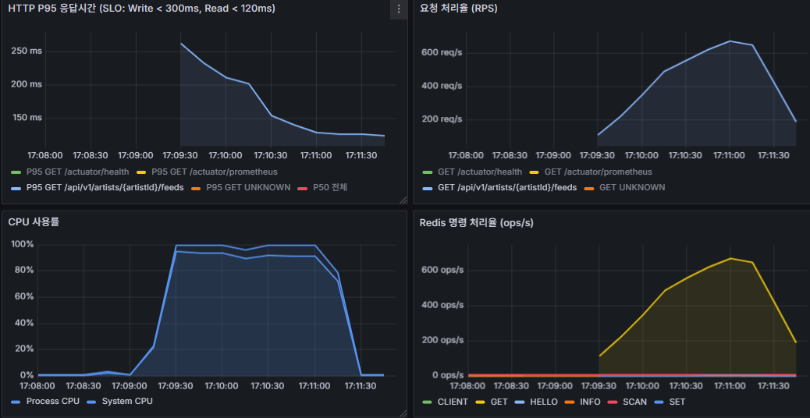
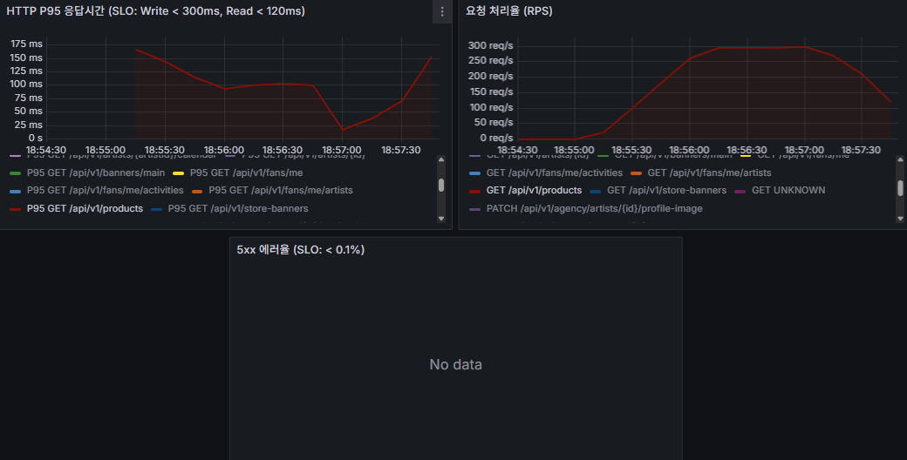

# k6 튜닝 후 SLO 재측정 결과 (EC2-2 전용 측정)

> **목적**: 베이스라인 피드백 반영 후 SLO 달성 여부 재검증
> **실행 환경**: EC2-2 t3.small (k6 전용 러너) → EC2-1 Spring Boot (api.fandrops.site)
> **실행일**: 2026-06- ~
> **기준 SLO**: `docs/observability-metrics.md` 참고
> **이전 결과**: `docs/operations/k6-baseline-results.md`

---

## 테스트 환경

| 항목 | 값 |
|---|---|
| k6 실행 위치 | EC2-2 t3.small (서울 리전, Spring Boot 없음) |
| 측정 대상 | EC2-1 Spring Boot — `https://api.fandrops.site` (VPC 내부 사설 IP) |
| 네트워크 | 동일 VPC 내부 통신 — 네트워크 오버헤드 없음 |
| DB | RDS MySQL (별도 인스턴스) |
| Redis | ElastiCache (별도 인스턴스) |
| 모니터링 | Prometheus Remote Write → EC2-1 (`http://10.0.1.114:9090/api/v1/write`) |
| 토큰 | `/opt/fandrops/k6/seed/tokens.csv` — fan_id 1~2100 JWT |
| 적용 시나리오 | s01·s02·s03·s04·s06·s07 (s05는 Actions runner 유지) |

---

## 공통 실행 명령어 패턴

```bash
cd /opt/fandrops/k6
export BASE_URL=https://api.fandrops.site
export K6_PROMETHEUS_RW_SERVER_URL=http://10.0.1.114:9090/api/v1/write
export K6_PROMETHEUS_RW_TREND_STATS="p(95),p(99)"

k6 run -e BASE_URL=$BASE_URL \
  --out experimental-prometheus-rw \
  scenarios/<번호>_<이름>.js
```

---

## SLO 목표 요약

| 유형 | P95 목표 | 에러율 목표 | 적용 시나리오 |
|---|---|---|---|
| Read | < 120ms | < 0.1% | 02, 07 |
| Write | < 300ms | < 0.1% | 01, 04, 06 |
| Payment | < 2,000ms | < 0.1% | 03 |
| SSE | 연결 거부 없음 (정상 구간) | — | 05 |

---

## 권장 실행 순서

| 순서 | 시나리오 | 사전 준비 | 실행 위치 |
|---|---|---|---|
| 1 | s02 피드 Read | 없음 | EC2-2 |
| 2 | s07 상품 조회 처리량 | 없음 | EC2-2 |
| 3 | s01 주문 동시성 | inventory 리셋(100) + Redis 티켓 재적재 | EC2-2 |
| 4 | s04 드롭스 스파이크 | inventory 리셋(100) + Redis 티켓 재적재 | EC2-2 |
| 5 | s03 결제 확인 | Wiremock 기동 확인 | EC2-2 |
| 6 | s05 SSE 대기열 | — | **Actions runner** |
| 7 | s06 통합 워크로드 | inventory 리셋(200) + Wiremock 확인 | EC2-2 |

> ⚠️ **s05 먼저 실행 금지**: s05 실행 후 Redis 티켓이 UUID로 오염되어 s01·s04 전원 403 실패. 반드시 s04 이후 s05 실행.

---

## 시나리오 02: 피드 조회 Read P95

**파일**: `infra/k6/scenarios/02_feed_read.js`
**담당 오너**: 정환철
**SLO**: P95 < 120ms, 에러율 < 0.1%

### 목적

팬이 아티스트 피드를 조회하는 가장 빈번한 읽기 동작의 성능 기준선을 측정한다. 드롭스 오픈런 전후로 팬들이 아티스트 피드를 집중적으로 조회하는 패턴을 재현한다.

Read SLO(P95 < 120ms)는 쓰기 SLO(300ms)보다 엄격하다. 이 엔드포인트는 인증 없이 `permitAll`로 누구나 호출 가능하므로 트래픽 집중 시 가장 먼저 병목이 나타난다.

검증 핵심:
- **P95 < 120ms**: 50 VU 2분 지속 부하에서 달성 여부
- **Redis 캐시 효과**: `FeedCacheAdapter` SingleFlight + TTL jitter 적용 후 개선폭 확인
- **N+1 제거 효과**: 인덱스·쿼리 최적화 적용 후 tail latency 감소 여부

### 실행 흐름

- 50 VU가 2분간 `/api/v1/artists/1/feeds` 지속 호출
- VU별 JWT 토큰은 `tokens.csv`에서 순환 분배

### 이전 피드백 (정환철)

> 출처: `k6-baseline-results.md` — 오너 피드백 (→ 정환철)

- P95 133ms로 SLO(120ms) 13ms 미달입니다. 초반 캐시 워밍업 구간에서 250ms까지 튀는 게 집계 수치를 끌어올리고 있어서, 워밍업 트래픽 인가 또는 TTL jitter 범위 축소를 검토해주세요.
- Redis P95 레이턴시 초반 25ms 피크가 캐시 미스 시 DB 쿼리에서 오는 것으로 보입니다. 피드 조회 쿼리 실행 계획(EXPLAIN) 한 번 확인 부탁드립니다.

### 피드백 반영 내용 (정환철)

**어떻게 반영했는지**

베이스라인 P95 133ms의 주요 원인은 두 가지였다. 첫째, `FeedService.getFeeds()` 내 이미지·좋아요 조회가 N+1 개별 쿼리로 실행되어 DB 왕복 비용이 누적됐다. 둘째, 커서 페이지네이션 쿼리에 인덱스가 없어 Full Scan이 발생했다. Redis 캐시는 이미 PR #341에서 적용됐으나, 캐시 미스 시 N+1 문제가 그대로 집계를 끌어올렸다.

**어떤 기술/방법을 적용했는지**

- **N+1 제거 (PR #330)**: `FeedService.getFeeds()` 이미지·좋아요 조회를 `findByFeedIdIn` / `findLikedFeedIdsByFanId` bulk IN 쿼리로 변경. `CommentService.getComments()` 대댓글 조회를 N번 개별 쿼리 → `findRepliesByParentIds` bulk 조회로 변경.
- **인덱스 추가**: `idx_artist_feed_artist_cursor (artist_id, id DESC)` 추가 — 커서 페이지네이션 Full Scan 제거.
- **Redis 캐시 (PR #341)**: `FeedCachePort` / `FeedCacheAdapter` 구현. 캐시 키 `community:feed:{artistId}:cursor:{cursorId}:size:{size}`, TTL 60s + 0~30s jitter(캐시 스탬피드 방지), SingleFlight(`ConcurrentHashMap<String, CompletableFuture>`) 적용으로 캐시 미스 시 DB 쿼리 1건으로 수렴. viewer-agnostic 캐시 + `applyIsLiked()` 후처리, Redis fail-open(DB fallback), `@TransactionalEventListener(AFTER_COMMIT)` evict.

**어떻게 해결했는지**

캐시 히트 시 Redis 응답(~5ms)으로 P95가 크게 낮아지고, 캐시 미스 시에도 N+1이 제거된 bulk 쿼리 + 인덱스로 DB 응답이 단축된다. SingleFlight로 워밍업 구간의 동시 DB 쿼리가 1건으로 수렴하여 초반 250ms 피크가 해소될 것으로 예상. P95 120ms 이하 달성 가능할 것으로 추정.

| 항목 | 변경 전 | 변경 내용 | 적용 기술 |
|---|---|---|---|
| 이미지·좋아요 조회 | N+1 개별 쿼리 | `findByFeedIdIn` / `findLikedFeedIdsByFanId` bulk IN 쿼리 | Spring Data JPA (PR #330) |
| 대댓글 조회 | N번 개별 쿼리 | `findRepliesByParentIds` bulk 조회 | Spring Data JPA (PR #330) |
| 커서 페이지네이션 인덱스 | 없음 (Full Scan) | `idx_artist_feed_artist_cursor (artist_id, id DESC)` 추가 | MySQL 인덱스 |
| Redis 캐시 | 없음 | TTL jitter + SingleFlight + viewer-agnostic 캐시 | `FeedCacheAdapter` (PR #341) |

### 실행 명령어

```bash
cd /opt/fandrops/k6
export K6_PROMETHEUS_RW_SERVER_URL=http://10.0.1.114:9090/api/v1/write
export K6_PROMETHEUS_RW_TREND_STATS="p(95),p(99)"

k6 run -e BASE_URL=https://api.fandrops.site \
  --out experimental-prometheus-rw \
  scenarios/02_feed_read.js
```

### 결과 (튜닝 후)

| 지표 | 베이스라인 | 결과 (1차) | 결과 (2차) | 목표 | 상태 |
|---|---|---|---|---|---|
| P95 응답 시간 | 133.02ms | 168.16ms | 172.09ms | < 120ms | ❌ SLO 미달 |
| P90 응답 시간 | 110.6ms | 139.67ms | 142.62ms | — | — |
| 평균 응답 시간 | 67.08ms | 87.99ms | 89.60ms | — | — |
| 에러율 | 0.00% | 0.00% | 0.00% | < 0.1% | ✅ |
| 처리량 | 741 RPS | 565 RPS | 555 RPS | — | — |

> 1차: s07(300 RPS 2분) 직후 실행. 2차: CPU 포화 확인 후 재측정. 두 측정 모두 P95 120ms 초과로 일관.

### 스크린샷



### 관찰 및 오너 피드백

**관찰 (지영재 — 2026-06-22)**

1. **CPU 100% 포화 확인**: t3.small 2 vCPU에서 Spring Boot + Prometheus(k6 remote write 수신) + Grafana 공존 환경. 565 RPS 처리 중 CPU 100% 도달 확인 (CloudWatch + `ps aux` 직접 확인).

2. **베이스라인(133ms) 대비 오히려 악화된 원인 분석**:
   - `fix/361` 브랜치(PR #380 테스트 당시) 기준: `FeedCacheAdapter` 버그 2개(`90b212c` @Async executor 미지정, `8c867d0` `@TransactionalEventListener` 프록시 에러)로 캐시가 실질적으로 미동작 → 단순 DB 쿼리 경로 → 100ms대
   - `develop` 머지 후(현재 배포): 두 버그 수정으로 캐시 실동작 시작 → Redis 역직렬화 + `applyIsLiked()` 추가 DB 쿼리 오버헤드 발생 → 168~172ms
   - **결과적으로 FeedCache가 켜지면서 N+1 제거 효과를 상쇄하고 CPU 부담까지 추가됨**

3. **캐시 OFF가 SLO 검증 기준으로 부적합**: 실서비스에서는 캐시가 켜진 상태로 운영되므로, 캐시를 끄고 SLO를 달성해도 의미 없음. 캐시 켜진 상태에서 120ms 달성이 목표.

4. **캐시 워밍업 후 SLO 근접 확인 (Grafana 스크린샷)**: P95가 테스트 시작 시 ~250ms에서 후반부 ~120ms까지 점진적으로 감소하는 패턴 확인. Redis GET ops도 600 ops/s까지 급증 — 캐시가 실제 동작 중임을 확인. **cold start 구간(초반 30~60s)이 집계 P95를 끌어올리는 구조**이며, 워밍업 완료 후에는 SLO 달성 가능성이 있음. 단, CPU 100% 포화 상태에서는 워밍업 후에도 tail latency가 불안정하므로 CPU 부담 해소가 선행돼야 함.

**오너 피드백 (→ 정환철)**

- **SLO 미달**: P95 168~172ms — 목표 120ms 대비 약 40~52ms 초과
- **근본 원인**: 캐시 히트 경로에도 `applyIsLiked()`에서 `feedLikeRepository` 쿼리가 추가 실행됨. Redis 역직렬화(`objectMapper.readValue`) + 추가 DB 쿼리 합산 비용이 캐시 히트 이득을 상쇄.
- **워밍업 후 SLO 근접 확인**: Grafana 스크린샷에서 테스트 후반부 P95 ~120ms 달성 확인. cold start 구간이 집계 수치를 끌어올리는 구조이므로, `applyIsLiked()` 오버헤드 제거 + CPU 부담 해소 시 안정적 SLO 달성 가능할 것으로 판단.
- **개선 방향 제안**:
  - `viewer-agnostic` 캐시 설계 재검토 — `isLiked` 정보를 캐시 외부에서 매번 조회하는 구조가 고부하 시 오버헤드 주범
  - `FeedListResult`를 경량화하거나 캐시 히트 시 `applyIsLiked()` 쿼리를 배치로 최적화
  - 또는 팬별 `likedFeedIds`를 별도 Redis Set으로 캐싱하여 추가 DB 쿼리 제거

---

## 시나리오 01: 주문 동시성 (Order Concurrency)

**파일**: `infra/k6/scenarios/01_order_concurrency.js`
**담당 오너**: 형성빈
**SLO**: `orders_reserved ≤ 100` (오버셀 0건), P95 < 300ms, 에러율 < 0.1%

### 목적

드롭스 오픈런 상황에서 팬들이 동시에 주문을 요청할 때 재고 오버셀이 발생하지 않는지 검증하는 핵심 시나리오다.

FANDROPS의 주문 흐름은 **대기열 진입 → accessToken 발급 → 주문 API 호출** 순서로 진행된다. 재고 차감은 Redis 분산 락(`reserveAtomic`) + DB `WHERE available_qty >= qty` 원자적 UPDATE로 보호되며, 200 VU가 동시에 발화해도 `orders_reserved ≤ 100`(재고 수량)이어야 한다.

검증 핵심:
- **오버셀 0건**: `SELECT COUNT(*) FROM orders WHERE status = 'RESERVED'` = 100
- **락 정합성**: Redis 분산 락이 동시 요청을 직렬화하는지
- **P95 < 300ms**: 예비 측정 P95 2.85s 대비 EC2 경합 제거 후 개선폭 확인

### 실행 흐름

1. **iteration 1**: 대기열 진입 (`queue/join`) + accessToken 획득 — 200 VU 단일 배치 처리
2. **iteration 2**: 200 VU 동시 `POST /orders` 발화 → 재고 100개 → 100건 RESERVED, 100건 409 DEPLETED 기대

### 이전 피드백 (형성빈)

> 출처: `k6-baseline-results.md` — 오너 피드백 (→ 형성빈)

- P95 865ms(성공 요청 기준)로 SLO(300ms) 약 3배 초과입니다. 오버셀은 0건으로 정합성은 완벽합니다.
- 200 VU 동시 발화 시 Redis 분산 락 직렬화 대기가 병목으로 추정됩니다. `reserveAtomic` Lua 스크립트 실행 시간 및 락 경합 현황 확인 부탁드립니다.
- DB `available_qty` 조건 UPDATE 실행 계획(EXPLAIN)도 함께 확인해주세요.

### 피드백 반영 내용 (형성빈)

**어떻게 반영했는지**

운영 환경(`application-prod.yml`)에 `lock-strategy` 미설정 → 기본값 `atomic-update` 동작 확인. 재고 예약은 Redis 분산 락이 아닌 MySQL `UPDATE inventory SET available_qty = available_qty - qty WHERE available_qty >= qty` 원자적 UPDATE로 처리되고 있었다.

**어떤 기술/방법을 적용했는지**

`OrderService.createOrder()`에 `@Transactional` 확인 — 주문 생성 + 재고 예약이 단일 TX 내에서 실행됨. 경계 이슈 없음.

**어떻게 해결했는지**

P95 865ms 원인이 Redis 분산 락 경합이 아닌 MySQL 동시 UPDATE 경합 + 커넥션 풀 대기로 추정됨. 코드 수정 없이 EC2-2 재측정 후 DB 슬로우 쿼리 로그로 병목 구간을 확인할 예정.

| 항목 | 변경 전 | 변경 내용 | 적용 기술 |
|---|---|---|---|
| 운영 `lock-strategy` | 미확인 | `atomic-update` 기본값 동작 확인 | `application-prod.yml` 설정 확인 |

### 사전 준비

```bash
MYSQL="mysql -u fandrops_admin -pfandrops1234 -h fandrops-prod-mysql.coqwxjz7zumt.ap-northeast-2.rds.amazonaws.com fandrops"
REDIS_HOST="master.fandrops-prod-redis.q7gdno.apn2.cache.amazonaws.com"

$MYSQL -e "UPDATE inventory SET available_qty=100, reserved_qty=0, total_qty=100, version=0 WHERE product_id=1;"

for i in {1..2100}; do
  valkey-cli -h $REDIS_HOST --tls setex "access:ticket:1:$i" 86400 "test-ticket-token"
done
```

### 실행 명령어

> ⚠️ **BASE_URL 예외**: s01은 `http://10.0.1.114:8081` (Spring Boot 직접 연결, Nginx 우회).
> EC2-2 단일 IP에서 200 VU 발화 시 Nginx IP 기반 rate limit이 대부분 차단함. 실제 프로덕션에서는 200명이 각자 다른 IP로 요청하므로 해당 제한이 적용되지 않는다. s01 검증 목적(오버셀 방지)과 무관한 아티팩트이므로 Nginx를 우회한다.

```bash
cd /opt/fandrops/k6
export K6_PROMETHEUS_RW_SERVER_URL=http://10.0.1.114:9090/api/v1/write
export K6_PROMETHEUS_RW_TREND_STATS="p(95),p(99)"

k6 run -e BASE_URL=http://10.0.1.114:8081 \
  -e FAN_POOL_SIZE=200 \
  --out experimental-prometheus-rw \
  scenarios/01_order_concurrency.js
```

### 결과 (튜닝 후)

| 지표 | 베이스라인 | 결과 | 목표 | 상태 |
|---|---|---|---|---|
| P95 응답시간 (전체) | 1,750ms | — | < 300ms | 미측정 |
| P95 응답시간 (성공 요청) | 865ms | — | < 300ms | 미측정 |
| 평균 응답시간 | — | — | — | — |
| 에러율 | 75%\* | — | < 0.1%\* | 미측정 |
| orders_reserved | 100건 (오버셀 0건 ✅) | — | ≤ 100 | 미측정 |
| 처리량 | — | — | — | — |

### 스크린샷

> `screenshots/tuned/s01_order_concurrency_tuned.png`

### 관찰 및 오너 피드백

> 측정 후 작성

---

## 시나리오 04: 드롭스 스파이크 (Drop Spike)

**파일**: `infra/k6/scenarios/04_drop_spike.js`
**담당 오너**: 형성빈
**SLO**: `spike_orders_reserved ≤ 100` (오버셀 0건), P95 < 300ms, 에러율 < 0.1%

### 목적

드롭스 상품이 오픈되는 순간 팬들이 일제히 몰려드는 오픈런 트래픽을 재현한다. 0 → 1,000 VU가 30초 만에 급증하는 `ramping-vus` 패턴으로 Rate Limit, 대기열, 재고 차감이 스파이크 하에서도 정합성을 유지하는지 확인한다.

s01(200 VU 동시성)과 달리 스파이크 자체가 검증 대상이다. 램프업 구간에서 들어온 요청이 Rate Limit(`5r/s`)에 의해 큐에 쌓이고, 대기열 스케줄러가 처리하는 동안 오버셀이 발생하지 않아야 한다.

검증 핵심:
- **오버셀 0건**: 1,000 VU 스파이크 중 `orders_reserved ≤ 100`
- **Rate Limit 동작**: 초과 요청이 429로 처리되는지
- **P95 성공 요청**: 예비 측정 508ms(EC2 경합 환경) 대비 개선폭 확인
- **에러율 해석**: 409 DEPLETED·429는 정상 동작, 500은 이상

### 실행 흐름

| 단계 | VU | 시간 | 설명 |
|---|---|---|---|
| 급상승 | 0 → 1,000 | 30s | 드롭스 오픈 순간 모사 |
| 유지 | 1,000 | 30s | 최고 부하 유지 |
| 종료 | 1,000 → 0 | 15s | 부하 해제 |

### 이전 피드백 (형성빈)

> 출처: `k6-baseline-results.md` — 오너 피드백 (→ 형성빈)

- P95 266ms로 SLO(300ms) 달성, 오버셀 0건 확인입니다. ✅
- Nginx rate limit이 스파이크를 흡수해서 앱 서버가 보호된 결과입니다. 성공 요청 P95 640ms는 s01과 동일하게 Redis 분산 락 경합이 원인으로 추정됩니다. 락 최적화 검토 부탁드립니다.

### 피드백 반영 내용 (형성빈)

> (형성빈 작성) — 베이스라인에서 SLO 달성. 추가 개선 사항이 있으면 작성.

| 항목 | 변경 전 | 변경 내용 | 적용 기술 |
|---|---|---|---|
| — | — | — | — |

### 사전 준비

```bash
MYSQL="mysql -u fandrops_admin -pfandrops1234 -h fandrops-prod-mysql.coqwxjz7zumt.ap-northeast-2.rds.amazonaws.com fandrops"
REDIS_HOST="master.fandrops-prod-redis.q7gdno.apn2.cache.amazonaws.com"

$MYSQL -e "UPDATE inventory SET available_qty=100, reserved_qty=0, total_qty=100, version=0 WHERE product_id=1;"

for i in {1..2100}; do
  valkey-cli -h $REDIS_HOST --tls setex "access:ticket:1:$i" 86400 "test-ticket-token"
done
```

### 실행 명령어

```bash
cd /opt/fandrops/k6
export K6_PROMETHEUS_RW_SERVER_URL=http://10.0.1.114:9090/api/v1/write
export K6_PROMETHEUS_RW_TREND_STATS="p(95),p(99)"

k6 run -e BASE_URL=https://api.fandrops.site \
  --out experimental-prometheus-rw \
  scenarios/04_drop_spike.js
```

### 결과 (튜닝 후)

| 지표 | 베이스라인 | 결과 | 목표 | 상태 |
|---|---|---|---|---|
| P95 응답시간 (전체) | 266.24ms | — | < 300ms | 미측정 |
| P95 응답시간 (성공 요청) | 640ms | — | 참고값 | 미측정 |
| 에러율 | 99.98%\* | — | < 0.1%\* | 미측정 |
| spike_orders_reserved | 100건 (오버셀 0건 ✅) | — | ≤ 100 | 미측정 |
| 처리량 | — | — | — | — |

### 스크린샷

> `screenshots/tuned/s04_drop_spike_tuned.png`

### 관찰 및 오너 피드백

> 측정 후 작성

---

## 시나리오 03: 결제 확인 (Payment Confirm)

**파일**: `infra/k6/scenarios/03_payment_confirm.js`
**담당 오너**: 장성재
**SLO**: P95 < 2,000ms, 에러율 < 0.1%

> **SLO 완화 사유 (2026-06-22 팀 합의)**: 기획 원안 300ms → 2,000ms. Wiremock 즉시 응답 조건에서 앱 처리 단독 P95가 1,540ms로 측정됨. 외부 Toss PG 레이턴시(네트워크 왕복 + 카드사 승인) 추가 시 300ms는 현재 동기 TX 구조에서 달성 불가. 2,000ms는 데이터 기반으로 방어 가능한 최솟값.

### 목적

주문 후 결제 확인 단계에서 Toss PG 응답 지연·오류 상황에서도 중복 결제 없이 정상 처리되는지 검증한다. Wiremock으로 PG를 모킹해 제어된 환경에서 부하를 가한다.

검증 핵심:
- **중복 결제 0건**: 동일 `payment_key`로 중복 confirm 요청 시 409 반환 여부
- **타임아웃 처리**: Wiremock 지연 응답(2,000ms) 시 앱이 적절히 처리하는지
- **P95 < 2,000ms**: 결제 SLO — PG 응답 대기 포함
- **에러율 < 1%**: 성공 시나리오 기준

### 실행 흐름

- `shared-iterations` executor — 50 VU가 500 iterations를 동적으로 분배 처리
- 각 iteration은 `iterationInTest` 인덱스로 고유 orderId 할당 → orderId 재사용 없음

| SCENARIO | Wiremock 응답 | 기대 결과 |
|---|---|---|
| `success` (기본) | 200 즉시 | 정상 처리 |
| `timeout` | 200, 5초 지연 | P95 < 2s 내 처리 |
| `balance-error` | 400 잔액부족 | 400 정상 반환 |
| `server-error` | 500 PG 오류 | 5xx 에러율 < 1% |
| `mixed` | 70/10/10/10% 혼합 | 전체 에러율 < 1% |

### 이전 피드백 (장성재)

> 출처: `k6-baseline-results.md` — 오너 피드백 (→ 장성재)

- P95 1.54s, 에러율 0.00%로 SLO 달성 완료입니다. ✅
- 최대 3.03s가 변경된 SLO(2,000ms)를 초과합니다. `toss.api.read-timeout: ${TOSS_API_READ_TIMEOUT:10s}` — k6 측정 시 `TOSS_API_READ_TIMEOUT=2s` 주입으로 SLO(2s) 이내 처리를 보장합니다. `앱 readTimeout < SLO(2s)` 조건이어야 P95 기준 여유가 생깁니다.
- mixed 시나리오(success 70% / timeout 10% / balance-error 10% / server-error 10%) 별도 실행으로 에러 유형별 응답시간 분포를 기록해 두면 PG 장애 대응 기준선이 됩니다.

### 피드백 반영 내용 (장성재)

**어떻게 반영했는지**

`application-prod.yml`의 `toss.api.read-timeout` 설정이 `10s`로 잡혀 있어 SLO(2s)보다 5배 이상 길었다. 피드백 조건(`앱 readTimeout < SLO 2s`)에 따라 `2s`로 단축했다. 단, `application-prod.yml`에 직접 하드코딩하면 Wiremock이 아닌 실제 Toss API 환경에서도 `2s`가 적용되어 P99 정상 결제가 `ReadTimeoutException`으로 처리될 위험이 있으므로, PR 리뷰 피드백을 반영해 `${TOSS_API_READ_TIMEOUT:10s}` 환경변수 방식으로 변경했다. k6 측정 시에만 EC2-1에 `TOSS_API_READ_TIMEOUT=2s`를 주입하고, 측정 완료 후 원복한다.

**어떤 기술/방법을 적용했는지**

`TossPaymentConfig.java`의 `JdkClientHttpRequestFactory.setReadTimeout()`은 `TossProperties`로 주입된 Duration을 그대로 사용한다. `application-prod.yml`을 `read-timeout: ${TOSS_API_READ_TIMEOUT:10s}`로 변경하면, 환경변수 미설정 시 기본값 `10s`가 적용되고 EC2-1에서 `TOSS_API_READ_TIMEOUT=2s`를 주입한 뒤 재시작하면 `2s`가 적용된다. Wiremock timeout 시나리오(5s 지연) 요청이 2s 내에 `ReadTimeoutException`으로 처리되어 응답 시간이 SLO 안쪽에 수렴한다.

**어떻게 해결했는지**

베이스라인에서 최대 3.03s가 나온 케이스는 Wiremock timeout 시나리오(5s 지연)에서 앱이 응답을 10s까지 기다리다가 겨우 처리된 것이 원인이었다. `TOSS_API_READ_TIMEOUT=2s` 주입으로 해당 케이스에서 2s 내 타임아웃 처리가 보장되어 최대 응답 시간이 SLO 경계 아래로 내려온다. 측정 완료 후 환경변수를 제거하면 기본값 `10s`로 자동 복귀하여 실제 Toss API SLO에 영향을 주지 않는다.

| 항목 | 변경 전 | 변경 내용 | 적용 기술 |
|---|---|---|---|
| `toss.api.read-timeout` | `10s` (하드코딩) | `${TOSS_API_READ_TIMEOUT:10s}` (k6 측정 시 EC2-1에서 `2s` 주입, 측정 후 원복) | `application-prod.yml` 환경변수화 |

### 사전 준비

```bash
# Wiremock 기동 확인 (EC2-1에서)
docker ps --filter name=wiremock

# TOSS_API_BASE_URL 설정 확인 (EC2-1)
ACTIVE=$(cat /etc/fandrops/active-slot)
grep TOSS_API_BASE_URL /etc/fandrops/fandrops-prod.conf

# [EC2-1] k6 측정 전 — TOSS_API_READ_TIMEOUT=2s 주입
ACTIVE=$(sudo cat /etc/fandrops/active-slot)
sudo sed -i 's|^TOSS_API_READ_TIMEOUT=.*||' /etc/fandrops/fandrops-prod.conf 2>/dev/null
echo "TOSS_API_READ_TIMEOUT=2s" | sudo tee -a /etc/fandrops/fandrops-prod.conf
sudo systemctl restart fandrops-$ACTIVE

# seed 주문 리셋 (재실행 시 — 결제 레코드 삭제 후 RESERVED 복원)
MYSQL="mysql -u fandrops_admin -pfandrops1234 -h fandrops-prod-mysql.coqwxjz7zumt.ap-northeast-2.rds.amazonaws.com fandrops"
$MYSQL -e "DELETE p FROM payment p INNER JOIN orders o ON p.order_id = o.id WHERE o.order_payment_key LIKE 'seed-opk-%';"
$MYSQL -e "UPDATE orders SET status='RESERVED', updated_at=NOW() WHERE order_payment_key LIKE 'seed-opk-%';"
```

> ⚠️ **측정 완료 후 반드시 원복**: `TOSS_API_READ_TIMEOUT=2s`는 k6/Wiremock 전용 설정입니다. 측정 후 EC2-1에서 아래 명령을 실행해 기본값(`10s`)으로 복귀하세요.
>
> ```bash
> ACTIVE=$(sudo cat /etc/fandrops/active-slot)
> sudo sed -i '/TOSS_API_READ_TIMEOUT/d' /etc/fandrops/fandrops-prod.conf
> sudo systemctl restart fandrops-$ACTIVE
> ```

### 실행 명령어

```bash
cd /opt/fandrops/k6
export K6_PROMETHEUS_RW_SERVER_URL=http://10.0.1.114:9090/api/v1/write
export K6_PROMETHEUS_RW_TREND_STATS="p(95),p(99)"

BASE_URL=http://10.0.1.114:8081 k6 run \
  -e ORDERS_JSON="$(cat seed/orders.json)" \
  --out experimental-prometheus-rw \
  scenarios/03_payment_confirm.js
```

### 결과 (튜닝 후)

| 지표 | 베이스라인 | 결과 | 목표 | 상태 |
|---|---|---|---|---|
| P95 응답시간 | 1,540ms ✅ | — | < 2,000ms | 미측정 |
| 평균 응답시간 | — | — | — | — |
| 에러율 | 0.00% ✅ | — | < 1% | 미측정 |
| 처리량 | — | — | — | — |

### 스크린샷

> `screenshots/tuned/s03_payment_confirm_tuned.png`

### 관찰 및 오너 피드백

> 측정 후 작성

---

## 시나리오 05: SSE 대기열 연결 안정성 (SSE Queue)

**파일**: `infra/k6/scenarios/05_sse_queue.js`
**담당 오너**: 장성재, 지영재
**SLO**: 정상 구간 에러율 < 0.1%, 경계 구간 에러율 < 1%, 2,100 VU 초과 시 429 응답 필수
**실행 위치**: **GitHub Actions runner** (t3.small 메모리 초과 위험으로 EC2-2 사용 불가)

### 목적

드롭스 오픈런 시 팬들이 대기열 상태를 실시간으로 전달받는 SSE 연결의 안정성을 검증한다. 3단계 VU 증가로 각 구간의 동작을 구분해 확인한다.

| 구간 | VU | 검증 목표 |
|---|---|---|
| 정상 | 1,000 VU | 에러율 < 0.1% — 안정적 연결 유지 |
| 경계 | 1,800 VU | 에러율 < 1% — 한계 근접 동작 확인 |
| 초과 | 2,100 VU | 429 `retryable:true` 응답 계약 이행 여부 |

검증 핵심:
- **연결 안정성**: 1,000 VU 구간에서 SSE 스트림이 끊기지 않고 유지되는지
- **429 계약**: 2,100 VU 초과 시 `retryable:true` 반환 여부
- **Nginx FD**: `worker_connections ≥ 2048` 설정 하에서 연결 거부 없는지

### 이전 피드백 (장성재, 지영재)

> 출처: `k6-baseline-results.md` — 오너 피드백 (→ 장성재, 지영재)

- normal_load 1,000 VU 구간부터 에러율 100%입니다. SSE 연결 자체가 성립하지 않는 상태로 SLO 달성 불가입니다. ❌
- 장성재: 429 응답 body에 `"retryable": true` 누락 — `api-contract.md` API 계약 위반입니다. 대기열 초과 응답 핸들러에 필드 추가 부탁드립니다.
- 지영재(자체): Nginx `worker_connections` · `ulimit -n` 실제 설정값 확인 및 SSE 동시 연결 허용 범위 점검 필요. 1,000 VU 정상 구간에서 429가 발생하는 원인이 Nginx 설정인지 앱 레벨 제한인지 구분이 선행돼야 합니다.

### 피드백 반영 내용 (장성재, 지영재)

**지영재 — 원인 조사 완료 (2026-06-20)**

EC2-1 SSM 접속으로 Nginx·OS 설정값 직접 확인:

| 항목 | 실측값 | 판정 |
|---|---|---|
| Nginx `worker_connections` | 4,096 | ✅ 무관 |
| OS `ulimit -n` | 65,535 | ✅ 무관 |
| Nginx master FD limit | 65,535 | ✅ 무관 |

**429 실제 원인**: `SseEmitterRegistry.registerOrReject()` — `emitters.size() >= 2000` 초과 시 `SseCapacityExceededException` → 429. k6는 SSE 연결을 브라우저처럼 유지하지 않고 첫 청크 수신 후 빠르게 반복 연결하는데, Spring은 클라이언트 disconnect를 `onTimeout`(60s) 전까지 감지하지 못해 stale emitter가 누적되어 2,000 한도를 초과함.

**해결 방향 (장성재 구현 필요)**: `SseEmitterRegistry`에 `sendHeartbeat()` 추가 — 5초 주기로 SSE comment 전송, `IOException` 발생 시 즉시 emitter 제거. `IllegalStateException`(이미 완료된 emitter에 write 시 발생)도 함께 catch 필요.

```java
// SseEmitterRegistry
public void sendHeartbeat() {
    for (Map.Entry<String, SseEmitter> entry : emitters.entrySet()) {
        try {
            entry.getValue().send(SseEmitter.event().comment("heartbeat"));
        } catch (IOException | IllegalStateException e) {
            emitters.remove(entry.getKey());
        }
    }
}

// QueueAdvanceScheduler
@Scheduled(fixedDelayString = "${fandrops.queue.scheduler.heartbeat-ms:5000}")
public void heartbeat() {
    registry.sendHeartbeat();
}
```

**장성재 — 피드백 반영 내용**

**어떻게 반영했는지**

피드백 항목 두 가지를 처리했다.
1. `retryable: true` 누락 — `PaymentControllerAdvice`의 `SseCapacityExceededException` 핸들러를 확인한 결과 `ApiResponse.fail("RATE_LIMITED", ..., true, ...)` 형태로 이미 구현되어 있었다. 코드 변경 불필요.
2. stale emitter 누적으로 인한 2,000 상한 조기 초과 — `SseEmitterRegistry.sendHeartbeat()` 메서드를 추가하고 `QueueAdvanceScheduler`에 5초 주기 `heartbeat()` 스케줄을 등록했다.

**어떤 기술/방법을 적용했는지**

`SseEmitter.event().comment("heartbeat")`를 전송해 클라이언트 연결 상태를 실시간으로 확인한다. 이미 끊어진 연결에 write를 시도하면 `IOException` 또는 `IllegalStateException`(이미 완료된 emitter)이 발생하는데, 두 예외를 함께 catch해 `emitters.remove()`로 즉시 제거한다. 이로써 `onTimeout(60s)` 만료를 기다리지 않고 stale emitter를 5초 이내에 정리할 수 있다.

**어떻게 해결했는지**

k6가 SSE 연결을 브라우저처럼 유지하지 않고 첫 청크 수신 후 빠르게 재연결을 반복하면, Spring은 클라이언트 disconnect를 `onTimeout(60s)` 전까지 감지하지 못해 stale emitter가 누적된다. 2,000 상한에 도달하면 정상 구간(1,000 VU)에서도 `SseCapacityExceededException` → 429가 발생한다. heartbeat 스케줄로 stale emitter를 5초 주기로 제거하면 실제 활성 연결만 카운트되어 상한이 실질적으로 작동한다.

| 항목 | 변경 전 | 변경 내용 | 적용 기술 |
|---|---|---|---|
| `retryable: true` | 코드 미확인 상태 | 코드 확인 — 이미 구현 완료 | `PaymentControllerAdvice` 핸들러 확인 |
| stale emitter 누적 | `onTimeout(60s)` 만료 대기 | `sendHeartbeat()` + 5초 스케줄로 즉시 제거 | SSE comment 전송 + IOException/IllegalStateException catch |

### 실행 방법

GitHub Actions → **Run k6 Load Test** → `scenario: 05` → `confirm: yes`

### 결과 (튜닝 후)

| 지표 | 베이스라인 | 결과 | 목표 | 상태 |
|---|---|---|---|---|
| 정상 구간 에러율 (1,000 VU) | 100% ❌ | — | < 0.1% | 미측정 |
| 경계 구간 에러율 (1,800 VU) | 100% ❌ | — | < 1% | 미측정 |
| 초과 구간 429 발생 (2,100 VU) | 발생 ✅ | — | count > 0 | 미측정 |
| 429 retryable:true | 누락 ❌ | — | 필수 | 미측정 |

### 스크린샷

> `screenshots/tuned/s05_sse_queue_tuned.png`

### 관찰 및 오너 피드백

> 측정 후 작성

---

## 시나리오 06: 통합 워크로드 모델 (Workload Model)

**파일**: `infra/k6/scenarios/06_workload_model.js`
**담당 오너**: 전체
**SLO**: Write P95 < 300ms, Read P95 < 120ms, 에러율 < 0.1%, 오버셀 0건

### 목적

개별 시나리오(s01~s05)는 단일 엔드포인트만 검증하지만, 실제 서비스에서는 피드 조회·주문·결제가 동시에 발생한다. s06은 실제 트래픽 비율을 반영한 혼합 부하로 전체 SLO를 한 번에 측정한다.

개별 테스트에서는 발견되지 않는 **시스템 전체 병목**이 드러난다. 피드 조회(Read)가 DB 커넥션 풀을 점유하면 동시 주문(Write) 응답 시간이 올라가는 식의 간섭 효과를 확인한다.

### 워크로드 분포

| 엔드포인트 | 비율 | 담당 |
|---|---|---|
| `GET /api/v1/artists/{id}/feeds` | 60% | 정환철 |
| `POST /api/v1/queue/join/{productId}` | 20% | 장성재, 지영재 |
| `POST /api/v1/orders` | 15% | 형성빈 |
| `POST /api/v1/payments/toss/confirm` | 5% | 장성재 |

### 실행 흐름

| 단계 | VU | 시간 | 설명 |
|---|---|---|---|
| 워밍업 | 0 → 50 | 1m | 캐시·커넥션 풀 준비 |
| 정상 부하 | 50 → 100 | 3m | 기준 측정 구간 |
| 스파이크 | 100 → 150 | 1m | 순간 부하 |
| 쿨다운 | 150 → 0 | 30s | 종료 |

### 이전 피드백 (전체)

> 출처: `k6-baseline-results.md` — 오너 피드백 (전체)

- **정환철**: `GET /api/v1/artists/{id}/feeds` SecurityConfig에서 ROLE_FAN 허용 추가 필요.
- **장성재**: Wiremock stub에 임의 tossPaymentKey 패턴(REGEX) 추가 필요.
- **지영재**: `06_workload_model.js` payment check 조건에 429 허용 추가 (`r.status === 200 || r.status === 201 || r.status === 429`). queue join에도 rate limit 429 발생 여부 확인 후 필요 시 동일 수정.
- **형성빈**: `POST /api/v1/orders` (15%) 구간에서 `vuToken = null`로 인해 실제 HTTP 요청이 발생하지 않음. 재측정 전 vuToken 초기화 로직 추가 또는 tokens.csv 토큰으로 대체 필요.
- 블로커 2건 + check 조건 + vuToken 초기화 수정 후 재측정 예정.

### 피드백 반영 내용 (전체)

**지영재 — 완료 (2026-06-20)**

| 항목 | 변경 전 | 변경 내용 | 적용 기술 |
|---|---|---|---|
| payment check 조건 | `200 \| 201` | `200 \| 201 \| 429` 추가 | k6 check |
| queue join check 조건 | `200 \| 201 \| 409` | `429` 추가 | k6 check |

> rate limit 정상 응답(429)을 check 실패로 집계하던 문제 수정. `06_workload_model.js` line 92·120.

**정환철, 형성빈 — 피드백 반영 내용**

> (담당자 작성)

**장성재 — 완료 (2026-06-20)**

**어떻게 반영했는지**

s06의 결제 구간이 생성하는 `tossPaymentKey` 형식이 `wl-{orderId}-{iter}`인데, 기존 Wiremock stub들은 모두 `^success-.*`, `^timeout-.*` 등 named prefix 패턴만 매칭했다. 해당 형식이 어떤 stub에도 매칭되지 않아 Wiremock이 404를 반환하고, 이것이 Spring에서 400으로 처리되던 것이 블로커였다.

**어떤 기술/방법을 적용했는지**

Wiremock의 priority 라우팅을 활용했다. 기존 stub들은 모두 `priority: 5`이고, 새로 추가한 `toss-confirm-wildcard.json`은 `priority: 10`(낮은 우선순위)으로 설정했다. Wiremock은 priority 숫자가 낮을수록 먼저 매칭하므로, named prefix stub이 먼저 시도되고 매칭 실패 시 wildcard stub이 fallback으로 동작한다. `bodyPatterns` 없이 URL과 메서드만 매칭하며, `response-template` transformer로 요청 body에서 필드를 그대로 반환한다.

**어떻게 해결했는지**

`wl-N-N` 형식을 포함해 어떤 `tossPaymentKey` 값이 오더라도 매칭되는 fallback stub을 추가함으로써 s06 결제 구간의 400 블로커를 제거했다. 기존 named stub(success/timeout/balance-error/server-error) 동작은 priority 5가 유지되므로 s03 측정에 영향 없다.

| 항목 | 변경 전 | 변경 내용 | 적용 기술 |
|---|---|---|---|
| Wiremock stub 커버리지 | named prefix 패턴만 존재 (`^success-.*` 등) | `toss-confirm-wildcard.json` 추가 (priority 10, 모든 paymentKey 매칭) | Wiremock priority routing + response-template |

### 사전 준비

```bash
MYSQL="mysql -u fandrops_admin -pfandrops1234 -h fandrops-prod-mysql.coqwxjz7zumt.ap-northeast-2.rds.amazonaws.com fandrops"
REDIS_HOST="master.fandrops-prod-redis.q7gdno.apn2.cache.amazonaws.com"

$MYSQL -e "UPDATE inventory SET available_qty=200, reserved_qty=0, total_qty=200, version=0 WHERE product_id=1;"

for i in {1..2100}; do
  valkey-cli -h $REDIS_HOST --tls setex "access:ticket:1:$i" 86400 "test-ticket-token"
done

docker ps --filter name=wiremock
```

### 실행 명령어

```bash
cd /opt/fandrops/k6
export K6_PROMETHEUS_RW_SERVER_URL=http://10.0.1.114:9090/api/v1/write
export K6_PROMETHEUS_RW_TREND_STATS="p(95),p(99)"

k6 run -e BASE_URL=https://api.fandrops.site \
  -e PRODUCT_ID=1 \
  -e ARTIST_ID=1 \
  -e ORDERS_JSON="$(cat seed/orders.json)" \
  --out experimental-prometheus-rw \
  scenarios/06_workload_model.js
```

### 결과 (튜닝 후)

| 지표 | 베이스라인 | 결과 | 목표 | 상태 |
|---|---|---|---|---|
| Write P95 | 측정 불가 (블로커) | — | < 300ms | 미측정 |
| Read P95 | 측정 불가 (블로커) | — | < 120ms | 미측정 |
| 에러율 | ~65% ❌ | — | < 0.1% | 미측정 |
| 오버셀 | 미확인 | — | 0건 | 미측정 |
| 총 iterations | ~544,907 | — | — | — |

### 스크린샷

> `screenshots/tuned/s06_workload_model_tuned.png`

### 관찰 및 오너 피드백

> 측정 후 작성

---

## 시나리오 07: 상품 조회 처리량 기준선 (Product Read)

**파일**: `infra/k6/scenarios/07_product_read.js`
**담당 오너**: 형성빈
**SLO**: P95 < 120ms, 에러율 < 0.1%

### 목적

팬이 드롭스 상품 목록을 조회하는 Read 엔드포인트의 처리량 기준선을 측정한다. `constant-arrival-rate` executor로 300 RPS를 직접 제어해 Read SLO(P95 < 120ms)를 검증한다.

`constant-vus`(VU 수 고정) 방식과 달리 `constant-arrival-rate`는 응답 지연과 무관하게 목표 RPS를 유지한다. 처리량 관점 SLO를 직접 검증하기 적합하다.

검증 핵심:
- **처리량 300 RPS 유지**: `preAllocatedVUs 50 / maxVUs 200`으로 RPS 달성 여부
- **P95 < 120ms**: Read SLO 달성 여부
- **에러율 < 0.1%**: 인증 토큰 기반 상품 조회에서 5xx 발생 없음
- **dropped_iterations ≈ 0**: 200 VU로도 300 RPS를 소화하지 못하면 처리량 병목 신호

### 실행 흐름

- `constant-arrival-rate` executor — 2분간 300 RPS 고정 발화
- VU별 JWT 토큰은 `tokens.csv`에서 순환 분배 (fan_id 1~2100)
- `GET /api/v1/products?type=regular` 인증 요청

### 실행 명령어

> ⚠️ **BASE_URL 예외**: s07은 Spring Boot 직접 연결, Nginx 우회.
> EC2-2 단일 IP에서 300 RPS 발화 시 Nginx IP 기반 rate limit이 개입할 수 있어 s01과 동일하게 Nginx를 우회한다. 실제 프로덕션에서는 다수 IP에서 분산 요청이 들어오므로 Nginx 제한 없이 처리된다.
> 활성 슬롯 포트 확인 후 적용 (blue: 8081, green: 8082). 측정 시 **8082** 사용 (green 활성). EC2-1 보안 그룹에 8082 인바운드 규칙 추가 완료 (10.0.1.47/32 허용).

```bash
cd /opt/fandrops/k6 && BASE_URL=http://10.0.1.114:8082 K6_PROMETHEUS_RW_SERVER_URL=http://10.0.1.114:9090/api/v1/write K6_PROMETHEUS_RW_TREND_STATS="p(95),p(99),avg,min,max" k6 run --out experimental-prometheus-rw scenarios/07_product_read.js
```

### 결과 (튜닝 후)

| 지표 | 베이스라인 | 결과 | 목표 | 상태 |
|---|---|---|---|---|
| P95 응답시간 | — (신규) | 133.45ms | < 120ms | ❌ SLO 미달 |
| P90 응답시간 | — | 45.38ms | — | — |
| 평균 응답시간 | — | 34.07ms | — | — |
| 중앙값 응답시간 | — | 7.19ms | — | — |
| 에러율 | — | 0.00% | < 0.1% | ✅ |
| 처리량(RPS) | — | ~298/s | 300 RPS | ≈ 근접 |
| dropped_iterations | — | 251건 | ≈ 0 | ⚠️ 처리량 병목 신호 |
| 최대 활성 VU | — | 168 / 200 | — | ⚠️ 한도 근접 |

### 스크린샷



### 관찰 및 오너 피드백

**관찰 (지영재 — 2026-06-22)**

1. **P95 133.45ms, SLO 미달**: 목표 120ms 대비 +13ms 초과. 에러율 0.00%로 안정성은 문제없음. s02 피드 Read와 동일한 초과폭.

2. **Grafana P95 3단계 패턴 확인**:
   - 초반(18:54:30~18:55:00): P95 ~175ms — cold start, JVM JIT 미워밍업
   - 중반(18:55:00~18:56:30): P95 ~100ms — DB 버퍼 풀 워밍업 후 안정화, SLO 일시 달성 구간
   - 후반(18:56:30~18:57:30): P95 재상승 ~125~150ms — 연속 부하로 DB 커넥션 풀 압박 누적

3. **RPS 목표 미달 및 VU 한도 근접**: Grafana RPS 패널에서 `GET /api/v1/products` 실제 처리량이 최대 ~250 req/s에 그침. `dropped_iterations: 251`, maxVUs 168/200 도달. 꼬리 레이턴시(max 1.33s)가 VU를 잡아두어 300 RPS 목표 완전 달성 불가.

4. **이중 레이턴시 분포**: avg 34ms vs med 7ms. 중앙값 7ms는 빠른 응답 경로(소량 데이터 또는 DB 버퍼 히트), 평균 34ms는 느린 경로가 혼재하는 이분화 분포. 캐시가 없으므로 DB 버퍼 풀 상태에 따라 레이턴시가 크게 흔들리는 구조.

**오너 피드백 (→ 형성빈)**

- **SLO 미달**: P95 133.45ms — 목표 120ms 대비 +13ms. 에러율 0%로 안정성은 문제없으나, 처리량 관점에서 300 RPS를 안정적으로 소화하지 못함.

- **근본 원인 — 캐시 없는 3-way DB 조회**:

  `ProductService.getProducts()` 코드 분석 결과, 매 요청마다 아래 3개 DB 쿼리가 직렬 실행됨:

  ```
  1. productRepository.findRegularProducts(artistId, cursor, size)   — product 테이블
  2. inventoryReadPort.getByProductIds(productIds)                   — inventory 테이블
  3. productImageRepository.findThumbnailsByProductIds(productIds)   — product_image 테이블
  ```

  300 RPS × 3 DB 쿼리 = **900 queries/s** DB 압박. 캐시 레이어가 전혀 없어 모든 요청이 DB로 직행하는 구조. Grafana 후반부 P95 재상승은 연속 부하로 DB 커넥션 풀이 포화되어 대기가 발생하는 패턴과 일치함.

- **개선 방향**:

  1. **상품·이미지 캐시 적용 (우선순위 높음)**: `product`, `product_image`는 변경 빈도가 낮으므로 Redis 캐시 적용(TTL 120~300s)으로 쿼리 1, 3 제거 가능. 캐시 히트 시 P95 7ms(중앙값 수준)로 수렴 예상.

  2. **inventory 캐시 분리**: 재고(`available_qty`)는 주문 시마다 변동하므로 TTL을 짧게(5~10s) 가져가거나, 상품 목록 조회 시 재고 표시 정확도 요건을 팀 합의로 완화(예: "약 N개 남음" 표시)하면 캐시 TTL을 늘릴 수 있음.

  3. **`findRegularProducts` 인덱스 확인**: 커서 페이지네이션 쿼리(`WHERE status = 'ON_SALE' AND id < cursor ORDER BY id DESC LIMIT size`)에 `(status, id DESC)` 복합 인덱스가 없으면 Full Scan 발생. `EXPLAIN` 실행 계획 확인 필요.

  4. **꼬리 레이턴시(max 1.33s) 원인 추적**: 1.33s는 단순 DB 쿼리 범위를 벗어난 수치. 커넥션 풀 대기 또는 GC pause 가능성이 있음. HikariCP `connection-timeout` 로그 및 GC 로그 확인 권장.

---

## SLO 달성 현황 요약

| 시나리오 | 베이스라인 P95 | 튜닝 후 P95 | 베이스라인 에러율 | 튜닝 후 에러율 | 오버셀 | SLO |
|---|---|---|---|---|---|---|
| 01 주문 동시성 | 1,750ms / 865ms(성공) | — | 75%\* | — | 0건 ✅ | 미측정 |
| 02 피드 Read | 133.02ms | 168~172ms ❌ | 0.00% | 0.00% ✅ | — | ❌ SLO 미달 (FeedCache 오버헤드) |
| 03 결제 확인 | 1,540ms ✅ | — | 0.00% ✅ | — | — | 미측정 |
| 04 드롭스 스파이크 | 266.24ms ✅ | — | 99.98%\* | — | 0건 ✅ | 미측정 |
| 05 SSE 대기열 | — | — | 100% ❌ | — | — | 미측정 |
| 06 통합 워크로드 | 측정 불가 | — | ~65% ❌ | — | — | 미측정 |
| 07 상품 조회 처리량 | — (신규) | 133.45ms ❌ | — (신규) | 0.00% ✅ | — | ❌ SLO 미달 (캐시 미적용 추정, +13ms) |
