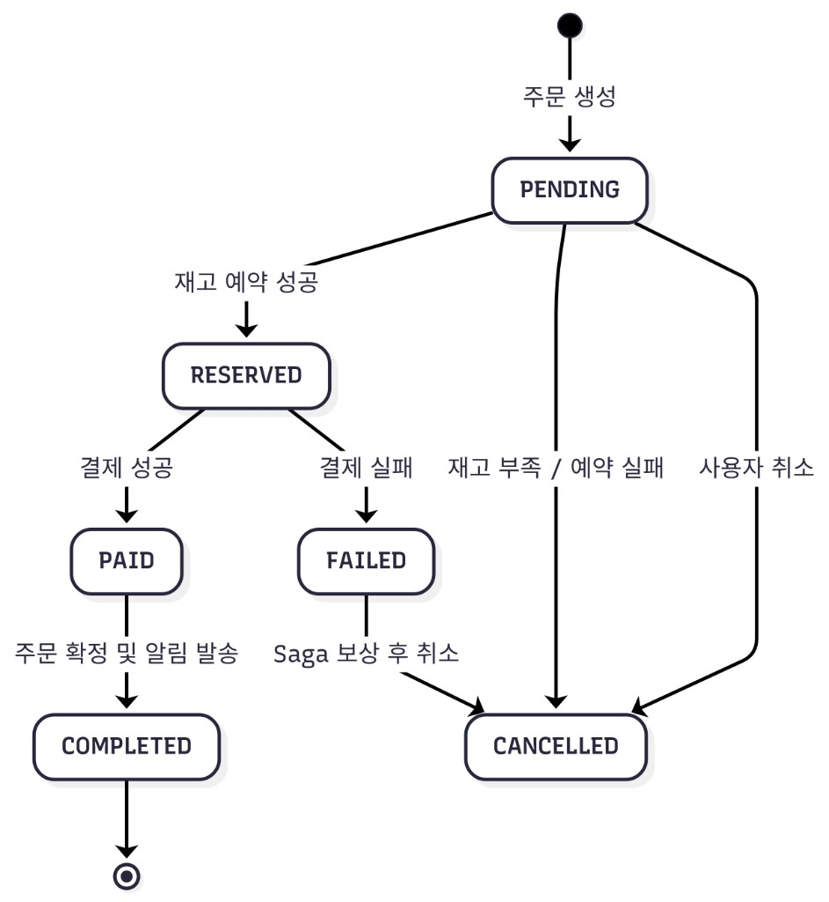

# 불변조건 · 상태 머신

> **다이어그램 (ORDER):** [`order-state-machine.png`](./order-state-machine.png)  
> **관련:** [ERD](../erd/erd-design.md) · [결제·주문 시퀀스](../sequence/payment-flow-reason.md) · [MVP API](../api/mvp-api-spec.md) · [아키텍처·오너십](../architecture/architecture.md)

본 문서는 MVP 핵심 엔티티의 **허용 상태 전이**, **타임아웃**, **Saga 보상**, **되돌릴 수 없는(종료) 상태**와 **불변조건(Invariant)** 을 한곳에 정의한다.  
구현·코드 리뷰·모니터링 알람은 이 표를 **단일 진실 공급원(SSOT)** 으로 삼는다.

---

## 1. 상태 분류 공통 규칙

| 분류 | 의미 | 예시 (ORDER) | 전이 |
| --- | --- | --- | --- |
| **초기·진행** | 비즈니스가 아직 진행 중 | `PENDING`, `RESERVED`, `PAID` | 허용 전이만 가능 |
| **경유 (Transient)** | DB에 남기지만 **최종 아님**. 보상·재처리 트리거 | `FAILED` | 반드시 종료 상태로 수렴 |
| **종료 (Terminal)** | **되돌릴 수 없음**. 이후 상태 변경 API·배치 금지 | `COMPLETED`, `CANCELLED` | 없음 (수정은 운영·리컨실만) |

> **원칙:** 종료 상태에서 다른 상태로의 전이는 **버그 또는 데이터 오염**으로 간주한다. 애플리케이션 레이어에서 `IllegalStateTransitionException` 등으로 거부한다.

---

## 2. ORDER 상태 머신

### 2.1 다이어그램



### 2.2 허용 전이

| From | Event / 조건 | To | 담당 모듈 | 재고·결제 부수 효과 |
| --- | --- | --- | --- | --- |
| *(start)* | 주문 생성 (`POST /orders`, TX 시작) | `PENDING` | `order` | — |
| `PENDING` | 재고 예약 성공 | `RESERVED` | `order` + `inventory` | `reserved_qty` ↑ |
| `PENDING` | 재고 부족·예약 실패 (`ERR_4004`/`4005`) | `CANCELLED` | `order` | 예약 없음 |
| `PENDING` | 사용자 취소 (재고 예약 전) | `CANCELLED` | `order` | — |
| `RESERVED` | PG 결제 성공 (웹훅·멱등) | `PAID` | `payment` → `order` | — |
| `RESERVED` | PG 결제 실패 | `FAILED` | `payment` → `order` | — |
| `RESERVED` | 결제 **타임아웃** (§4.1) | `FAILED` → `CANCELLED` | `order` (스케줄러) | 보상: `restore` |
| `RESERVED` | 사용자 취소 (`DELETE /orders/{id}`) | `CANCELLED` | `order` | 보상: `restore` |
| `PAID` | 재고 확정 + 후처리 완료 | `COMPLETED` | `payment` + `inventory` | `confirm`: `reserved_qty`↓ `total_qty`↓ |
| `PAID` | 후처리 실패 (재고·알림) | `PAID` 유지 | — | **재시도 Job** (§4.3) |
| `FAILED` | Saga 보상 완료 | `CANCELLED` | `payment` / `order` | `restore`: `reserved_qty`↓ |
| `FAILED` | 보상 실패·중단 | `FAILED` 유지 | — | **모니터링·수동 개입** (§5) |

### 2.3 공개 API vs 내부 TX

| 관점 | 동작 |
| --- | --- |
| [MVP API](../api/mvp-api-spec.md) `POST /orders` | 성공 응답은 **`RESERVED`** 만 노출. `PENDING`은 **동일 트랜잭션 내부**에서만 존재할 수 있음. |
| [시퀀스](../sequence/payment-flow-reason.md) | 시퀀스 상 `PENDING` 표기는 **논리 단계**이며, 구현은 원자적 reserve와 동치 가능. |

### 2.4 종료·되돌릴 수 없는 상태

| 상태 | 종료 여부 | 되돌림 |
| --- | --- | --- |
| `COMPLETED` | ✅ Terminal | 불가. 환불·CS는 별도 도메인(Not Scope MVP). |
| `CANCELLED` | ✅ Terminal | 불가. |
| `FAILED` | ❌ Transient | 반드시 `CANCELLED`로만 이탈. |

### 2.5 ORDER 불변조건

| ID | 불변조건 | 검증 시점 |
| --- | --- | --- |
| **O-1** | `status ∈ { PENDING, RESERVED, PAID, FAILED, COMPLETED, CANCELLED }` | 매 전이 |
| **O-2** | `RESERVED` ⟹ 해당 주문 line item에 대해 `reserved_qty`가 반영됨 | reserve 직후 |
| **O-3** | `COMPLETED` ⟹ `PAYMENT.status = SUCCESS` 이고 재고 `confirm` 완료 | `PAID→COMPLETED` |
| **O-4** | `CANCELLED` ⟹ 활성 재고 선점 없음 (`reserved` 롤백 완료 또는 미예약) | 종료 시 |
| **O-5** | `FAILED` ⟹ `PAYMENT.failed_at` 또는 동등 실패 기록 존재 | `RESERVED→FAILED` |
| **O-6** | `COMPLETED` / `CANCELLED` 에서는 **어떤 전이도 허용하지 않음** | 전이 시도 시 |
| **O-7** | `PAID` 상태가 **SLO 초과**(§4.3) 지속 시 알람·리컨실 대상 | 배치 |

---

## 3. PAYMENT 상태 머신

ERD: [§3 PAYMENT](../erd/erd-design.md#3-payment--failed_at-독립-컬럼-및-payment_key-멱등성) · API: [결제 식별자](../api/mvp-api-spec.md#결제-식별자-orderpaymentkey--tosspaymentkey)

### 3.1 허용 전이

| From | Event | To | 비고 |
| --- | --- | --- | --- |
| *(create)* | 주문 `RESERVED` 시 결제 행 생성 | `PENDING` | `orderPaymentKey` 연결 |
| `PENDING` | 토스 confirm·웹훅 성공 (멱등) | `SUCCESS` | `tossPaymentKey` → `payment_key` |
| `PENDING` | 결제 실패·거절 | `FAILED` | `failed_at` 기록 |
| `SUCCESS` | — | *(없음)* | **Terminal** |
| `FAILED` | — | *(없음)* | **Terminal** (동일 `tossPaymentKey` 재시도는 멱등·새 주문) |

### 3.2 종료 상태

| 상태 | 되돌림 |
| --- | --- |
| `SUCCESS` | 불가. ORDER는 `PAID` → `COMPLETED`로만 진행. |
| `FAILED` | 불가. ORDER Saga가 `CANCELLED`로 수렴. |

### 3.3 PAYMENT 불변조건

| ID | 불변조건 |
| --- | --- |
| **P-1** | `payment_key` (`tossPaymentKey`) **Unique** — 웹훅 재전송 멱등 |
| **P-2** | `SUCCESS` ⟹ `paid_at` NOT NULL |
| **P-3** | `FAILED` ⟹ `failed_at` NOT NULL |
| **P-4** | `SUCCESS`와 `FAILED` 동시 만족 불가 |

---

## 4. 타임아웃 정책

MVP 기본값. **환경별 `application-*.yml`에서 오버라이드** 가능. 부하 테스트 후 조정.

| 대상 | 설정 키 (예시) | 기본값 | 만료 시 동작 |
| --- | --- | --- | --- |
| Access Ticket (대기열) | `fandrops.queue.access-ticket-ttl` | **5분** | `ERR_4003`, 대기열 `EXPIRED` 가능 |
| `ORDER` 결제 대기 (`RESERVED`) | `fandrops.order.payment-timeout` | **15분** | `RESERVED→FAILED→CANCELLED` + inventory `restore` |
| `WAIT_QUEUE` `PROCESSING` | `fandrops.queue.processing-timeout` | **10분** | `PROCESSING→EXPIRED`, 토큰 무효 |
| `PAID` 후처리 미완 | `fandrops.order.paid-completion-slo` | **60초** | 재시도 Job; 초과 시 **지영재** 모니터링 알람 |
| 알림 전송 (Outbox) | `fandrops.notification.max-retry` | **3회** | `outbox_events` → `FAILED` → DLQ |

### 4.1 RESERVED 결제 타임아웃 (상세)

```
[스케줄러 / @Scheduled]
ORDER.status = RESERVED AND reserved_at + payment-timeout < now()
  → ORDER: RESERVED → FAILED
  → PAYMENT: PENDING → FAILED (미결제)
  → InventoryPort.restore(...)
  → ORDER: FAILED → CANCELLED
  → (선택) 결제 만료 알림 이벤트 발행
```

- 팬 UX: `GET /orders/{id}` 에서 `CANCELLED` + 사유 `PAYMENT_TIMEOUT` (구현 시 reason 코드).
- **O-4** 만족까지 `CANCELLED` 전이를 보장한다.

### 4.2 대기열·주문 교차 타임아웃

| 규칙 | 설명 |
| --- | --- |
| **Q-1** | `PROCESSING` + Access Ticket 만료 후 `POST /orders` → `403` `ERR_4003` |
| **Q-2** | 주문이 `CANCELLED`/`COMPLETED` 되면 `WAIT_QUEUE` → `DONE` (성공·실패 무관) |
| **Q-3** | `DONE` / `EXPIRED` 는 **재진입** 시 새 `WAITING` 행 또는 정책에 따라 재등록 |

### 4.3 PAID 정체 재처리

[시퀀스 §3](../sequence/payment-flow-reason.md#3-결제-성공-시-paid를-독립-상태로-분리): `PAID`에서 멈춘 주문은 재고 확정·알림 실패 추적용.

| 단계 | 동작 |
| --- | --- |
| 1 | `PAID` + `updated_at` 경과 > `paid-completion-slo` → Job 큐 등록 |
| 2 | Idempotent `inventory.confirm` 재시도 |
| 3 | 성공 시 `COMPLETED` + `PAYMENT_SUCCESS` 알림 |
| 4 | N회 실패 → 운영 대시보드 (`/admin/monitoring`) · 수동 리컨실 |

---

## 5. Saga 보상 (Compensation)

멀티모듈 모놀리스: [Internal API](../api/mvp-api-spec.md#inventory-internal--외부-비노출) = **포트 직접 호출**. 실패 시 **보상 순서**를 지킨다.

### 5.1 결제 실패 (`RESERVED` → `FAILED` → `CANCELLED`)

담당: **장성재** (`payment`) + **형성빈** (`inventory` restore)

| Step | 액션 | 실패 시 |
| --- | --- | --- |
| 1 | ORDER `RESERVED` → `FAILED`, PAYMENT `failed_at` | 중단·재시도 |
| 2 | `InventoryRestorePort.restore(productId, qty)` | ORDER **`FAILED` 유지** → 알람 (O-7) |
| 3 | ORDER `FAILED` → `CANCELLED` | 알람 |
| 4 | `PAYMENT_FAILED` 알림 이벤트 발행 | notification 재시도 |

클라이언트 노출: 진행 중 `ERR_4006` (`PAYMENT_FAILED`) — [API 에러 코드](../api/mvp-api-spec.md#공통-에러-코드).

### 5.2 결제 성공 후처리 (정상 경로, 보상 아님)

| Step | 액션 |
| --- | --- |
| 1 | 웹훅 멱등 (`tossPaymentKey`) |
| 2 | ORDER `RESERVED` → `PAID` |
| 3 | `inventory.confirm` |
| 4 | ORDER `PAID` → `COMPLETED` |
| 5 | `PAYMENT_SUCCESS` 알림 |

한 Step 실패 시 **전진 재시도**(§4.3). 이미 `confirm` 된 재고는 **restore 하지 않음** (이중 보상 방지).

### 5.3 사용자 취소 (`RESERVED` → `CANCELLED`)

| 조건 | 전이 | 보상 |
| --- | --- | --- |
| `DELETE /orders/{id}` && `RESERVED` | → `CANCELLED` | `restore` (§5.1 Step 2와 동일) |
| PG 승인 **이후** | 취소 API 거부 또는 환불 플로우 (MVP Not Scope) | — |

### 5.4 `FAILED` 정체 모니터링

| 조건 | 조치 |
| --- | --- |
| `ORDER.status = FAILED` AND `updated_at` > **5분** | Pager / Slack (지영재 SRE) |
| `reserved_qty` ≠ 실제 선점 합 | 재고 리컨실 배치 (형성빈) |

---

## 6. WAIT_QUEUE 상태 머신

저장: **Redis** (`product_id` 단일 키). DB ERD 미포함 — [erd-design §10](../erd/erd-design.md#10-드롭스-대기열--redis-db-erd-미포함)

### 6.1 허용 전이

| From | Event | To |
| --- | --- | --- |
| *(join)* | `POST /queue/join/{productId}` | `WAITING` |
| `WAITING` | 순번 도달·토큰 발급 | `PROCESSING` |
| `PROCESSING` | 주문 플로우 종료 (주문 `COMPLETED` 또는 `CANCELLED`) | `DONE` |
| `PROCESSING` | 토큰·처리 타임아웃 (§4) | `EXPIRED` |
| `WAITING` | `DELETE /queue/exit` | *(삭제 또는 종료 상태 — 구현 선택)* |

### 6.2 불변조건 · 분리 원칙

| ID | 불변조건 |
| --- | --- |
| **W-1** | `DONE` / `EXPIRED` 는 **Terminal** (재활성화는 신규 join) |
| **W-2** | `DONE` ⟹ 주문 성공 여부는 **`ORDER.status`만** 본다 ([ERD §10 허용값](../erd/erd-design.md#10-드롭스-대기열--redis-db-erd-미포함)) |
| **W-3** | `PROCESSING` ⟹ 유효한 Access Ticket 1개 (fan × product) |

담당: **장성재** (`payment` Traffic Gate)

---

## 7. INVENTORY · PRODUCT · RESTOCK_ALERT · 알림 (Outbox + NOTIFICATION)

### 7.1 INVENTORY (재고)

| ID | 불변조건 | 위반 시 |
| --- | --- | --- |
| **I-1** | `total_qty ≥ 0`, `reserved_qty ≥ 0`, `available_qty ≥ 0` | DB CHECK 또는 도메인 검증 |
| **I-2** | `available_qty = total_qty - reserved_qty` | 저장 컬럼 drift 감지 · 리컨실 |
| **I-3** | `COMPLETED` 주문만 `total_qty` 영구 차감 | confirm 시점 |
| **I-4** | `available_qty = 0`이면 `PRODUCT.status = SOLD_OUT`, 재입고로 1 이상이면 `ON_SALE` | 상품 노출·품절 알림 판단 |
| **I-5** | `INVENTORY` 변경 시 반드시 `INVENTORY_HISTORY` 에 이력(변동량, 사유 등)을 동기적으로 기록해야 함 | 오버셀 방지 및 추적 불가 |

[ERD §1](../erd/erd-design.md#1-inventory--재고-테이블-분리-및-이력history-기록) · 담당: **형성빈**

### 7.1.1 PRODUCT 상태 전이 (status)

| From | Event / 조건 | To | 비고 |
| --- | --- | --- | --- |
| *(create)* | 상품 등록 시 기본값 | `ON_SALE` | - |
| `ON_SALE` | 주문(`reserve`) 또는 확정(`confirm`)으로 `available_qty` 가 `0`이 됨 | `SOLD_OUT` | 품절 알림 판단 근거 |
| `SOLD_OUT` | 취소 보상(`restore`) 또는 재입고로 `available_qty` 가 `1` 이상이 됨 | `ON_SALE` | 재입고 알림(`RESTOCK_ALERT`) 발행 트리거 |

### 7.2 RESTOCK_ALERT

| 상태 | Terminal | 전이 |
| --- | --- | --- |
| `PENDING` | ❌ | `SENT` (재입고 알림 발행 후) / `CANCELLED` (팬 구독 해지) |
| `SENT` | ✅ | 없음 |
| `CANCELLED` | ✅ | 없음 |

### 7.3 알림 파이프라인 (Outbox → `NOTIFICATION`)

**Outbox** (`outbox_events`, ERD PNG 외 — [ERD §11](../erd/erd-design.md#11-알림--notification-vs-outbox)):

| 상태 | Terminal | 전이 |
| --- | --- | --- |
| `PENDING` | ❌ | `PUBLISHED` / `FAILED` |
| `PUBLISHED` | ✅ | — |
| `FAILED` | ✅ (DLQ) | 수동 재처리만 |

**팬 알림함** (`NOTIFICATION`): 전송 성공 후 `sent_at`과 함께 INSERT. `is_read`만 갱신하며, 행 단위 전송 `status`는 없음.

전송: **표지민** (`notification`)

---

## 8. 크로스 도메인 불변조건 (요약)

| ID | 설명 | 관련 문서 |
| --- | --- | --- |
| **X-1** | **대기열 대상 상품** 주문은 유효 `accessTicket` 없이 생성 불가 | [API 대기열](../api/mvp-api-spec.md#wait-queue-대기열) |
| **X-2** | `orderPaymentKey` ↔ `orderId` 1:1 (미결 `PENDING` 결제 세션) | [API 결제 식별자](../api/mvp-api-spec.md#결제-식별자-orderpaymentkey--tosspaymentkey) |
| **X-3** | 웹훅·confirm은 **클라이언트가 상태를 바꿀 수 없음** | [API confirm 비노출](../api/mvp-api-spec.md#confirm--fail-api-비노출) |
| **X-4** | `OUT_OF_STOCK` vs `RESERVE_FAILED` 혼용 금지 | [API ERR_4004/4005](../api/mvp-api-spec.md#err_4004-vs-err_4005) |
| **X-5** | 결제 실패 시나리오 **60초 내** 일관 상태 수렴 (SLO) | §4, §5 |

---

## 9. 구현 체크리스트 (오너별)

| 모듈 | 담당 | 구현 항목 |
| --- | --- | --- |
| `order` | 형성빈 | 상태 전이 가드, `POST /orders` 원자 reserve, 취소·타임아웃 |
| `payment` | 장성재 | 웹훅 멱등, `PAID`/`FAILED` 전이, Saga orchestration |
| `inventory` | 형성빈 | reserve / confirm / restore 포트, I-1~I-3 |
| `payment` | 장성재 | 대기열·Access Ticket TTL, W-1~W-3 |
| `notification` | 표지민 | 이벤트 재시도·DLQ |
| `api-server` / SRE | 지영재 | `FAILED`·`PAID` 정체 알람, `/admin/monitoring` |

**권장:** `order-domain`에 `OrderStatus` enum + `canTransitionTo()` · ArchUnit/단위 테스트로 **금지 전이** 고정.

---

## 10. 변경 이력 · 관련 문서

| 문서 | 역할 |
| --- | --- |
| [erd-design.md](../erd/erd-design.md) | 컬럼·상태값·ERD 근거 |
| [payment-flow-reason.md](../sequence/payment-flow-reason.md) | 시퀀스·설계 WHY |
| [mvp-api-spec.md](../api/mvp-api-spec.md) | HTTP 계약·에러 코드 |
| [architecture.md](../architecture/architecture.md) | 모듈 오너십 |

상태·타임아웃·보상 규칙 변경 시 **본 문서 + ERD + API + 시퀀스**를 동시에 갱신하고, 해당 **도메인 오너 PR 리뷰**를 받는다.
